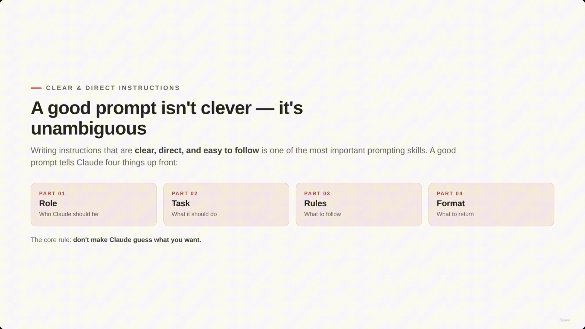
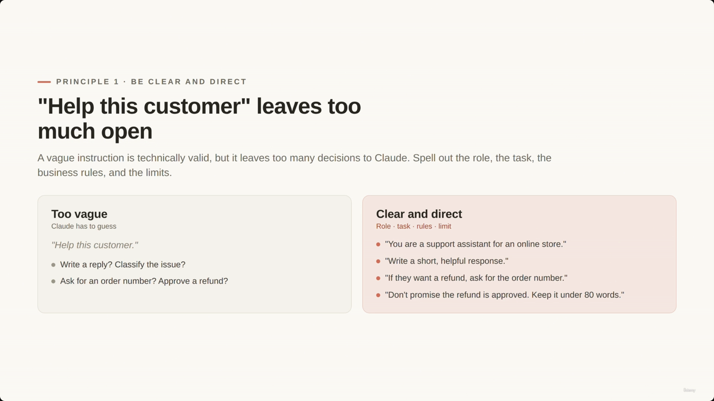
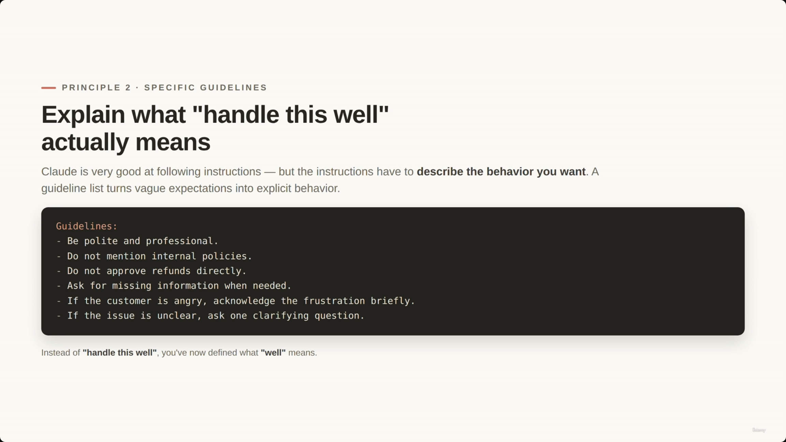
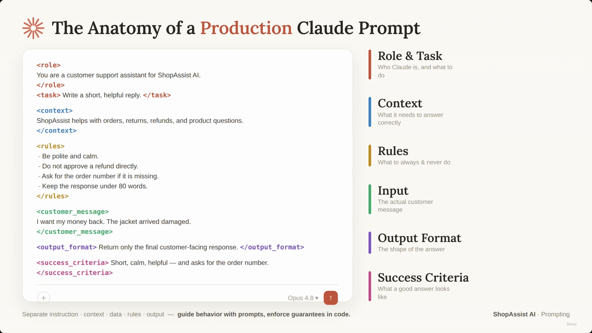
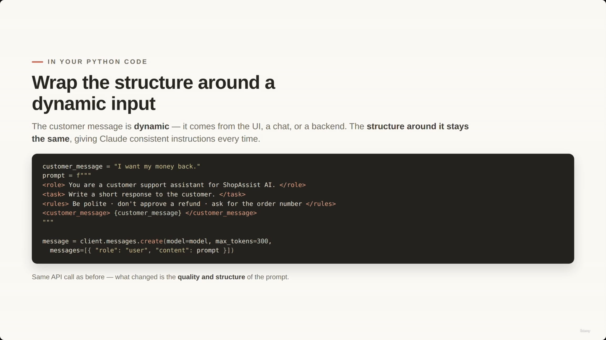
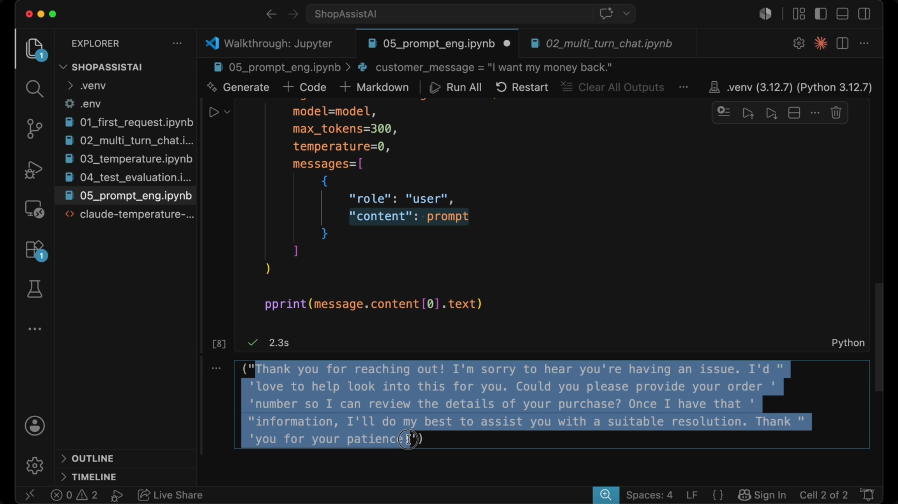
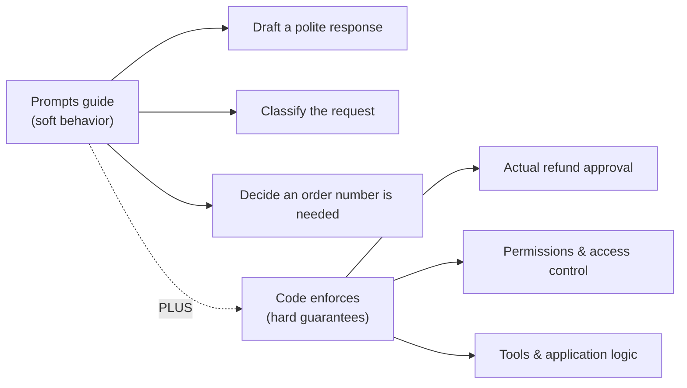
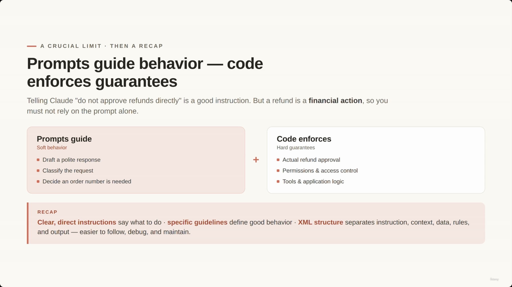
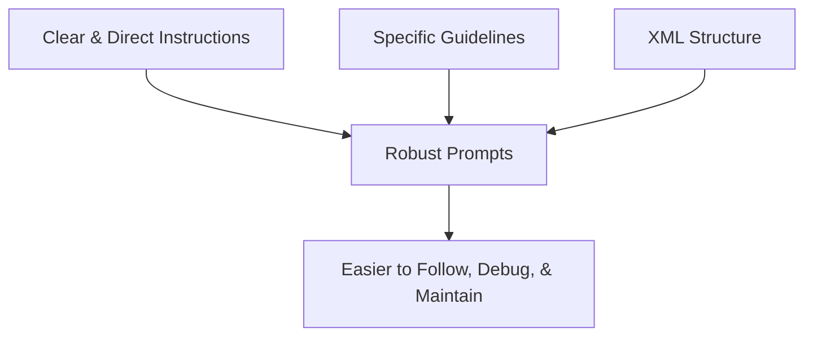
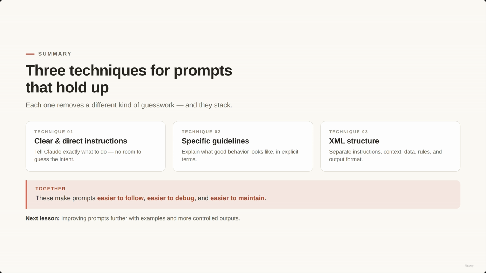

# Clear & Direct Prompting: Specific Guidelines and XML Structure

> This lecture covers three prompting techniques that stack together: **clear & direct instructions** (don't make Claude guess), **specific guidelines** (spell out what "good" behavior means), and **XML structure** (separate a prompt's functional parts so both Claude and developers can follow it). It closes with a reminder that none of this replaces backend enforcement for anything that carries real financial or security weight.

---

## 1. Clear & Direct Instructions

- A good prompt isn't clever — it's **unambiguous**.
- The goal is instructions that are clear, direct, and easy to follow.
- **Core rule:** don't make Claude guess what you want.
- A good prompt tells Claude four things up front:

| Part | Purpose |
|---|---|
| **Role** | Who Claude should be |
| **Task** | What it should do |
| **Rules** | What to follow |
| **Format** | What to return |

> **Transcript color:** "A good prompt is not about sounding clever. A good prompt tells Claude exactly what role it should play, what task it should complete, what rules it should follow and what format it should return."



---

## 2. Prompt Precision: Vague vs. Clear

- **[The Problem]** Vague instructions are technically valid but leave too many decisions to Claude.
- **[The Solution]** Spell out the role, task, business rules, and limits.

The lecture's running example is a ShopAssist AI support assistant. Here's the vague-vs-clear contrast exactly as shown on the slide:

| Too vague — Claude has to guess | Clear and direct — role · task · rules · limit |
|---|---|
| `"Help this customer."` | `"You are a support assistant for an online store."` |
| *Write a reply? Classify the issue?* | `"Write a short, helpful response."` |
| *Ask for an order number? Approve a refund?* | `"If they want a refund, ask for the order number."` |
| | `"Don't promise the refund is approved. Keep it under 80 words."` |

> **Transcript color:** "Should it write a polite response? Should it classify the issue? Should it ask for an order number? Should it approve a refund? The instruction is technically valid, but it leaves too many decisions open."



---

## 3. Specific Guidelines

- **[Principle 2]** Explain what "handle this well" actually means.
- Claude is very good at following instructions — but the instructions must explicitly **describe the behavior you want**.
- A guideline list turns vague expectations into explicit behavior.

**Example guidelines for the ShopAssist support assistant** (as shown on the slide):

```text
Guidelines:
- Be polite and professional.
- Do not mention internal policies.
- Do not approve refunds directly.
- Ask for missing information when needed.
- If the customer is angry, acknowledge the frustration briefly.
- If the issue is unclear, ask one clarifying question.
```

> Instead of **"handle this well"**, you've now defined what **"well"** means.



---

## 4. Anatomy of a Production Claude Prompt

- In production, a prompt is rarely just one sentence — it's composed of several distinct, functional parts.
- **Initial components:** Task (what Claude should do) and Context (background info needed for an accurate response).
- **Additional components for a robust prompt:**
  - **Rules** — what Claude should always/never do
  - **Input** — the actual data to process (e.g. `<customer_message>`)
  - **Output Format** — the desired shape of the answer (plain text, JSON, short answer, classification, etc.)
  - **Success Criteria** — what a good answer looks like

The complete structure, exactly as shown on the slide:

```text
<role>
You are a customer support assistant for ShopAssist AI.
</role>

<task>
Write a short, helpful reply.
</task>

<context>
ShopAssist helps with orders, returns, refunds, and product questions.
</context>

<rules>
- Be polite and calm.
- Do not approve a refund directly.
- Ask for the order number if it is missing.
- Keep the response under 80 words.
</rules>

<customer_message>
I want my money back. The jacket arrived damaged.
</customer_message>

<output_format>
Return only the final customer-facing response.
</output_format>

<success_criteria>
Short, calm, helpful -- and asks for the order number.
</success_criteria>
```

**[Slide detail]** The mocked-up prompt box shows a model selector reading **"Opus 4.8"** and a footer line not spoken in the transcript nor written in the slide-note bullets: *"Separate instruction · context · data · rules · output — guide behavior with prompts, enforce guarantees in code."* That closing phrase previews the lecture's final point (§9 below) well before it's explicitly introduced.



---

## 5. Organizing Prompts with XML Tags

- Avoid mixing all instructions into a single, messy paragraph.
- Separate distinct parts so the prompt is easier for Claude to follow and easier for developers to maintain.
- **[Technique]** XML tags aren't "magic" — they're simply a clean way to draw structural boundaries and stop different parts of the prompt from bleeding into one another.

| Component | XML Tag | Purpose |
|---|---|---|
| Role & Task | `<role>` / `<task>` | Defines who Claude is and what to do |
| Context | `<context>` | Provides necessary background information |
| Rules | `<rules>` | Specifies what to always or never do |
| Input | `<customer_message>` | The actual data or message being processed |
| Output Format | `<output_format>` | Defines the shape of the response (e.g. JSON, plain text) |
| Success Criteria | `<success_criteria>` | Describes what a good answer looks like |

**Why it matters (benefits of XML tagging in production):**
- **Improved model understanding** — helps Claude distinguish instructions (what to do), data (what's being processed), and expected output requirements.
- **Developer maintainability** — much easier to read and update as prompts grow.
- Production prompts scale quickly to include business rules, customer/order data, tool results, and formatting requirements — without tags, all of that becomes one unmanageable "messy paragraph."

> **[Note on the source material]** The slide deck's four consecutive headings — *Anatomy of a Production Claude Prompt*, *Essential Prompt Components for Production*, *Organizing Prompts with XML Tags*, and *Benefits of XML Tagging in Production* — are all narrated over the **same static slide screenshot** (unchanged from 00:02:05 through 00:03:35, over 90 seconds of runtime). No distinct visual of the tag-comparison table above was actually captured; it's reconstructed here from the slide note's own text since the underlying image never changes. Treat the table as a synthesis of what's spoken/written, not a literal on-screen table.

---

## 6. Messy vs. Structured Prompts

The transcript sets up a direct contrast between a single run-on paragraph and the same instructions separated into tags. No screenshot captures this specific comparison (the slides move on to code by this point), but it's a clean before/after worth preserving verbatim:

**The messy approach — one continuous paragraph:**

```text
You are a support assistant. A customer wants a refund. Be nice. Ask
for details if needed. Don't say too much and don't approve anything
unless you know the order. Customer says I want my money back.
```

**The structured approach — same instructions, tagged:**

```text
<role>You are a support assistant.</role>
<task>Respond to a customer who wants a refund.</task>
<rules>
- Be nice.
- Ask for details if needed.
- Don't say too much.
- Don't approve anything unless you know the order.
</rules>
<customer_message>I want my money back.</customer_message>
```

- **[Problem with messy]** As more rules and data get added, a paragraph becomes increasingly difficult to read and maintain.
- **[Benefit of structured]** Each section is isolated — if business rules change, update only `<rules>`; if the output format changes, update only `<output_format>`. This is why XML is especially useful for production prompts that grow over time.

---

## 7. Implementing Structure in Python Code

- In a real application, the **structural part of the prompt stays constant** while the **customer message is injected dynamically**.
- This gives Claude consistent instructions on every request, regardless of the changing input.



**[Factual inconsistency flagged]** The slide note's own hand-transcribed code block for this section (under "Implementing Structure in Python Code") reads:

```python
# As written in the original slide note — contains an error:
prompt = f"""
<rules>You are a customer support assistant for ShopAssist AI.</rules>
<task>Write a short response to the customer.</task>
<rules>Be polite - don't approve a refund - ask for the order number</rules>
<customer_message>{customer_message}</customer_message>
"""
```

This uses `<rules>` twice — once, incorrectly, in place of `<role>`. The actual on-screen slide (above) and the VS Code screenshot (below) both show it correctly as `<role>`. The code block below reflects what's actually on screen, not the slide note's mistranscription.

**The full, production version — Python f-string wrapping a static XML template around dynamic input** (from the VS Code screenshot, `05_prompt_eng.ipynb`):

```python
customer_message = "I want my money back."

prompt = f"""
<role>You are a customer support assistant for ShopAssist AI.</role>
<task>Write a short response to the customer.</task>
<rules>
- Be polite and calm.
- Do not approve a refund.
- Ask for the order number.
- Keep the response under 80 words.
</rules>
<customer_message>{customer_message}</customer_message>
<output_format>
Return only the message that should be sent to the customer.
</output_format>
"""

message = client.messages.create(
    model=model,
    max_tokens=300,
    temperature=0,
    messages=[{"role": "user", "content": prompt}]
)
```

**[Slide detail]** The VS Code file explorer (visible in the notebook screenshot) shows the course's project structure: `01_first_request.ipynb`, `02_multi_turn_chat.ipynb`, `03_temperature.ipynb`, `04_test_evaluation.ipynb`, `05_prompt_eng.ipynb` — confirming this prompting lecture corresponds to notebook 5 in the `ShopAssistAI` project, building directly on the temperature/testing lectures that precede it.

> **Transcript color:** "The customer message is dynamic... But the structure around it stays the same. That structure gives Claude consistent instructions every time."


---

## 8. Result: What the Structured Prompt Produces

Running the cell above (`message.content[0].text`) produces:

> "Thank you for reaching out! I'm sorry to hear you're having an issue. I'd love to help look into this for you. Could you please provide your order number so I can review the details of your purchase? Once I have that information, I'll do my best to assist you with a suitable resolution. Thank you for your patience!"

- Polite, doesn't approve the refund, asks for the missing order number, and stays short — exactly the behavior the `<rules>` and `<output_format>` tags asked for.



---

## 9. Prompts vs. Backend Logic

- **Prompts guide behavior** → "soft behavior": drafting a polite response, classifying the request, deciding an order number is needed.
- **Code enforces guarantees** → "hard guarantees": actual refund approval, permissions & access control, tools & application logic.
- **[Key principle]** Prompting improves behavior, but it does not replace backend logic. Telling Claude "do not approve refunds directly" is a good instruction — but because a refund is a **financial action**, the backend must still enforce the real rule.



> **Transcript color:** "Claude can draft a response. Claude can classify the request. Claude can decide that an order number is needed. But the actual refund approval should be controlled by application logic, permissions, and tools. So prompts guide behavior. Code enforces guarantees."



---

## Summary: Three Techniques That Stack

Each technique removes a different kind of guesswork, and they're most effective used together:

| Technique | What it does |
|---|---|
| **01 — Clear & direct instructions** | Tell Claude exactly what to do — no room to guess the intent |
| **02 — Specific guidelines** | Explain what good behavior looks like in explicit terms |
| **03 — XML structure** | Separate instructions, context, data, rules, and output format |



**Next lesson:** improving prompts further with examples and more controlled outputs.



---

## In Plain English

Here's the whole file in plain, everyday language:

**The big picture:** three techniques that stack together to make prompts more reliable — being crystal clear instead of vague, spelling out exactly what "good" behavior looks like, and organizing a growing prompt with clear labeled sections instead of one giant paragraph.

**1. Don't make Claude guess**
A good prompt tells Claude, up front, who it should be (role), what it should do (task), what rules to follow, and what format to return the answer in. Leave any of that out and Claude has to fill in the blanks itself — inconsistently.

**2. Vague vs. clear, side by side**
"Help this customer" leaves a dozen unanswered questions (write a reply? classify it? approve a refund?). "You are a support assistant... write a short helpful response... if they want a refund, ask for the order number... don't promise the refund is approved... keep it under 80 words" leaves nothing to guess.

**3. Spell out what "good" actually means**
Instead of vaguely saying "handle this well," give an explicit list of guidelines (be polite, don't mention internal policies, ask for missing info, acknowledge frustration briefly, ask one clarifying question if unclear) — now "well" has an actual definition.

**4. A real production prompt has distinct parts**
Role, task, context, rules, the actual input data, the output format, and success criteria — trying to cram all of that into one paragraph gets messy fast as a project grows.

**5. XML tags are the fix**
Wrap each part in its own tag (`<role>`, `<task>`, `<rules>`, `<customer_message>`, `<output_format>`) so Claude can clearly tell instructions apart from data, and so a developer can update just one section (like the rules) without touching everything else.

**6. The final, most important reminder**
None of this prompting technique replaces backend enforcement. A prompt can guide Claude to draft a polite reply and decide it needs an order number — but the actual refund approval, permissions, and real actions still have to be controlled by your application code, not just requested nicely in a prompt.

**One-sentence summary:** Clear, unambiguous prompts (role/task/rules/format), explicit behavior guidelines instead of vague words, and XML tags to organize a growing prompt all combine to make Claude's output more reliable — but for anything that's actually financially or operationally critical, your backend code still has to enforce it, not the prompt.

---

*Sources: [slide notes](../12-Clear-And-Direct-Prompting-Specific-Guidelines-XML-Structure.md) · [[hover-notes-transcripts/12-Clear-And-Direct-Prompting-Specific-Guidelines-XML-Structure (transcript)|full transcript]]*
