# RAG Overview: Retrieval Before Generation

> **The mental model, straight off the title slide:** why RAG exists, how the pipeline works, and how to search for relevant context. **[Slide detail]** The title slide's tagline sums up the whole lecture in one line: *"Retrieve the right evidence first — then generate the answer from it."*

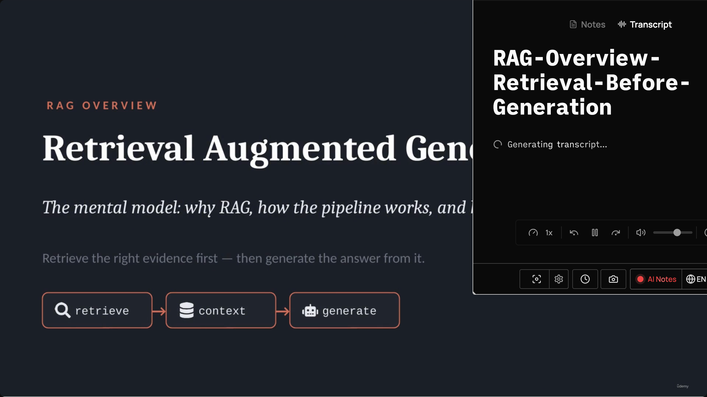

Retrieval-Augmented Generation (RAG) is a pattern that helps an AI model answer questions using information that is **not fully included in the prompt**.

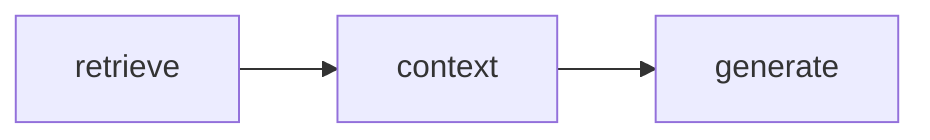

---

## The Problem: You can't fit everything in the prompt

- A large organization (the running example is a hypothetical **"ShopAssist"**) may have thousands of support articles, refund policies, shipping rules, product manuals, and incident reports.
- A user asks a narrow question — e.g. *"Can I return a damaged item after 45 days?"* — but the answer is buried somewhere in all of it.
- Attempting to **stuff all of this documentation into the prompt** doesn't scale:
  - **Expensive** — sending everything costs more per request.
  - **Slow** — the model has to wade through too much text.
  - **Context limits** — sometimes the documentation simply won't fit, even with a large context window.
  - **Less focused** — the answer becomes diluted and vaguer.

> **Transcript color:** "Even if the model supports a large context window, sending everything is usually not ideal. The model has to search through too much information, the request costs more, and the answer may become less focused."

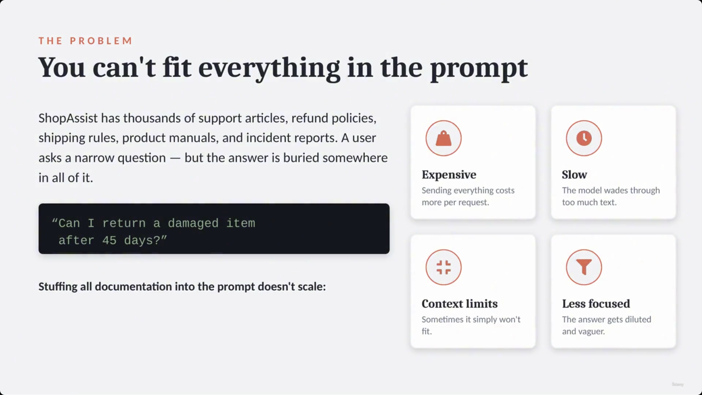

*(This slide was captured three times in a row — 00:00:15, 00:00:28, 00:00:52 — with no change in content; the duplicates are omitted here.)*

---

## The Solution: Add a Retrieval Step Before Generation

- RAG solves the scaling problem by adding a **retrieval step** before the generation step.
- **[Why?]** Instead of giving the model everything, you first search for the most relevant pieces and send only those along with the user's question.

### Comparison: Without RAG vs. With RAG

| Approach | Process | Characteristics |
| --- | --- | --- |
| **Without RAG** | Dump all documentation into the prompt and hope the model finds the answer | Expensive · slow · unfocused |
| **With RAG** | Search first, then send only the most relevant chunks with the question | Cheaper · faster · grounded |

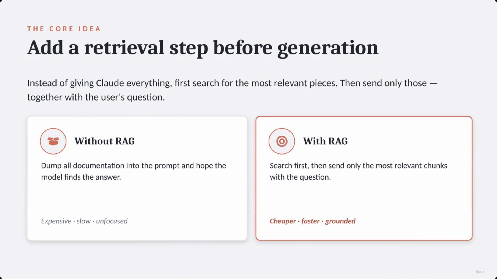

*(Duplicate capture at 00:01:07 omitted — identical slide.)*

---

## The RAG Pipeline

The workflow follows three distinct stages:

1. **Prepare** — documents are split into smaller chunks, and those chunks are stored in a searchable system. `docs → chunks → store`
2. **Retrieve** — when a user question arrives, the system searches for the most relevant chunks. `question → top-k chunks`
3. **Generate** — the retrieved chunks are placed into the prompt, and the model (e.g., Claude) answers the question using that specific context. `chunks + Q → answer`

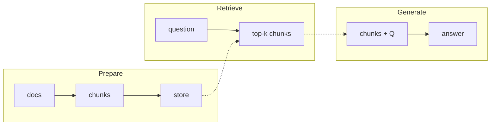

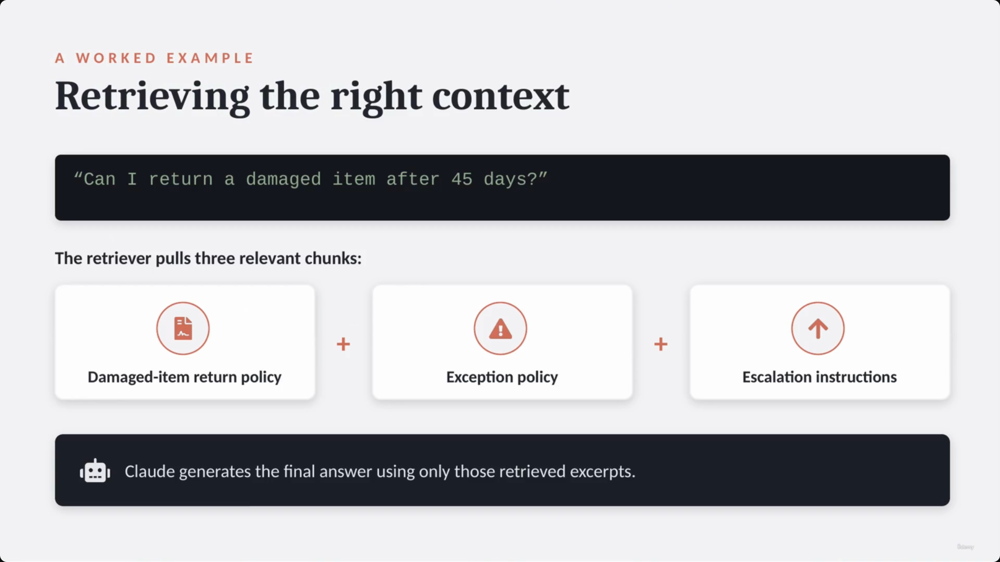

### Worked Example: Retrieving Context

- **User question:** *"Can I return a damaged item after 45 days?"*
- The retriever pulls **three relevant chunks**:
  - Damaged-item return policy
  - Exception policy
  - Escalation instructions
- Claude generates the final response using only these retrieved excerpts.

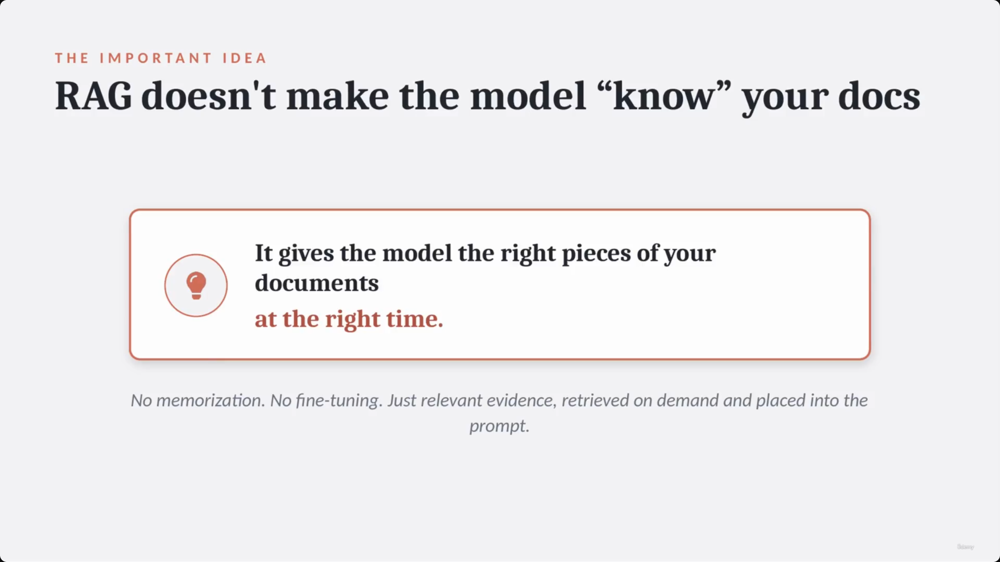

---

## The Core Concept of RAG

> **[The Important Idea]** RAG does **not** magically make the model "know" your documents. It does not involve memorization or fine-tuning. Instead, it gives the model the right pieces of your documents **at the right time** — relevant evidence, retrieved on demand, and placed into the prompt.

> **Transcript color:** "The important idea is this: RAG does not magically make the model know your documents. It gives the model the right pieces of your documents at the right time."

*(Duplicate capture at 00:01:59 omitted — identical slide.)*

---

## Search Option 1: Keyword

- Looks for **exact words or close matches** in the documents.
- **[Strengths]** Fast, and performs very well when users use precise language — specific IDs (e.g., `INC12345`), product names, error codes.
- **[The Limitation]** Can miss the best result if the wording is different from the document's phrasing.

| User Input | Document Text | Match? |
| --- | --- | --- |
| "Can I get my money back?" | "Customers may request a refund." | ❌ No |

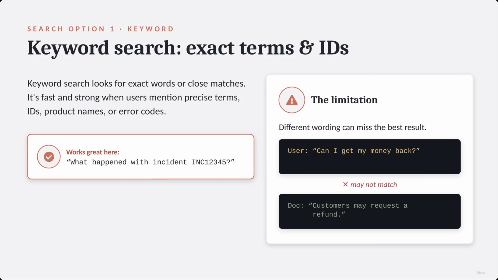

---

## Search Option 2: Semantic

- Uses **embeddings** to find context based on **meaning** rather than exact characters.
- **[What is an embedding?]** A numerical representation of text meaning. The system converts both the question and the document chunks into vectors — similar meanings produce similar numbers, so a match can be found even with different wording.

### How a Vector Database Works

By representing text as vectors in a "meaning space," the system can calculate proximity between concepts:

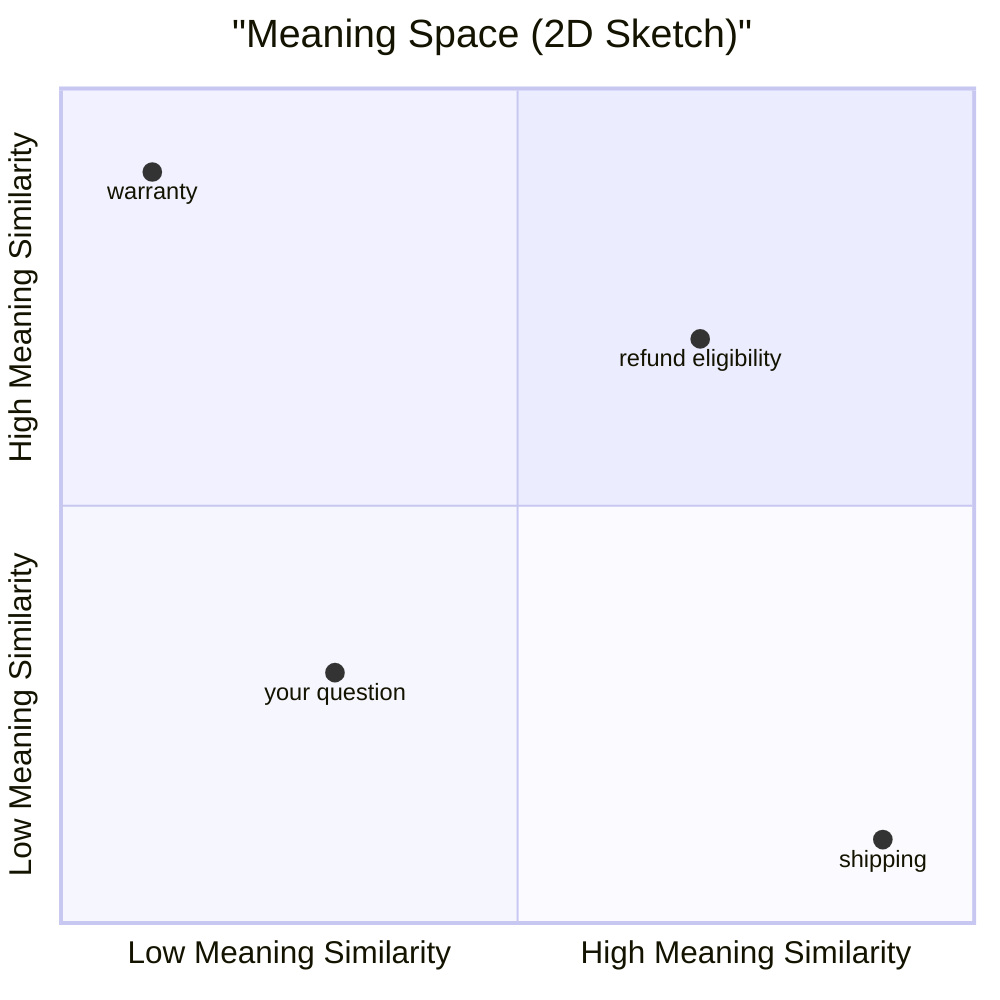

**The workflow:**

1. **Chunk** — break documents into pieces.
2. **Embed** — convert chunks into numerical vectors.
3. **Store** — save vectors in a vector database.
4. **Retrieve nearest** — when a question is asked, convert it to an embedding and find the closest vectors in the database.
5. **Pass to model** — send the most relevant chunks to the LLM.

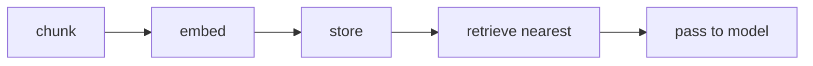

> **[Corrected transcription]** The slide's worked example converts three phrases into vectors to illustrate closeness in meaning space:
> - `"refund eligibility"` → `[0.82, 0.10, 0.93, ...]`
> - `"Can I get my money back?"` → `[0.79, 0.14, 0.90, ...]` — **close**
> - `"shipping delays"` → `[0.06, 0.88, 0.12, ...]` — **far**
>
> The original slide note transcribed the second vector's third value as `0.00`; the actual on-screen value is **`0.90`** (which is what makes it numerically close to `0.93`, consistent with the slide's own "close" label). This note corrects that transcription error.

- A **vector database** is a specialized storage system optimized for handling and searching embeddings — its job is to efficiently find the chunks that are mathematically closest in meaning to the user's query.
- This allows a question like *"Can I get my money back?"* to match a document about *"refund eligibility"* despite having no overlapping words.

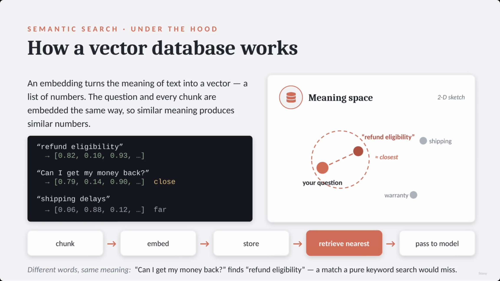

*(This same "How a vector database works" slide was captured four times across 00:02:34–00:03:41. Note that the 00:02:34 capture landed chronologically under the Keyword-search section of the original slide note — the slide had already advanced to Semantic search / vector DB content by then, so that capture was filed one section early by position. It's grouped here with its correctly-placed duplicates rather than under Keyword search.)*

---

## Search Option 3: Hybrid

- Combines **semantic search** and **keyword search** to cover more cases.
- **[The logic]** Semantic search captures meaning and intent; keyword search excels at finding exact terms and specific IDs.

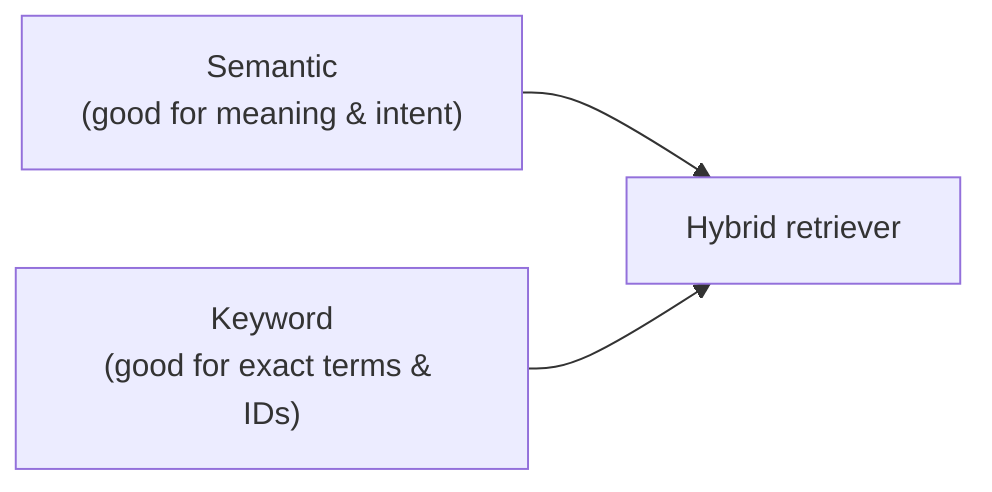

- **Example:** *"Why was order 12345 escalated?"* — semantic search grasps the intent of the question; keyword search nails the exact order ID; the hybrid retriever merges both and returns the strongest set of results.

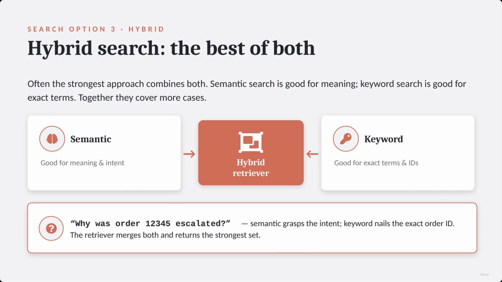

*(Duplicate capture at 00:04:17 omitted — identical slide.)*

---

## Why Retrieval Matters Most

- **[The Core Principle]** RAG quality depends heavily on retrieval quality. If the retrieval step is flawed, the model's response will be flawed regardless of its reasoning capabilities.
- **Consequences of poor retrieval:**
  - **Wrong context** — the model may produce a confident but incorrect answer, because it's working from the wrong information.
  - **Incomplete context** — the model may miss critical details, such as an important policy exception.
- **[A Better Approach]** Shift the focus of evaluation. Instead of asking *"Can the model answer?"*, ask instead: **"Did we retrieve the right evidence for the model to answer?"**

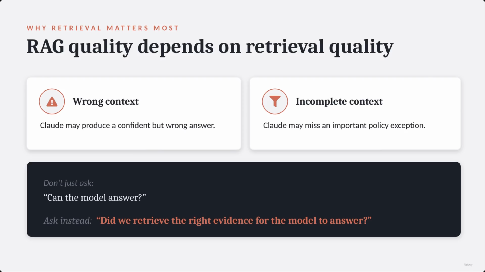

---

## Practical Decisions in RAG Design

Building an effective RAG system involves several key tuning decisions:

- **Chunking** — by size, paragraph, heading, or meaning?
- **How many chunks** — how much context to retrieve (top-k)?
- **Search type** — vector, keyword, or hybrid?
- **Reranking** — reorder results before sending them to the model?
- **Citations** — should the model cite the retrieved sources?
- **Knowledge scope** — which sources belong in the index?

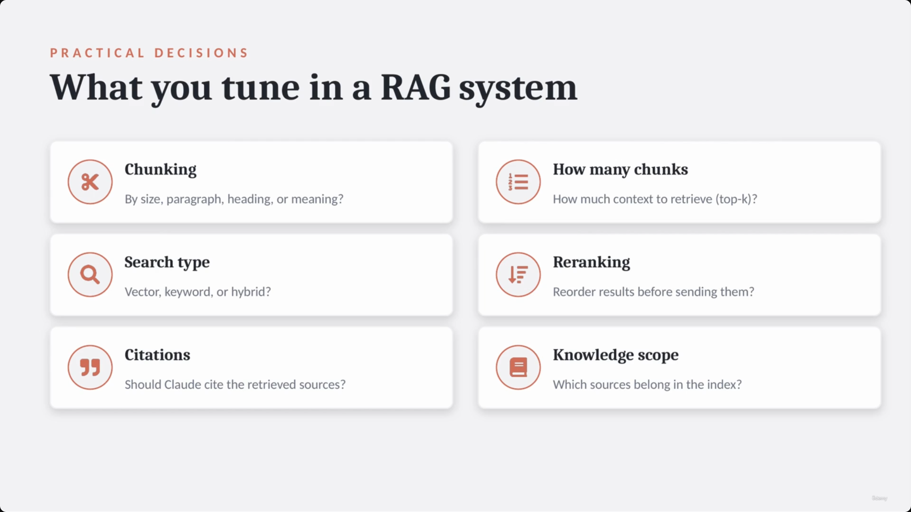

*(This "What you tune in a RAG system" slide was captured three times, 00:04:42–00:05:13. The 00:04:42 capture landed chronologically under the "Why Retrieval Matters" section, one section early by position — the slide had already advanced to the Practical Decisions content. Grouped here with its correctly-placed duplicates.)*

> The course framing here is deliberately light: *"For this course, you do not need to implement a full production RAG system right now. What matters is understanding the pattern."*

---

## When to Reach for RAG

- **[The Core Use Case]** RAG is useful when an application needs to answer questions using **large or changing knowledge sources** — documentation, policies, support history, contracts, product catalogs, internal reports.
- **Key advantages:**
  - **Scalability** — you don't have to send everything to the model at once.
  - **Freshness** — documents can be updated outside of the model's training cycle.
  - **Control** — answers are grounded in retrieved, specific sources.
- **The core idea, restated:** retrieve relevant information first, then generate the answer using that information.

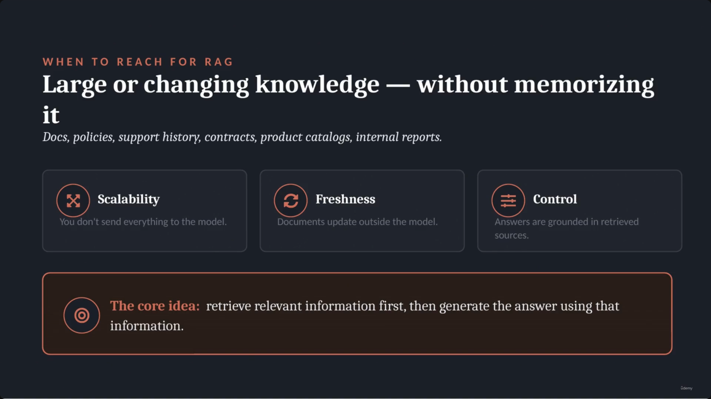

### ShopAssist Example: Applying RAG

> **[Bleed / no new slide]** The slide note files a second, near-identical screenshot (00:05:58) under a "ShopAssist Example" heading, implying a ShopAssist-specific slide. In fact the capture at 00:05:58 is pixel-identical to the "When to Reach for RAG" slide above — the deck did not visually advance. The ShopAssist specifics below come entirely from the transcript's spoken narration, not from a distinct slide.

- **[The Use Case]** Using RAG to answer support questions based on dynamic information — latest return policies, shipping rules, warranty terms, escalation procedures.
- **[The Advantage]** The model does not need to memorize these policies — it only needs to be provided with the correct policy excerpts via retrieval.

> **Transcript color:** "In ShopAssist, RAG could be used to answer support questions based on the latest return policies, shipping rules, warranty terms, and escalation procedures. The model does not need to memorize those policies. It only needs the right policy excerpts... That is the core idea of RAG. Retrieve relevant information first, then generate the answer using that information."

---

## Summary

- **RAG** = a retrieval step before generation, so the model answers from a small set of relevant, retrieved chunks instead of the entire knowledge base.
- **Pipeline:** Prepare (chunk + store) → Retrieve (search for top-k chunks) → Generate (answer from those chunks).
- **RAG does not make the model "know" your docs** — no memorization, no fine-tuning; it's evidence retrieved on demand and placed into the prompt.
- **Three search strategies:** keyword (fast, exact-match, weak on paraphrase), semantic/vector (meaning-based via embeddings, weak on exact IDs), and hybrid (combines both, generally the strongest default).
- **Retrieval quality is the bottleneck** — the better question during evaluation isn't "can the model answer?" but "did we retrieve the right evidence?"
- **Practical tuning knobs:** chunking strategy, top-k, search type, reranking, citations, knowledge scope.
- **When to reach for RAG:** large or changing knowledge sources, where scalability, freshness, and grounded control matter more than baking everything into the prompt or the model's weights.

---

## In Plain English

Here's the whole file in plain, everyday language:

**The big picture:** RAG (Retrieval-Augmented Generation) solves one specific problem — you can't cram your entire company's documentation into every single prompt — by searching for just the relevant pieces first, then handing only those to Claude to answer from.

**1. The problem RAG solves**
A company might have thousands of support articles and policy documents. Stuffing all of it into every prompt is expensive, slow, sometimes literally doesn't fit, and actually makes answers worse (too much irrelevant noise to sift through).

**2. The fix, in one sentence**
Search first, generate second — find just the handful of relevant chunks of text, then hand only those (plus the question) to Claude.

**3. The three-step pipeline**
Prepare (chop your documents into small chunks and store them somewhere searchable) → Retrieve (when a real question comes in, search for the most relevant chunks) → Generate (hand those specific chunks plus the question to Claude, which writes the answer using only that evidence).

**4. The most important thing to understand about RAG**
It does NOT make Claude magically "know" your documents forever — there's no memorizing or retraining happening. It's just handing Claude the right few paragraphs at exactly the right moment, fresh, every single time.

**5. Three ways to search for the relevant chunks**
Keyword search (looks for exact word matches — fast, great for exact IDs, but misses different phrasing of the same idea, like "money back" not matching a document that only says "refund"), semantic/vector search (converts both the question and documents into numbers based on MEANING, so it can match "money back" to "refund eligibility" even with zero overlapping words), and hybrid search (uses both together — semantic for catching the meaning, keyword for nailing exact IDs/codes).

**6. The most important lesson**
Your final answer is only as good as what you retrieved. If you searched for and pulled the WRONG documents, Claude's answer will be confidently wrong no matter how smart the model is — so when something goes wrong, the first question to ask isn't "why did the model answer badly," it's "did we actually retrieve the right evidence."

**7. There are real tuning decisions to make when building a RAG system**
How big should each chunk be, how many chunks to retrieve, which search type to use, whether to re-rank results, whether to show citations, and which documents even belong in the searchable set to begin with.

**One-sentence summary:** RAG means searching for the small handful of genuinely relevant document chunks first, then generating the answer only from those — it doesn't make Claude "know" your documents permanently, and since a wrong or incomplete search means a wrong answer no matter how good the model is, retrieval quality (not the model) is usually the real bottleneck.

---

*Sources: [slide notes](../13-RAG-Overview-Retrieval-Before-Generation.md) · [[hover-notes-transcripts/13-RAG-Overview-Retrieval-Before-Generation (transcript)|full transcript]]*
