# Explicit Criteria & Few-Shot Examples

> Lecture 12 (Clear & Direct Prompting) covered getting Claude to *follow instructions*. This lecture is the next step up the difficulty ladder: getting Claude to make a **judgment call** — and doing it *consistently*, the same way every time the same kind of input shows up.

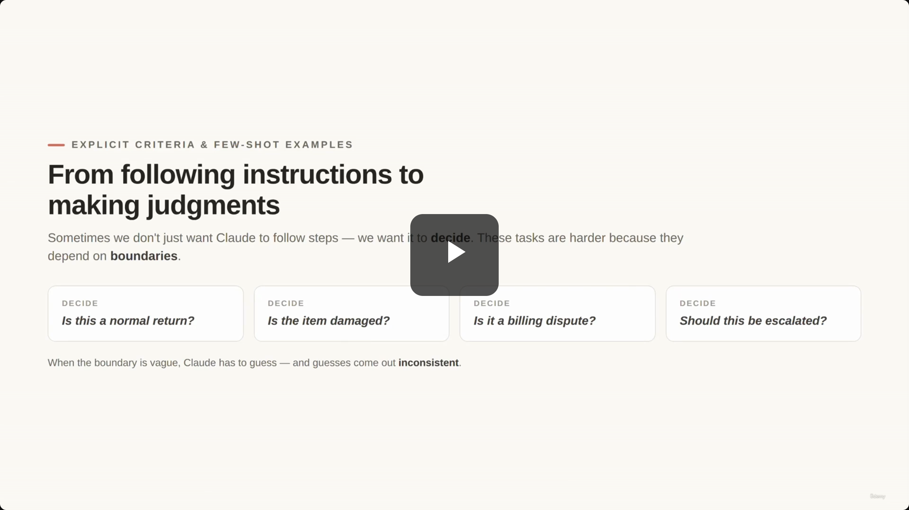

## 1. From following instructions to making judgments

- Some tasks aren't "do X" — they're "decide X":
  - Is this a normal return?
  - Is the item damaged?
  - Is this a billing dispute?
  - Should this customer message be escalated?
- **[The Challenge]** Judgment tasks are harder because they depend on **boundaries**. If a boundary is vague, Claude has to guess — and guesses come out inconsistent.

---

## 2. The problem with vague judgment

- `"Be conservative"` is not a rule Claude can apply — it *sounds* reasonable but leaves the actual decision undefined.
- **Vague prompt example** (from the slide note / transcript):

  ```text
  Classify this customer message. Be conservative. Only escalate serious cases.
  ```

- **Why this fails** — it leaves open questions that force Claude to guess:
  - What does "conservative" mean?
  - What counts as a "serious case"?
  - Should an angry customer always be escalated, or only if they mention a legal, bank, or safety issue?
- Undefined words simply **push the judgment back onto the model** — the opposite of what you want from a production system.

> **[Slide-capture note]** No screenshot in the source lecture actually shows this vague-prompt slide on screen — the capture tool's first two grabs (00:00:56, 00:00:58) had already landed on the *next* slide ("Replace vague words with concrete triggers"), and a third grab at 00:01:27 caught the same slide again. This is exactly the chronological-lag problem: the vague-prompt example only exists here as slide-note text and transcript narration, not as a captured image. The three near-identical screenshots are consolidated below into one.

---

## 3. The fix: explicit criteria

- Replace vague judgment words with **concrete triggers**: instead of "escalate serious cases," list the exact conditions that qualify.
- This ensures the boundary is explicit and **the same input lands in the same bucket every time** — you (the human) decide what "serious" means, not the model.

```text
# Use escalation_candidate ONLY when the customer:
- asks for a manager or human agent
- threatens legal action
- says they'll contact their bank or dispute the charge
- reports a safety concern
- is extremely upset AND has a billing, legal, or policy issue
```

> **Transcript color:** "Now the boundary is clearer. Claude is no longer deciding what serious means on its own — we're giving it concrete criteria."

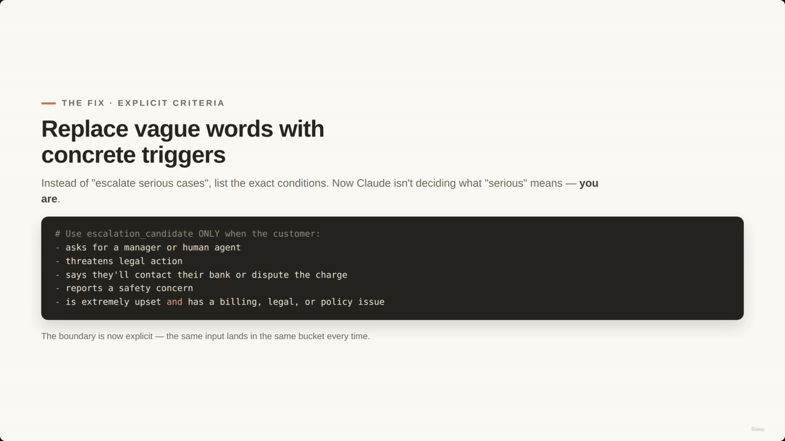

---

## 4. Applying it to ShopAssist: categories + priority order

ShopAssist needs to classify every customer message into exactly **one** of five categories. Each category gets its own definition, and — because a single message can plausibly match more than one — a **priority order** resolves the overlap.

| Category | Definition |
|---|---|
| `normal_return` | Standard-policy return — no damage, billing, policy exception, or escalation trigger |
| `damaged_item` | Item arrived broken, defective, missing parts, or not working |
| `billing_dispute` | Incorrect, duplicate, or unauthorized charge, missing refund, or payment problem |
| `policy_exception` | A request outside standard policy, e.g. returning after the return window |
| `escalation_candidate` | Only when an escalation trigger is present (manager, legal, bank, safety…) |

**Priority order (if multiple categories match):**

`escalation_candidate` → `billing_dispute` → `damaged_item` → `policy_exception` → `normal_return`

**Why priority matters — the overlap example:**

> "My package arrived damaged, and I was charged twice." → could be `damaged_item` **or** `billing_dispute`. The priority rule picks `billing_dispute`, because it ranks higher. Without the rule, the result is ambiguous and could go either way depending on how the model happens to read it.


### The full classification prompt

```text
You are ShopAssist, a customer support classification assistant. Classify the message into exactly one category.

Categories:
- normal_return
    Wants to return under the standard policy — no damage, billing, policy exception, or escalation trigger.
- damaged_item
    Item arrived broken, defective, missing parts, or not working.
- billing_dispute
    Incorrect, duplicate, or unauthorized charge, missing refund, or payment problem.
- policy_exception
    A request outside standard policy, e.g., returning after the return window.
- escalation_candidate
    Use only when the message includes an escalation trigger:
    - asking for a manager / human agent
    - threatening legal action
    - contacting the bank / disputing charge
    - reporting a safety concern
    - extreme frustration + billing, legal, or policy issue

If multiple apply, use this priority:
1. escalation_candidate
2. billing_dispute
3. damaged_item
4. policy_exception
5. normal_return

Return only JSON:
{
  "category": "...",
  "reason": "..."
}
```

**Reading it:** this single prompt does three jobs at once — defines each category, spells out escalation triggers explicitly (rather than leaving "serious" undefined), and fixes a priority order for overlaps. "This is much more reliable than simply saying be careful or only escalate when necessary." *(transcript, 1:27–1:57)*

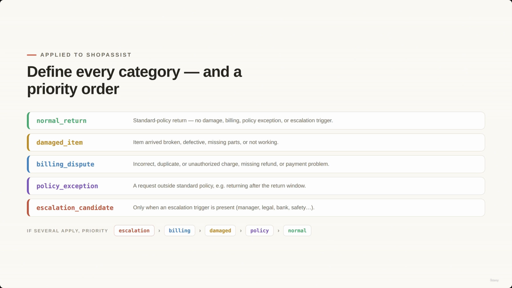

---

## 5. Few-shot examples: teach the boundary, lock the output

Few-shot examples are sample input → output pairs placed directly in the prompt. They do **two jobs at once**:

| Job | What it does |
|---|---|
| **Teach the boundary** | Shows the model exactly how to classify specific, nuanced cases |
| **Lock the output** | Ensures the model follows the exact JSON shape every time, reducing "format drift" |

**ShopAssist few-shot examples:**

| Customer message | Classification |
|---|---|
| "Wrong size, want to send it back." | `normal_return` |
| "Headphones arrived broken." | `damaged_item` |
| "Charged twice… I'll dispute with my bank." | `escalation_candidate` |

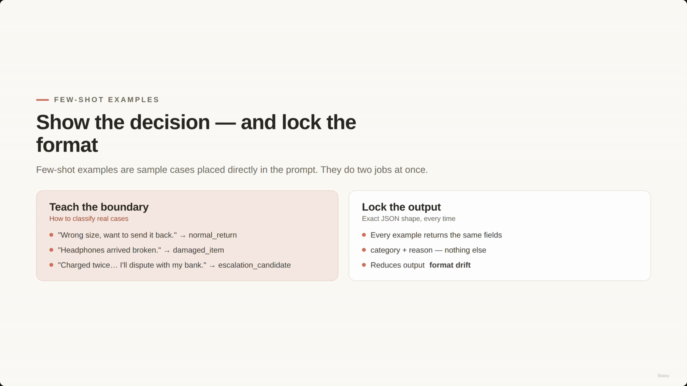

---

## 6. Preventing format drift

- **Format drift** = the model gives a *reasonable* answer, but with the wrong field names or structure — a human reads it fine, but application code that keys on specific field names silently fails.

| | JSON |
|---|---|
| **What the app expects** (stable) | `{"category": "billing_dispute", "reason": "A duplicate charge."}` |
| **Format drift** (same meaning, wrong shape) | `{"intent": "billing", "confidence": "high"}` |

> **Transcript color:** "A human can understand it, but our application may fail because the field names are different. Few-shot examples help keep the structure consistent."

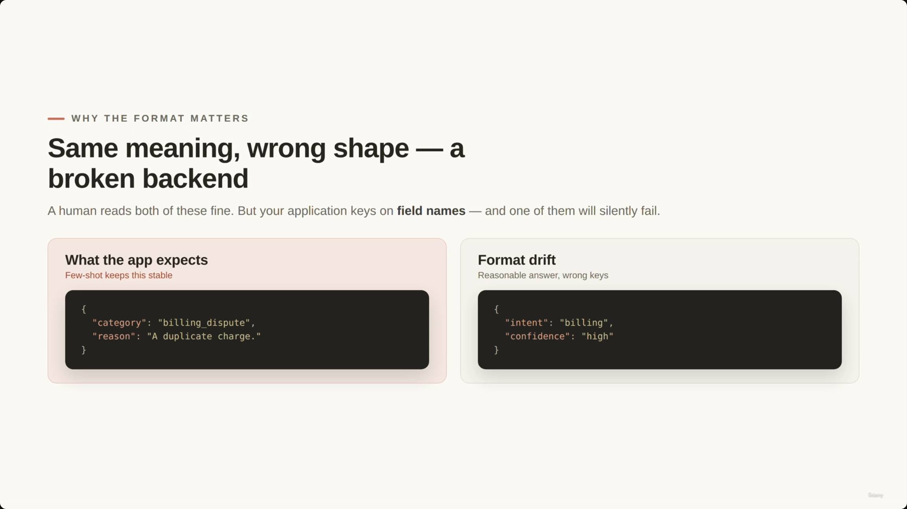

---

## 7. Show both sides of the boundary (preview)

Before drilling into each domain separately, the deck shows one overview slide that pairs the "should flag" and "should NOT flag" idea across **both** ShopAssist support *and* code review at once — previewing where the lecture is headed:

| | Should flag / escalate | Should NOT flag / escalate |
|---|---|---|
| **Support** | "I'll dispute this with my bank." → `escalation` | "Don't like the color, want to return." → `normal_return` |
| **Code review** | Refund runs *before* identity check → `critical` | Variable renamed `customerInfo` → `customerProfile` → `none` |

**[Slide detail]** This same slide also previews the generalization point covered later: "refund says completed but the money never came back" → `billing_dispute`, even though that exact sentence was never in the prompt. It functions as a bridge slide tying the false-positive technique, the code-review technique, and the generalization technique together before each is shown in detail below.

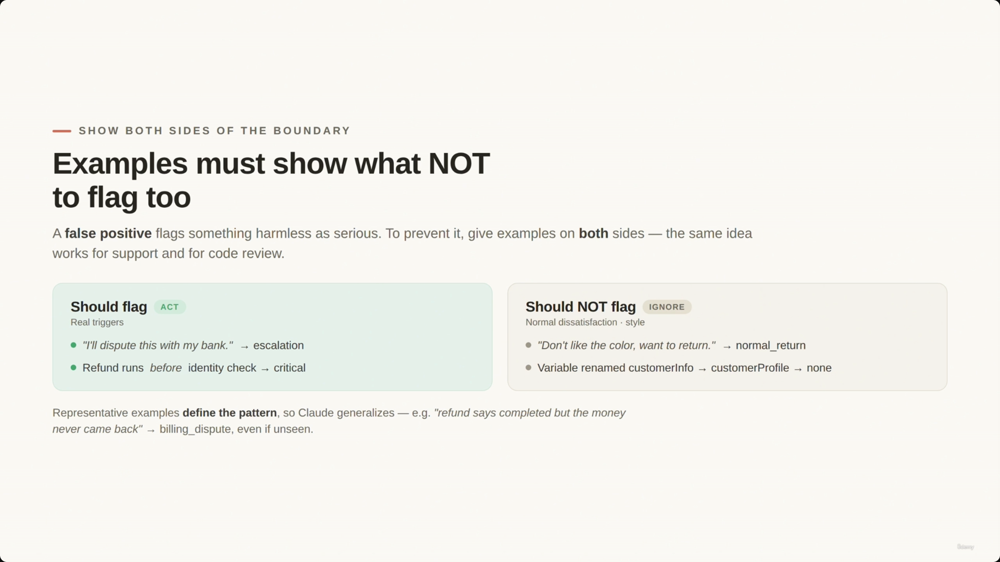

---

## 8. Reducing false positives (ShopAssist detail)

- **False positive** = the system incorrectly flags a harmless message as something serious.
- Example: *"I do not like the color and want to return it."* — the customer is unhappy, but this is still a `normal_return`: no damage, no billing issue, no policy exception, no escalation trigger.
- **How to prevent it:** add a few-shot example that shows where the boundary *isn't* — this teaches the model not to over-classify normal dissatisfaction as escalation.

```json
{
  "category": "normal_return",
  "reason": "Wants to return the item, but reports no damage, billing issue, policy exception, or escalation trigger."
}
```

| Feature | Status |
|---|---|
| No damage | ✅ |
| No billing issue | ✅ |
| No policy exception | ✅ |
| No escalation trigger | ✅ |

> **Why it matters:** this teaches Claude not to over-classify normal dissatisfaction as escalation — keeping false positives down.

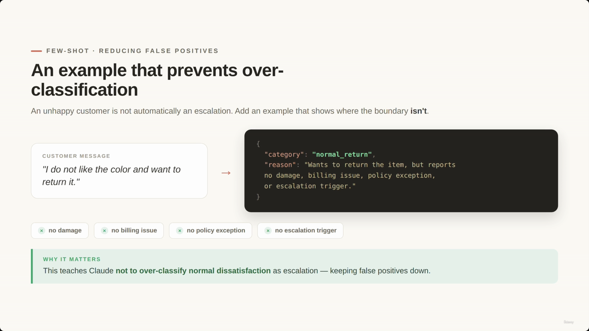

---

## 9. Applying explicit criteria to code review

The exact same "vague word → explicit criteria" fix from ShopAssist applies to a completely different domain: code review.

- **Vague prompt:** *"Review this pull request, find serious issues. Be conservative."*
- **Resulting noise** — Claude may flag non-critical items such as:
  - Naming preferences
  - Formatting changes
  - Subjective refactoring ideas

> **Transcript color:** "Just like 'escalate serious cases,' a vague review prompt leaves 'serious' undefined — so Claude pads the review with low-value comments."

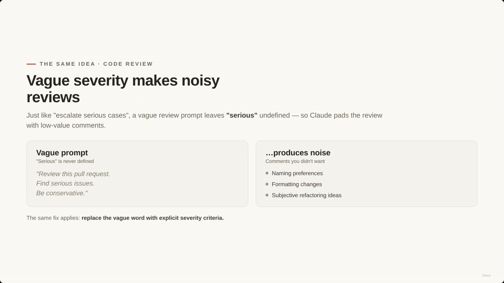

### Defining severity criteria

| What to flag | What NOT to flag |
|---|---|
| Incorrect behavior | Formatting preferences |
| Failed builds or tests | Minor naming suggestions |
| Security exposure | Subjective refactoring ideas |
| Data loss | Code that's acceptable but could be written differently |
| Broken user workflows | |
| Production errors | |

### Few-shot examples showing both sides of the boundary

The same "teach both sides" strategy from the ShopAssist false-positive example applies here — one example of a real issue, one example of a non-issue, **both returning the same JSON shape** so the format stays consistent:

| Type | Example | JSON output |
|---|---|---|
| **Real issue** | Refund function processes a refund **before** verifying customer identity | `{"severity": "critical", "should_comment": true, "reason": "Financial action before customer verification."}` |
| **Not an issue** | Variable renamed `customerInfo` → `customerProfile` | `{"severity": "none", "should_comment": false, "reason": "A naming change, no correctness or security risk."}` |

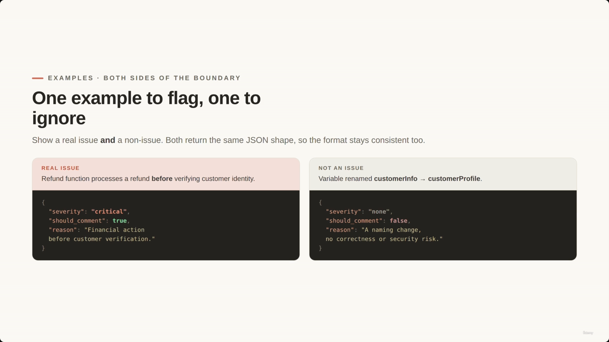

---

## 10. Generalizing through representative examples

- **The strategy:** don't try to list every possible future case. Provide enough *representative* examples to mark the boundary of a pattern — this lets the model generalize to messages it has never seen before.
- **ShopAssist example:** if the prompt includes examples for duplicate charges, missing refunds, and bank disputes, the model can correctly classify a brand-new, unseen message:

  > *"My refund says completed, but the money never came back to my card."* → `billing_dispute`

  — even though this exact sentence was never in the prompt.

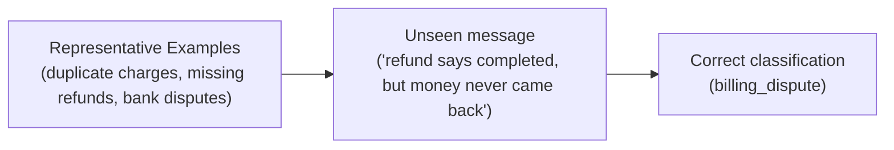

> **The takeaway:** representative examples teach the *pattern*, not a lookup table.

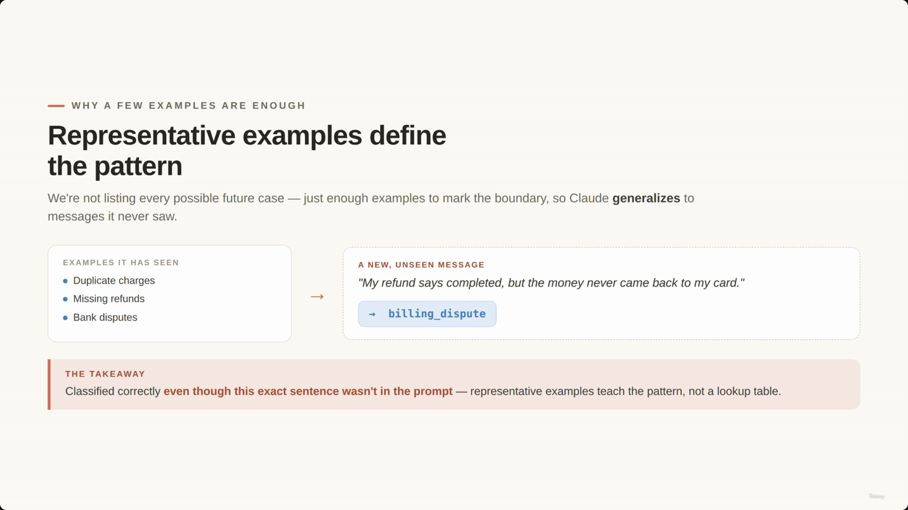

---

## 11. The practical pattern: prompting guides, the app validates

Two-layer approach to production-grade reliability:

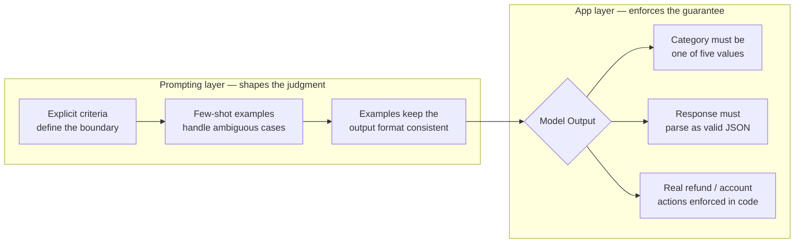

- **[Why validate?]** Prompting makes output *reliable*, but not *guaranteed* — the backend must enforce hard limits that a model might occasionally miss.
- Backend enforcement examples: check the category is one of the five allowed values, verify the response parses as valid JSON, and enforce the actual business rule in code before any real refund or account action executes.

> **Transcript color:** "Prompting guides the model, but your application should still validate the result... If a real refund or account action is involved, enforce the business rule in the backend."

This directly echoes the "verification gate" idea from lecture 3 (Claude App vs API vs Code vs MCP vs Agent SDK): a system prompt or few-shot example *guides* Claude's behavior, but only a programmatic check in your backend *guarantees* it.

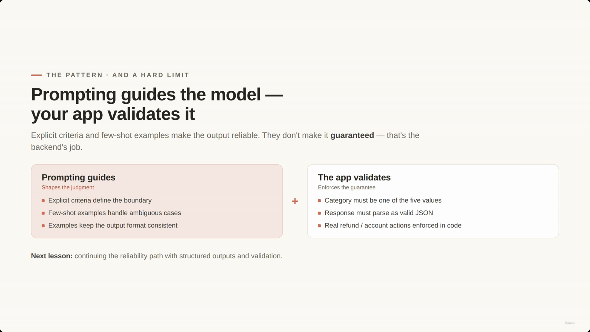

---

## Summary

- **Judgment tasks** (is this X? should this be escalated?) are harder than simple instruction-following because they depend on boundaries — vague boundaries force Claude to guess, and guesses are inconsistent.
- **Explicit criteria** replace subjective words ("serious," "conservative") with concrete, enumerable triggers, so the same input always lands in the same bucket.
- For ShopAssist, this means: five defined categories, explicit escalation triggers, and a priority order for messages that match more than one category.
- **Few-shot examples** do two jobs: teach the model how to classify nuanced/ambiguous cases, and lock the exact output JSON shape to prevent format drift.
- Examples should show **both sides of a boundary** — a case that should be flagged and one that shouldn't — to reduce false positives; the same technique works identically for customer-support classification and for code-review severity.
- A handful of **representative** examples (not an exhaustive list) is enough for Claude to generalize correctly to messages it has never seen.
- **The reliability pattern:** prompting (explicit criteria + few-shot examples) guides the model's judgment; the application layer still validates the output (allowed values, JSON parsing) and enforces real business actions in code — prompting alone is never a substitute for backend enforcement.

**Next lesson:** Structured Outputs.

---

*Sources: [slide notes](../14-Explicit-Criteria-And-Few-Shots-Examples.md) · [[hover-notes-transcripts/14-Explicit-Criteria-And-Few-Shots-Examples (transcript)|full transcript]]*
