# Tool Schemas, Tool Choice, and the First Tool Use

> Up to now, ShopAssist could read a customer message and return structured information — but structured information about *nothing real*. This lecture is where Claude gets a bridge to actual backend data: **tool use**. It covers the mechanics in order — how a tool schema is written, how it's sent to the API, how to read back a `tool_use` response, and the three `tool_choice` modes that control whether a tool call happens at all. Lecture [[03-ClaudeApp-vs-ClaudeAPI-vs-ClaudeCode-vs-MCP-vs-AgentSDK|03]] already introduced the *shape* of this idea (the `process_refund` verification gate, and "clear name / typed schema / structured output" as marks of a good tool) — this lecture is the concrete, code-level version of that.

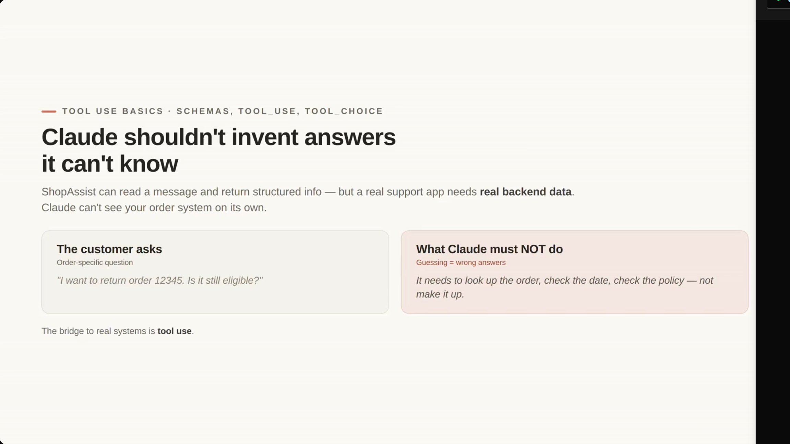

---

## 1. Claude shouldn't invent answers it can't know

- ShopAssist can already read a message and return structured info — but a real support app needs **real backend data**. Claude can't see the order system on its own.
- **The customer asks:** *"I want to return order 12345. Is it still eligible?"*
- **[The Problem]** Claude must not guess. Guessing here means wrong answers — it needs to look up the order, check the date, and check the policy rather than making it up.
- **[The Solution]** Tool use is the bridge to real systems.

> **Transcript color:** "If a customer asks, I want to return order 12345, is it still eligible? Claude should not invent the answer... it may need to look up the order, check the purchase date, check the return policy and maybe create a return request."

---

## 2. Tool Use Basics — the loop

- A **tool** is a function your application exposes to Claude.
- Claude does **not** execute the function directly — it decides a tool should be called and returns a structured `tool_use` request instead.
- The server then runs the *actual* logic (e.g. `lookup_order()`) and sends the real result back.

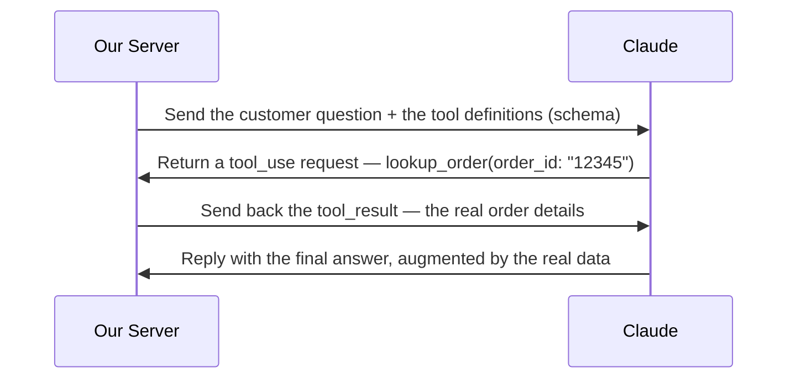

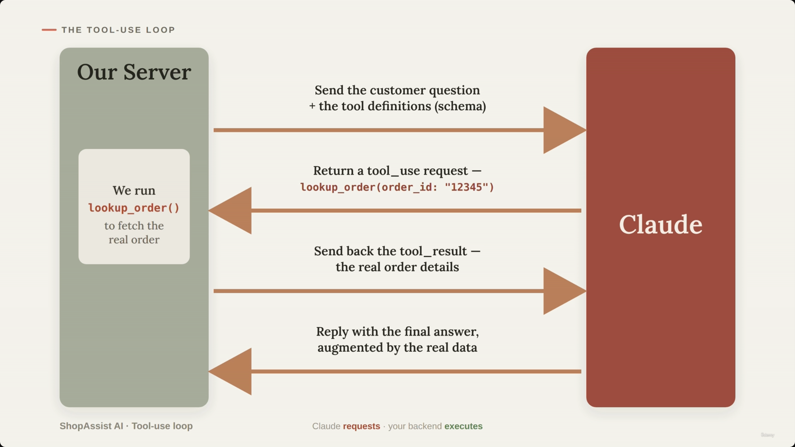

- **Responsibility is split three ways:**
  - **Claude's role** — decides what information is needed.
  - **Your code's role** — executes the tool safely.
  - **Your application's role** — controls what Claude is allowed to access.

---

## 3. Defining a tool with a schema — `lookup_order`

- ShopAssist's first tool: `lookup_order`. It accepts an order ID and returns whether the order exists, what was purchased, the delivery date, and return eligibility.
- The schema is what makes this legible to Claude — it tells Claude the tool's exact name, what it does, what input it needs, which fields are required, and their types.

> **Transcript color:** "This schema is very important. We are not just telling Claude call some function. We are giving Claude a contract. If Claude wants to use this tool, it must provide arguments that match this shape."

```json
[
  {
    "name": "lookup_order",
    "description": "Look up an order by order ID and return order details.",
    "input_schema": {
      "type": "object",
      "properties": {
        "order_id": {
          "type": "string",
          "description": "The customer's order ID."
        }
      },
      "required": ["order_id"]
    }
  }
]
```

**Reading the contract:**

| Field | Purpose |
|---|---|
| `name` | The exact identifier Claude will use to call the tool |
| `description` | Explains what the tool does and when it's useful |
| `input_schema.type` | Data type of the whole input (`object`) |
| `input_schema.properties` | The individual fields the tool accepts, each with its own `type` and `description` |
| `input_schema.required` | Fields that must be provided for the tool to function |

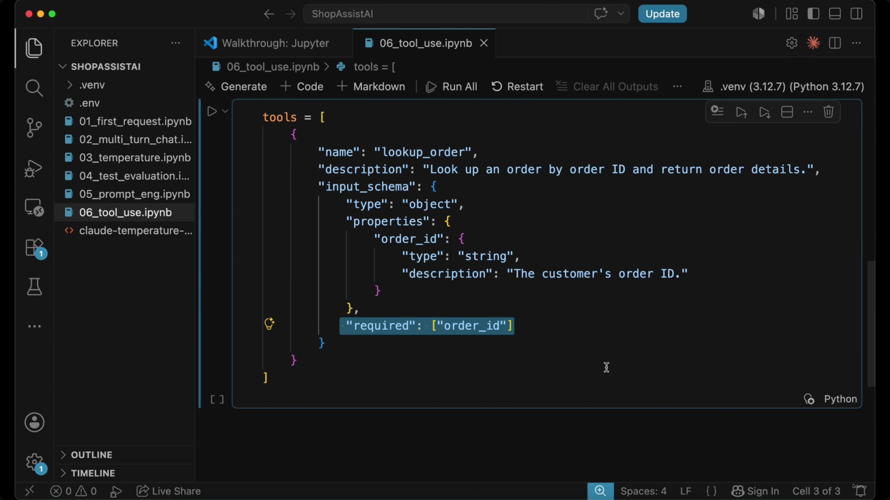

- **[Slide detail — correction]** The slide note's earlier code snippets (in the "Example: `lookup_order` Tool," "Defining Tools via Schema," "Input Schema as a Contract," and "Sending Tools to the API" sections) write `tools = { ... }` as a single dict. The actual code shown on screen — both in this screenshot and in the completed API call later in the lecture — defines `tools` as a **list containing one dict**: `tools = [ { "name": ..., ... } ]`. The `tools` parameter to `client.messages.create()` always expects a list, even with one tool. The reconstruction above uses the corrected, list-wrapped form.

---

## 4. Sending the tools and reading back the first `tool_use` response

- To enable tool use, the `tools` list is passed into `client.messages.create()` alongside the customer's message.
- **Identifying a tool request:** check `message.stop_reason`.
  - A normal text response → `stop_reason` is usually `end_turn`.
  - A tool request → `stop_reason` is `tool_use`.
- `message.content` then contains the tool call details — which tool, and what arguments.

Here is the completed call and the **actual output** captured on screen:

```python
tools = [
    {
        "name": "lookup_order",
        "description": "Look up an order by order ID and return order details.",
        "input_schema": {
            "type": "object",
            "properties": {
                "order_id": {
                    "type": "string",
                    "description": "The customer's order ID."
                }
            },
            "required": ["order_id"]
        }
    }
]

message = client.messages.create(
    model=model,
    max_tokens=500,
    tools=tools,
    messages=[
        {"role": "user", "content": "Can I return order 12345?"}
    ]
)

print(message.stop_reason)
print(message.content)
```

```text
tool_use
[TextBlock(citations=None, text='Let me look up that order for you right away!', type='text'),
 ToolUseBlock(id='toolu_01R3pqBvR8J6Ndc4LKNx6ZWi', caller=DirectCaller(type='direct'),
              input={'order_id': '12345'}, name='lookup_order', type='tool_use')]
```

- **[Slide detail]** Two things about this real output aren't called out in the slide bullets or transcript:
  - Claude's response contains **two content blocks**, not just the tool call: a `TextBlock` ("Let me look up that order for you right away!") *followed by* the `ToolUseBlock`. Claude can narrate what it's about to do in the same turn it requests a tool.
  - The `ToolUseBlock` carries a `caller=DirectCaller(type='direct')` attribute — an SDK-level field not mentioned anywhere in the slide text, alongside the fields that *are* discussed (`id`, `input`, `name`, `type`).

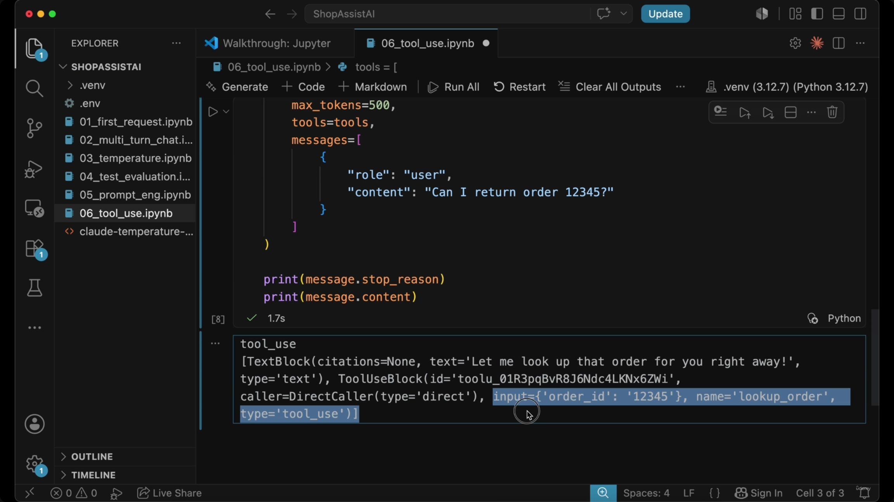

*(The lecture briefly shows the code being typed incrementally in the editor — a `tools=[...]` autocomplete popup, then the `messages=[...]` block being filled in — before landing on this completed, executed state. Those in-progress keystrokes are omitted here since nothing in the finished cell above is missing from them.)*

### The crucial distinction: Claude requests, your backend executes

- Claude does **not** call your database or execute any external code. It only produces a structured request — conceptually: *"I need you to call [tool_name] with [these arguments]."*
- Your backend is responsible for: (1) taking the structured request, (2) calling the real function/database, (3) returning the result to Claude.

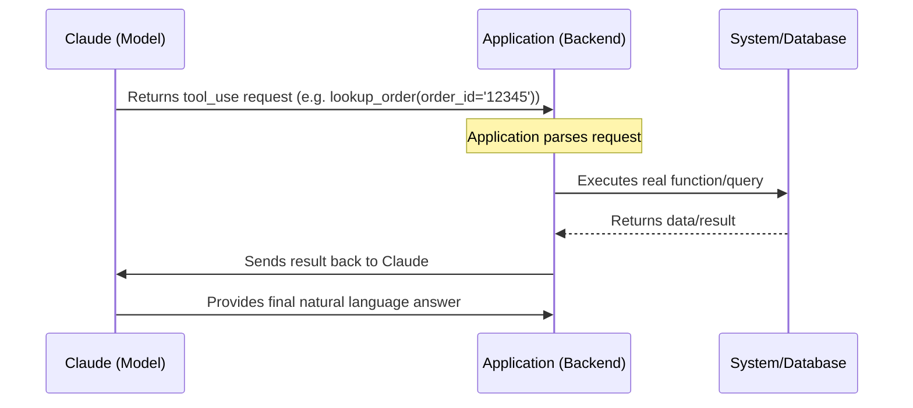

> **Transcript color:** "That is one of the most important ideas in tool use. Claude suggests the tool call. Your application performs the tool call."

---

## 5. Why tool use matters

| Scenario | Claude's Behavior | Result |
|---|---|---|
| Without tools | Answers based only on conversation | Potentially wrong/hallucinated answers (e.g. "Yes, your order is probably eligible for return") |
| With tools | Requests to look up data first | Grounded in real-world facts |

> Claude can request a tool — but your code decides whether it actually runs.

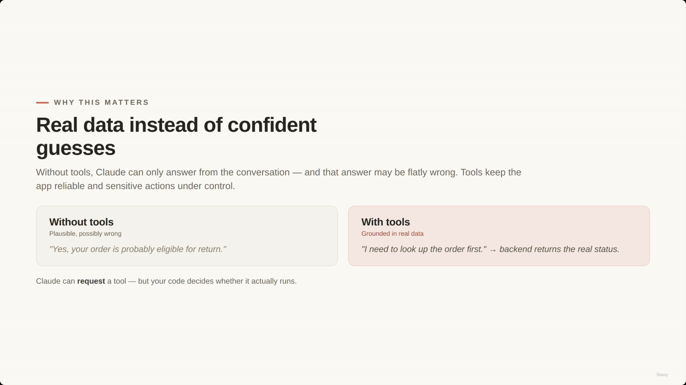

---

## 6. Designing effective tool schemas: weak vs. strong

- **[The Goal]** Schemas must be specific enough that Claude doesn't have to guess what to pass or what it'll get back.

**Weak schema** — vague, no explanation of what the query means or returns:

```python
tools = [
    {
        "name": "query",
        "type": "string",
        "required": ["query"]
    }
]
```

**Strong schema** — clear purpose, descriptive field name, detailed description:

```python
tools = [
    {
        "name": "lookup_order",
        "description": "Look up an order by order ID and return order details.",
        "input_schema": {
            "type": "object",
            "properties": {
                "order_id": {
                    "type": "string",
                    "description": "The customer's order ID."
                }
            },
            "required": ["order_id"]
        }
    }
]
```

- No dedicated slide screenshot survives for this weak/strong comparison specifically — see the misattribution note in the next section for why.

---

## 7. Narrow schemas and required fields as a contract

- **[The Pattern]** Good tools are **narrow** (focused on one task), **well-named**, and **clearly described**. Vague tools make tool use less reliable because Claude has to guess.
- **Required fields keep Claude honest.** If a tool needs specific inputs the user hasn't provided, Claude shouldn't fabricate them — it should ask a follow-up question instead.

**Example: `create_return_request`** — three required fields: `order_id`, `item`, `reason`.

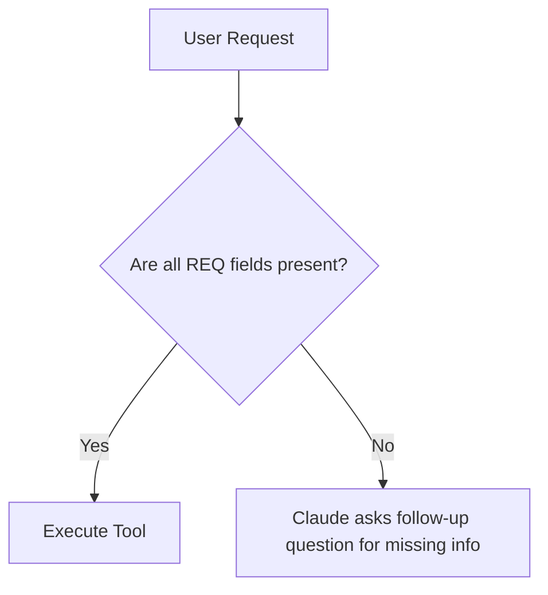

- Missing information becomes **visible** — the gaps are part of the contract, not something Claude papers over.
- This keeps a clean boundary between Claude's reasoning and backend logic.

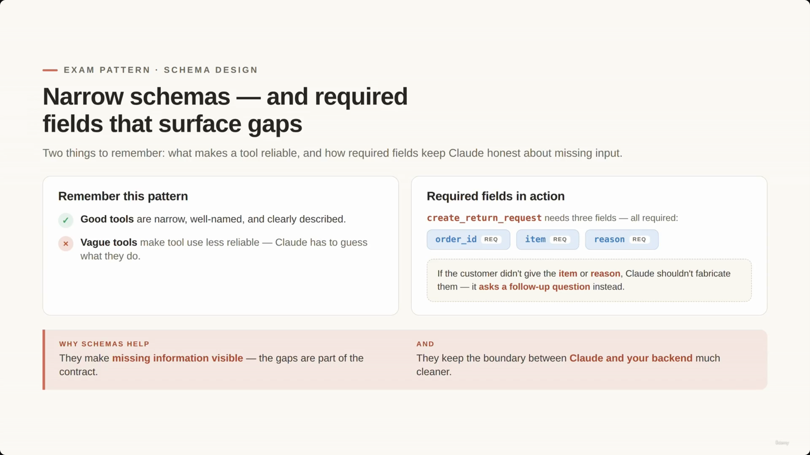

> **[Misattribution caught]** The original slide note places this exact screenshot at 00:04:22 under its "Example: Strong Tool Schema" heading. But the image itself — titled "Narrow schemas — and required fields that surface gaps," with the `create_return_request` / `order_id` / `item` / `reason` REQ badges — is visually and topically the slide for *this* section (Narrow Schemas and Required Fields), not the weak/strong schema comparison. The capture appears to have lagged the actual slide transition. It's placed here, at its correct home, instead. (The two later copies of this same slide, timestamped 00:04:51 and 00:05:00 in the original notes, are the same capture repeated while the narrator kept talking — dropped as duplicates.)

---

## 8. Controlling tool use: the three `tool_choice` modes

- By default, Claude decides whether to use a tool at all — this is `auto` tool choice.

| Mode | `tool_choice` value | Behavior | Best used when… |
|---|---|---|---|
| **auto** (default) | `{"type": "auto"}` | Claude may answer normally *or* request a tool — its call | The general case: e.g. a return-policy question might get answered from system instructions, but "Is order 12345 eligible?" triggers `lookup_order` |
| **any** | `{"type": "any"}` | Claude must use a tool, but chooses which one from the list | A middle ground — Claude must act, but retains flexibility over which tool |
| **tool** (forced/pinned) | `{"type": "tool", "name": "lookup_order"}` | Claude must use this one specific tool every time | A dedicated extraction step where the application needs structured arguments every time, not a conversational reply |

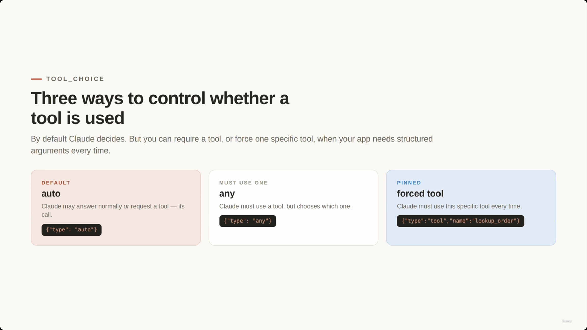

> **[Factual correction]** The slide note's own comparison table (in "Three Ways to Control Tool Use") writes the forced-tool example as `"type": "tool", "value": "lookup_order"`. The actual on-screen code in this screenshot uses **`"name"`**, not `"value"`: `{"type":"tool","name":"lookup_order"}` — which also matches the real Anthropic Messages API syntax for `tool_choice`. The table above uses the corrected field name.

> **Transcript color:** "Use auto when Claude may or may not need a tool. Use any when Claude must use a tool, but the choice is flexible. Use a forced tool when your application requires one specific tool."

---

## 9. ShopAssist example: where the handoff happens

- **Scenario:** *"Hi, I want to return order 12345. It arrived yesterday, but the box was damaged."*
- This lecture covers only **step one** — the lookup. Later steps (policy verification, actually creating the return request) come in future lectures.

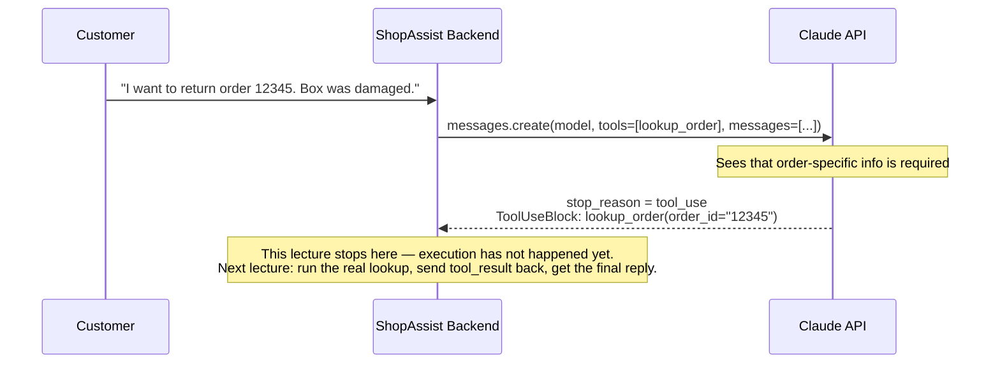

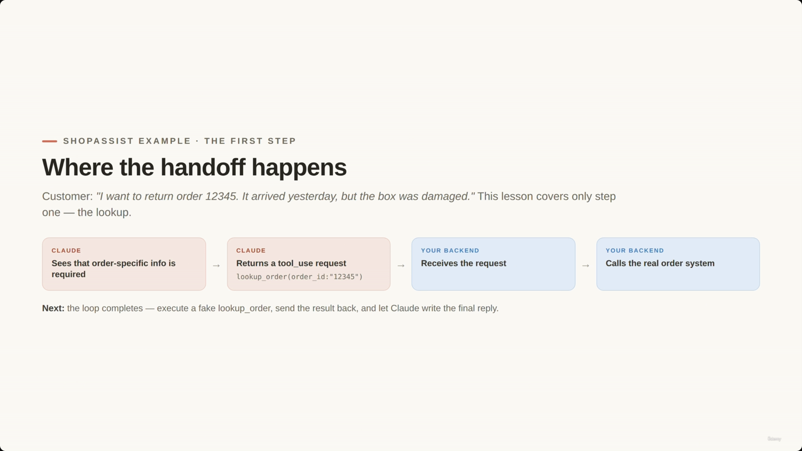

> **Transcript color:** "Let's connect this back to ShopAssist... In this lesson we only focus on the first step. Claude receives the message, sees that order-specific information is required, and returns a tool use request for lookup order. Our backend receives that request. Then our backend calls the real order system."

The full assistant workflow eventually spans three stages — **order lookup → policy verification → action execution** — but this lecture's diagram and code stop at the first tool-use request; the actual execution and reply loop is built out in the next lecture.

---

## 10. Tools as a structured interface — the division of labor

- A tool is not Claude directly reaching into your database. It's a structured interface *your application* exposes. Claude **requests**; your backend **executes**.
- Deterministic business logic belongs in your code, not in the prompt — prompts and schemas guide and structure Claude's *requests*, but your backend remains the ultimate authority on validation and security.

| Claude's side (guides & structures) | Your backend's side (executes & enforces) |
|---|---|
| Prompt instructions guide behavior | Runs the real function |
| Tool schemas structure the requests | Validates permissions & business rules |
| Returns a `tool_use` block — never executes | Handles errors, decides what's safe to return |

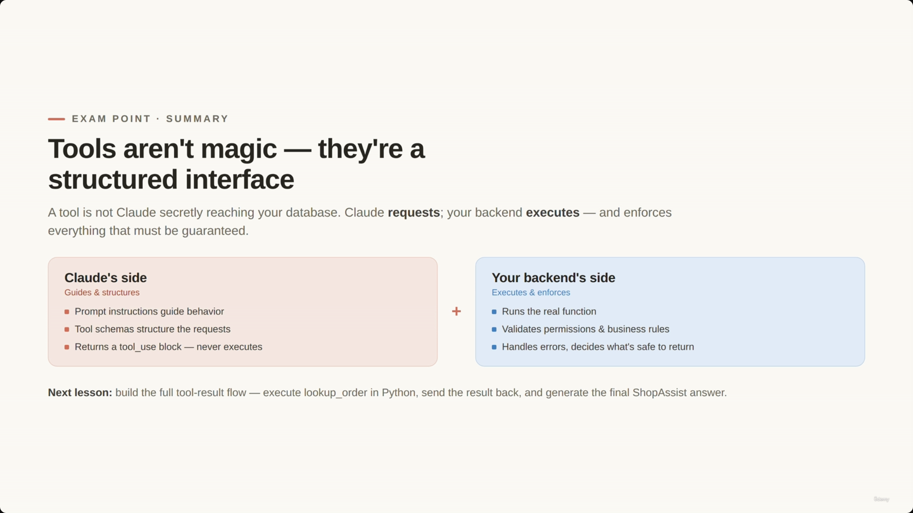

> **[Duplicate capture, misfiled section]** The original slide note also places a copy of this exact same "Tools aren't magic — they're a structured interface" slide at 00:06:52, filed under a separate "The Foundation of Multi-Step Workflows" heading (the three-stage order-lookup → policy-verification → action-execution list in section 9 above). That heading's own content never got a distinct slide capture — the capture tool grabbed this later slide early, before the deck had actually advanced to it. Both timestamped copies are the same image; it's kept once, here, at its actual (later) position, and the "Foundation" bullets are folded into section 9 above without a redundant image.

> **Transcript color:** "A tool is not Claude directly accessing your database. It is a structured interface exposed by your application... So prompts can guide Claude and schemas can structure Claude's requests. But deterministic business logic should stay in code."

*(The slide note's closing "Summary: Tools as a Structured Interface" section restates this exact table and these exact bullets a second time — consolidated here rather than repeated.)*

---

## Summary

- **Tool use is the bridge to real data.** Claude must not guess at things like order eligibility — it requests a tool, and your backend supplies the real answer.
- **A tool schema is a contract:** `name` (exact identifier), `description` (when/why to use it), `input_schema` (typed `properties` + `required` list). The API expects `tools` as a **list** of these schema dicts, even for a single tool.
- **Reading a tool request:** `stop_reason == "tool_use"` (vs. `"end_turn"` for a normal reply); `message.content` may contain a `TextBlock` alongside the `ToolUseBlock` — Claude can narrate before it requests.
- **Claude only ever requests — it never executes.** Your backend takes the structured request, runs the real function, and sends the result back.
- **Good schemas are narrow, well-named, clearly described**, and use `required` fields to force missing information into the open rather than let Claude fabricate it.
- **Three `tool_choice` modes:** `auto` (Claude decides), `any` (must use *a* tool, picks which), `tool` with a `name` (forced to one specific tool) — use forced choice for dedicated structured-extraction steps.
- **This lecture ends at the request.** ShopAssist gets as far as Claude returning `lookup_order(order_id="12345")`; actually executing it, sending back `tool_result`, and letting Claude write the final grounded reply is the next lecture's build.

---

*Sources: [slide notes](../15-ToolSchemas-ToolChoice-And-FirstToolUse.md) · [[hover-notes-transcripts/15-ToolSchemas-ToolChoice-And-FirstToolUse (transcript)|full transcript]]*
