# Structured Output With Tool Use, JSON Schema & Tool Output

> Lecture 15 introduced `tool_use` for triggering a real action (a tool call the app then executes and feeds a result back to Claude). This lecture repurposes the exact same mechanism for a different job: **forcing Claude to emit reliable, parseable data** instead of running any action at all. The tool is never actually "executed" — its `input` *is* the answer.

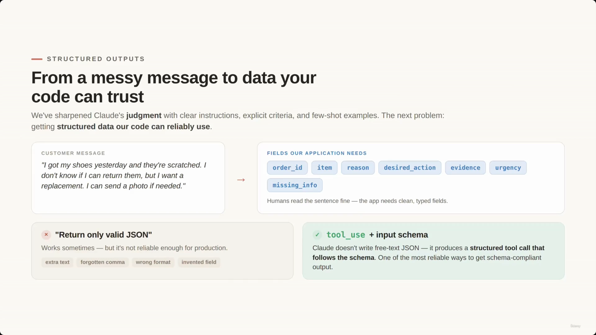

## From a messy message to data your code can trust

- **[The Goal]** Turn a messy customer message into fields the application can trust and act on.
  - Example messy message: *"I got my shoes yesterday and they're scratched. I don't know if I can return them, but I want a replacement. I can send a photo if needed."*
- **[The Transformation]** Humans read that sentence fine — the application needs clean, typed fields instead: `order_id`, `item`, `reason`, `desired_action`, `evidence`, `urgency`, `missing_info`.

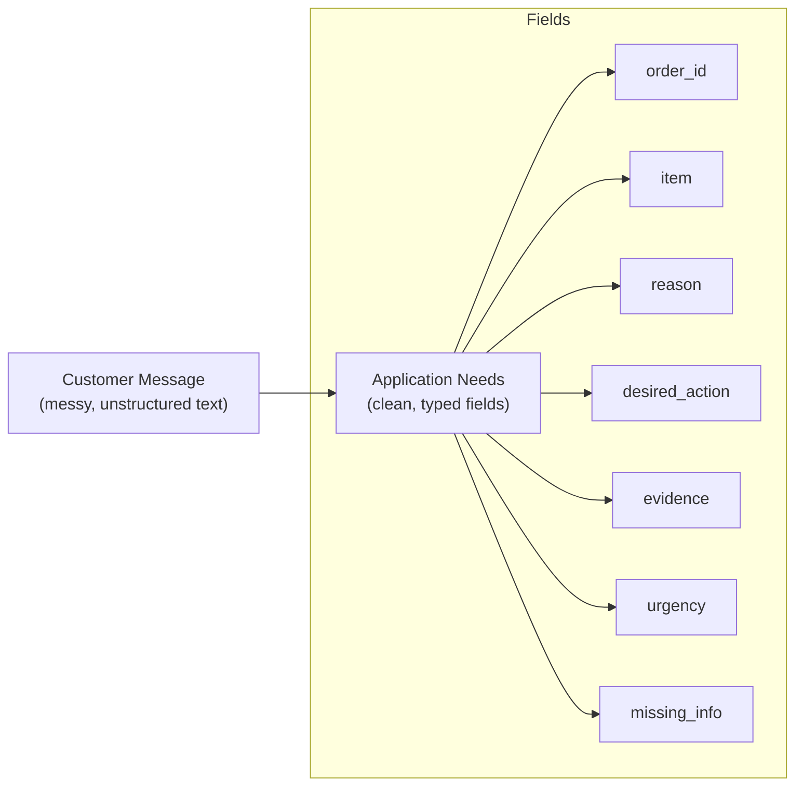

> **Transcript color:** "As humans, we understand this message. But for an application, we need something more structured... A common beginner approach is to ask the model, return only valid JSON. This can work sometimes, but it is not the most reliable approach."

**Note on the screenshots:** the slide-note originally cited this same "messy message" title slide three times (as the frontmatter cover, again at 00:00:22, and again at 00:00:52 under the *Approaches to Structured Output* header). All three captures are pixel-identical — the video simply held on this slide while the narrator kept talking. Only one copy is kept here as the lecture's hero image.

---

## Two approaches to structured output

| Approach | Characteristics |
|---|---|
| **"Return only valid JSON"** (prompting) | Simple, but not reliable enough for production — the model can add conversational text around the JSON, forget a comma, use the wrong format, or invent/invert a field. |
| **`tool_use` + input schema** | Claude doesn't write free-text JSON at all — it produces a structured tool call that strictly follows the schema. One of the most reliable ways to get schema-compliant output. |

### The beginner approach, in code

The notebook first shows the unreliable version — a plain prompt asking for JSON, with no schema at all:

```python
message = client.messages.create(
    model=model,
    max_tokens=500,
    temperature=0,
    messages=[
        {
            "role": "user",
            "content": """
Extract the return request from this customer message.
Return only valid JSON.

Customer message:
I got my shoes yesterday and they are scratched.
I want a replacement. I can send a photo if needed.
"""
        }
    ]
)

print(message.content[0].text)
```

- **[The Weakness]** The structure exists only in the prompt's instructions — Claude has to *infer* the fields. It may return good JSON, but the application is still dependent on text formatting, and if the response isn't valid JSON the parser can fail.

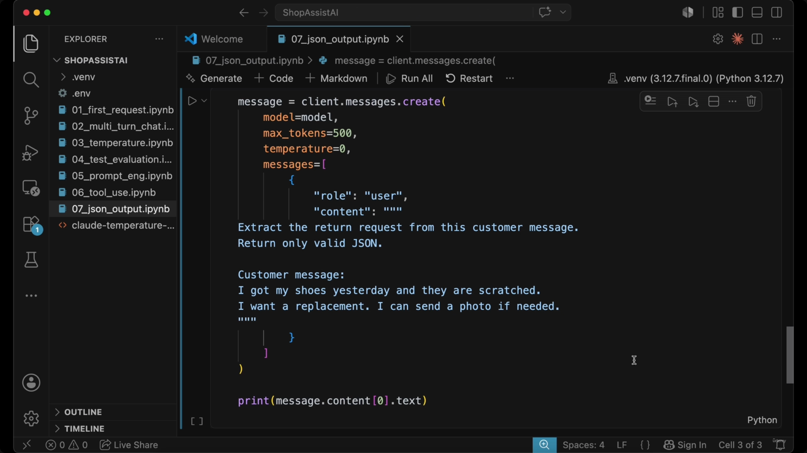

---

## Defining structure as a tool

Instead of prompting for JSON, the required structure is defined as a tool the model is given (same `tools` list mechanism as lecture 15), but here the tool is never actually run — Claude is only ever asked to *fill in its input*.

- **Tool Name**: `extract_return_request`
- **Description**: "Extract a structured return request from a customer support message."
- **Input Schema**: defines the exact properties and types required.

> **Transcript color:** "Claude does not just write JSON as plain text. Instead Claude produces a structured tool call that follows the schema we defined. This is one of the most reliable ways to get schema-compliant structured output."

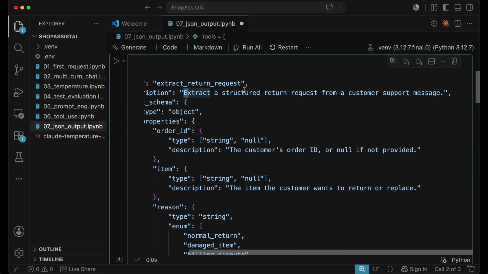

### Schema design: required vs. nullable

- **[Key Distinction]** A field being *mandatory in the structure* is different from its *value being mandatory in the content*.
  - **Required** — the field must exist in the JSON object.
  - **Nullable** — the value of that field can be `null` if the information is missing.
- **[Why this matters]** This combination stops Claude from "inventing" data to satisfy a requirement — instead of hallucinating an `order_id`, it can safely return `"order_id": null`.

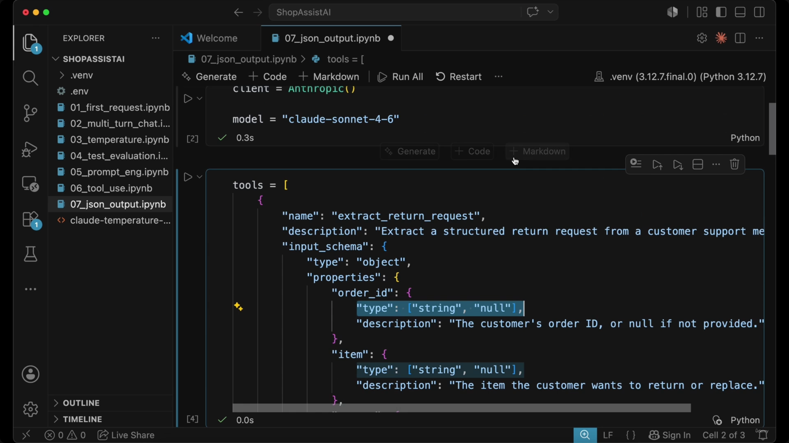

**[Factual inconsistency worth flagging]** The slide-note's own reconstructed "first" schema code block shows `order_id` and `item` as plain `"type": "string"` (not yet nullable), with a *separate*, later code block introducing `"type": ["string", "null"]`, as if the nullable typing were added as a second step. The actual notebook screenshot at this point in the recording already shows `order_id` and `item` as `"type": ["string", "null"]` from the very first moment the schema is visible on screen — the demo never actually had a required-only, non-nullable version of this tool. The nullable pattern is present from the start; treat the schema below (reconstructed from the screenshots) as the authoritative version rather than the slide-note's staged two-step retelling.

Continuing to scroll through the same schema reveals the enum-based `reason` field, plus `reason_detail` and the start of `desired_action`:

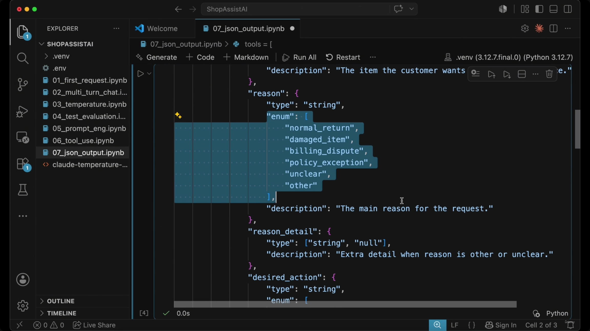

Reconstructing the tool definition as actually shown on screen (combining what's visible across the 01:49, 02:05, and 02:24 captures — these are the same notebook cell, just scrolled to different portions, not separate build states):

```json
{
  "name": "extract_return_request",
  "description": "Extract a structured return request from a customer support message.",
  "input_schema": {
    "type": "object",
    "properties": {
      "order_id": {
        "type": ["string", "null"],
        "description": "The customer's order ID, or null if not provided."
      },
      "item": {
        "type": ["string", "null"],
        "description": "The item the customer wants to return or replace."
      },
      "reason": {
        "type": "string",
        "enum": [
          "normal_return",
          "damaged_item",
          "billing_dispute",
          "policy_exception",
          "unclear",
          "other"
        ],
        "description": "The main reason for the request."
      },
      "reason_detail": {
        "type": ["string", "null"],
        "description": "Extra detail when reason is other or unclear."
      },
      "desired_action": {
        "type": "string",
        "enum": ["...visible on screen but cut off before the values scrolled past"]
      }
      // "...schema continues off-screen: desired_action_detail, evidence_provided,
      //  urgency, missing_information — inferred from the structured_data output
      //  example below, but their field definitions were never actually captured
      //  in a screenshot. Flagging this as a gap rather than fabricating them."
    }
    // "required" array not visible in any captured screenshot — also a gap.
  }
}
```

**[Slide detail / gap]** Neither the slide-note nor any captured screenshot shows the complete tail of this schema (the rest of `desired_action`'s enum, `desired_action_detail`, `evidence_provided`, `urgency`, `missing_information`, or the `required` array). Their existence is only inferable from the final `structured_data` output example later in the lecture (see below) — the schema fields that *produce* that output were never shown on screen. This is a genuine content gap, not an omission on this note's part.

### Advanced schema design strategies

- **Enums for categorization** — restricts Claude to a fixed set of allowed values, preventing random/inconsistent labels (e.g. "product issue" instead of `damaged_item`).
- **Handling ambiguity** — an `unclear` enum value lets Claude explicitly signal "intent not understood" instead of forcing a bad classification.
- **The "Other + Detail" pattern** — an `other` enum value paired with a nullable `reason_detail` field lets Claude capture information that doesn't fit the existing categories while still preserving context.

```python
"reason": {
    "type": "string",
    "enum": [
        "normal_return",
        "damaged_item",
        "billing_dispute",
        "policy_exception",
        "unclear",
        "other"
    ],
    "description": "The main reason for the request."
},
"reason_detail": {
    "type": ["string", "null"],
    "description": "Extra detail when reason is other or unclear."
}
```

> **Transcript color:** "This prevents random labels like product issue or return problem when our system expects damaged item or normal return... If the customer message doesn't fit our categories, Claude can choose other and explicitly [give] the case in reason detail. This gives us controlled structure without losing flexibility."

---

## Forcing structured output with `tool_choice`

Cross-referencing lecture 15: there, `tool_choice` (or its absence) let Claude *decide* whether to call a tool. Here it's used deliberately to **force** the specific extraction tool every single time, so Claude always returns a `tool_use` block instead of a conversational text answer.

```python
message = client.messages.create(
    model=model,
    max_tokens=500,
    temperature=0,
    tools=tools,
    tool_choice={
        "type": "tool",
        "name": "extract_return_request"
    },
    messages=[
        {
            "role": "user",
            "content": f"""
Extract the return request from this customer message.

Use these normalization rules:
- If the customer did not provide an order ID, set order_id to null.
- If the customer says they can provide evidence later, evidence_provided is false.
- Use damaged_item only when the item arrived broken, scratched, defective, or unusable.
- Use unclear when the message does not contain enough information to choose confidently.

Customer message:
{customer_message}
"""
        }
    ]
)
```

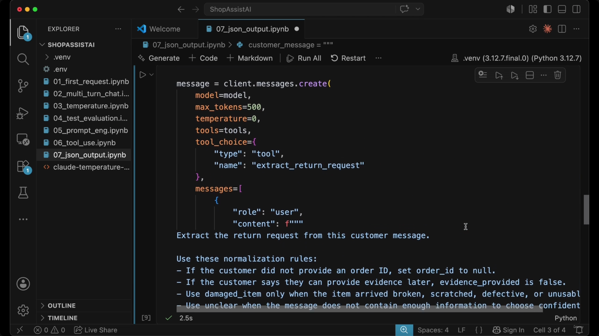

### Extracting the structured data

The extraction code below appears earlier in the same notebook cell (captured at 00:03:19, just before the `message.create()` call above was scrolled into view — the recording revealed the bottom of the cell slightly before the top, so it's presented here in logical top-to-bottom order rather than capture order):

```python
tool_use = next(
    block for block in message.content
    if block.type == "tool_use"
)
structured_data = tool_use.input
print(structured_data)
```

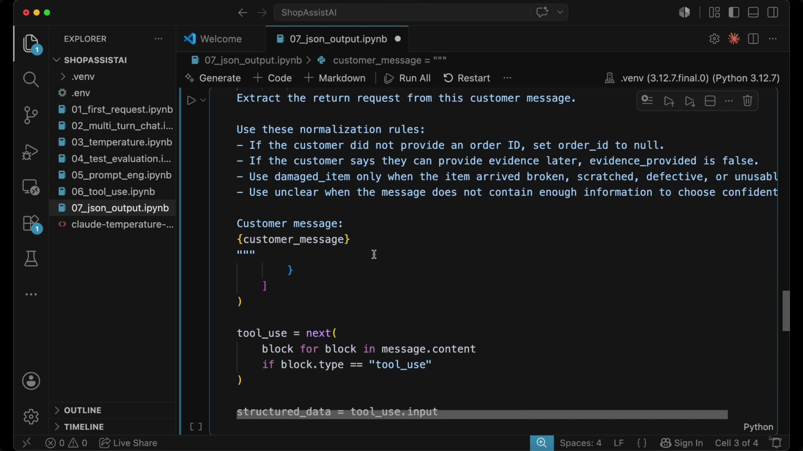

- **[Practical Applications]**
  - Save the extracted data directly to a database
  - Route requests to specific automated workflows
  - Programmatically ask the customer for missing information
  - Trigger escalations based on specific reasons or urgency levels

Example output of `structured_data` (a plain Python dict — no parsing, no JSON string to fail on):

```python
{
    'order_id': None,
    'item': 'shoes',
    'reason': 'damaged_item',
    'reason_detail': None,
    'desired_action': 'replacement',
    'desired_action_detail': None,
    'evidence_provided': False,
    'urgency': 'normal',
    'missing_information': ['order_id']
}
```

Note that this output dict is the first place several fields (`desired_action_detail`, `evidence_provided`, `urgency`, `missing_information`) are confirmed to exist at all — consistent with the schema gap flagged above.

---

## `tool_choice`: may / must / must-use-one-specific

- The `tool_choice` setting controls how Claude decides whether to use a tool at all:
  - **may use a tool** — optional (Claude chooses)
  - **must use a tool** — enforced tool use, but Claude picks which one (if several are available)
  - **must use one specific tool** — forced selection, exactly what `{"type": "tool", "name": "extract_return_request"}` does above
- **[Why forced selection here]** In structured-extraction workflows you almost always want the structured object, never a conversational reply — forcing one specific tool guarantees that.

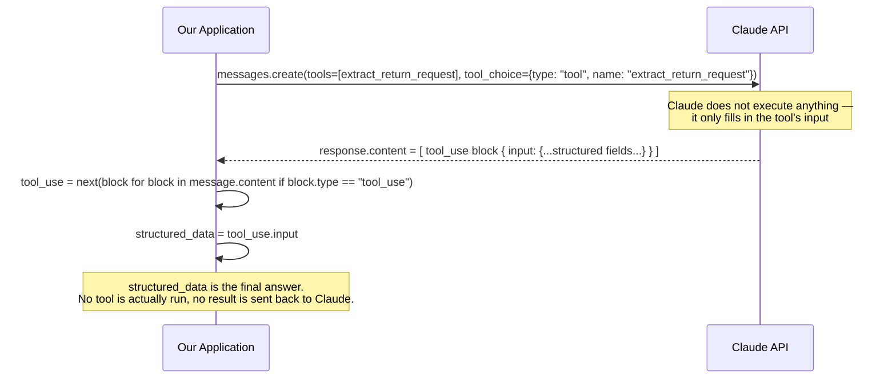

**Architectural contrast with lecture 15:** in a real-action tool call, the round trip continues — the app executes the tool, sends a `tool_result` back to Claude, and Claude produces a final natural-language reply. Here the loop stops at one turn: the `tool_use.input` **is** the deliverable, so there is no execution step and no second call back to Claude.

---

## The limits of schema validation

- A strict schema is effective at preventing **syntax and formatting** errors: it ensures the output contains all expected fields, that enum values belong to the allowed list, and that fields like `missing_information` follow the defined format (e.g. an array).
- **[The Critical Limitation]** Schemas do not guarantee **semantic correctness**. A schema controls the *shape* of the answer; instructions, criteria, and examples control the *quality* of the decision.

| Aspect | Controlled by schema? | What it ensures | Example |
|---|---|---|---|
| Structure | Yes | Shape and format | Correct fields, valid enums, correct types |
| Judgment | No | Semantic meaning | The model's reasoning and accuracy of the choice |

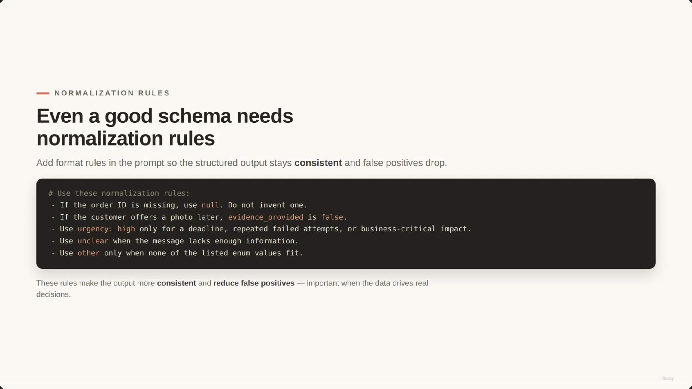

- **[The Problem]** Claude might follow the schema perfectly but still make an incorrect semantic choice — e.g. marking a message as `urgency: high` when nothing in the text justifies it, or picking `normal_return` when it should be `damaged_item`.
- **[The Solution]** Combine schemas with good prompt instructions, explicit criteria, examples, and evaluation tests. Tool use and schemas solve the **structure problem**; they do not solve the **judgment problem** on their own.

> **Transcript color:** "So tool use solves the structure problem. But we still need good prompt instructions, explicit criteria, examples and evaluation tests to solve the judgment problem... Structure and judgment are different problems. A schema controls the shape of the answer. Criteria control the quality of the decision."

---

## Normalization rules

Even with a good schema, add explicit normalization rules to the prompt to keep output consistent and reduce false positives:

- If the order ID is missing, use `null`. Do not invent one.
- If the customer offers a photo later, `evidence_provided` is `false`.
- Use `urgency: high` only for a deadline, repeated failed attempts, or business-critical impact.
- Use `unclear` when the message lacks enough information.
- Use `other` only when none of the listed enum values fit.


**Duplicate capture noted:** the slide-note also cited this exact same "normalization rules" slide at 00:04:06, filed under the earlier *Extracting and Using Structured Data* header. That placement was a chronological mis-file — the 04:06 capture is pixel-identical to this one and belongs here, not there (the video had already moved on to the normalization-rules slide by 04:06, but the note's own section boundaries lagged behind). Only one copy is kept.

- **[Why it matters]** These rules make structured output more consistent and reduce false positives — important because, in ShopAssist, extracted data drives real workflow decisions.

### Workflow routing examples

| Extracted data | Resulting workflow |
|---|---|
| `damaged_item` | Goes to the replacement workflow |
| `billing_dispute` | Goes to the billing team |
| `policy_exception` | Requires escalation |
| `order_id = null` | Triggers a follow-up question instead of a return authorization |

**[Gap]** The slide-note places a screenshot (00:06:32) right after this table, but that capture is not a table at all — it's pixel-identical to the final "When and how to use structured output" summary slide shown again at 00:06:44 (see Summary, below). No screenshot of this routing-examples table was actually captured; the table content comes from the slide-note's own bullets and the transcript only. Both instances of the summary-slide duplicate are represented once, in the Summary section where they actually belong.

> **Transcript color:** "A damaged item may go to a replacement workflow. A billing dispute may go to a billing team. A policy exception may require escalation. And a missing order ID may trigger a follow-up question instead of a return authorization."

---

## Summary: when and how to use structured output

| Approach | Characteristics |
|---|---|
| Free-form JSON | Simple, yet fragile — depends on text formatting and can break parsing |
| `tool_use` + JSON schema | Structured by construction — gives a structured tool input the application can extract directly |

- **When** — reach for `tool_use` + JSON schemas whenever the application needs reliable structured output.
- **How: the schema** — strict, yet practical. Combine `required` fields, `nullable` values, `enum`s, and an `unclear` / `other` + detail-field default.
- **How: control** — use `tool_choice` to decide whether Claude *may* use a tool, *must* use a tool, or *must use one specific* tool.

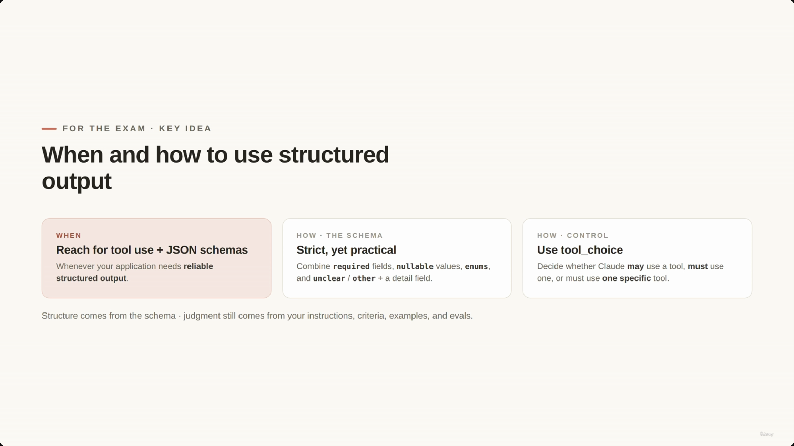

> **Core Principle:** Structure comes from the schema; judgment still comes from your instructions, criteria, examples, and evals.

**[Key Reminder]** Schemas improve reliability, but they don't replace good instructions. Nullable fields matter because, when the customer doesn't provide an order ID, Claude should return `null`, not a fabricated value.

---

## How this connects to lecture 15

| | Lecture 15: tool use for real actions | Lecture 16: tool use for structured output |
|---|---|---|
| Purpose of the tool | Perform (or trigger) a real action | Shape Claude's answer as typed data |
| What happens with the `tool_use` block | The app executes it, then sends a `tool_result` back to Claude | The app reads `tool_use.input` directly — it *is* the final answer |
| Number of model round trips | Two (or more): request → tool_use → tool_result → final reply | One: request → tool_use, done |
| Role of `tool_choice` | Usually left to "auto" so Claude decides whether/which tool to call | Deliberately forced to one specific tool, every time |

---

## In Plain English

Here's the whole file in plain, everyday language:

**The big picture:** Getting Claude to reliably produce clean data (instead of just hoping it writes valid JSON) is possible — you reuse the "tool" mechanism from the previous lecture, except this time the tool is never actually run.

**1. The problem**
Asking Claude "please just return valid JSON" in plain text is unreliable — it can add extra words, break formatting, or invent a field.

**2. The fix**
Give Claude a tool schema like before — but instead of using it to trigger a real action, you use it purely as a strict form for Claude to fill out. Claude "calling the tool" just means "filling in the form correctly" — nothing gets executed.

**3. A clever trick: required vs. empty**
A field can be required to *exist* in the answer while still being allowed to be empty/`null`. This lets Claude honestly say "I don't know the order number" instead of inventing one just to avoid a blank.

**4. Force it, don't suggest it**
Since you always want the structured form back (never a casual reply), you pin `tool_choice` to force that one specific tool, every single time.

**5. Only one round trip**
Because nothing is executed, the conversation stops right after Claude fills the form — no second call is needed, unlike a real-action tool.

**6. The catch**
A schema only checks that the *shape* is correct (right fields, right types). It does **not** check that Claude's actual decision was right. Claude can fill the form in perfectly and still pick the wrong category.

**One-sentence summary:** Reuse Claude's tool-calling ability to force it to hand back clean, structured data instead of free-text JSON — but remember a valid-looking form is not the same thing as a correct one.

---

*Sources: [slide notes](../16-StructuredOutput-With-ToolUse-JSONSchema-ToolOutput.md) · [[hover-notes-transcripts/16-StructuredOutput-With-ToolUse-JSONSchema-ToolOutput (transcript)|full transcript]]*
