# Validation, Retry Loops, Confidence & Human Review

> Lecture 16 covered getting Claude to return **structured** output via tool_use. This lecture is about what happens *after* that: structured output is not the same thing as *correct* output, so production systems need a validation layer that catches mistakes, retries the fixable ones with specific feedback, refuses to paper over missing information, scores confidence per field, and routes the risky remainder to a human — echoing the model/code/human review split introduced in [[11-Grading-Claude-Outputs-Code-Model-And-Human-Review]].

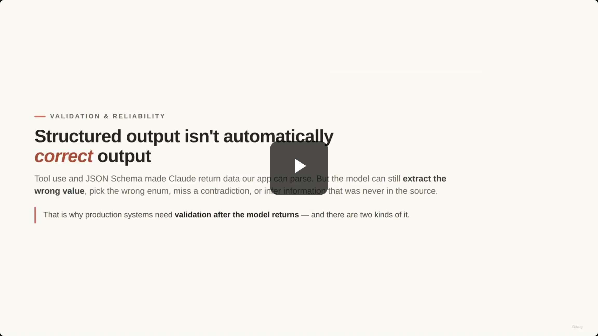

## The Distinction: Structured ≠ Correct

- Tool use and JSON Schema make Claude's output easy for an application to **parse** — but parsing success says nothing about whether the content is right.
- Even with a valid schema, the model can still:
  - Extract the wrong value
  - Pick the wrong enum
  - Miss a contradiction
  - Infer information that was never in the source
- **[The Solution]** Production systems need **validation after the model returns output**, and there are two distinct kinds of it: schema validation and semantic validation.

> **Transcript color:** "Structured output does not automatically mean correct output... This is why production systems need validation after the model returns output."

---

## Schema Validation: The Shape

- Checks the **structural integrity** of the output:
  - Are all required fields present?
  - Are the types correct?
  - Are the enum values valid?
- **Example failure:** `desired_action` must be one of `refund`, `replacement`, `store_credit`, `unclear`. If Claude returns `exchange`, schema validation catches it immediately — this is a shape problem, not a meaning problem.

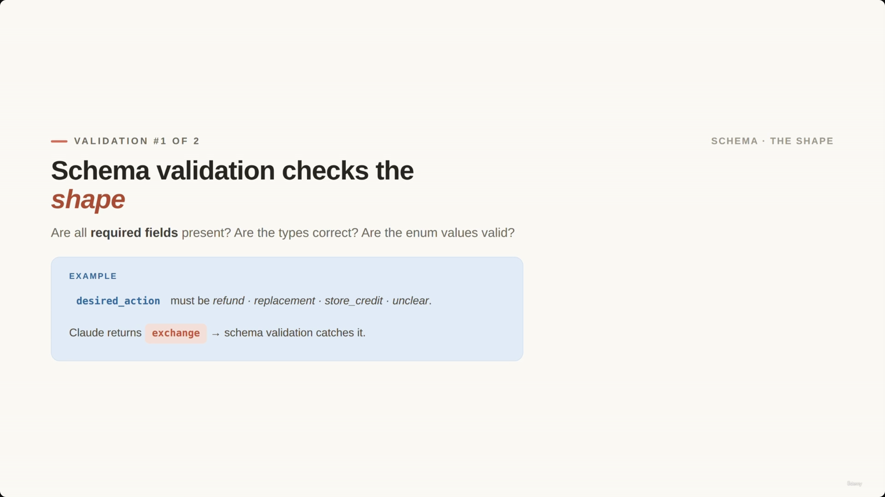

---

## Semantic Validation: The Meaning

- Checks whether the extracted values **make sense** relative to the source text — the JSON can be perfectly valid and still be wrong.
- **Example:** customer message says "I want a replacement," but Claude extracts `desired_action: refund`. The structure passes; the meaning doesn't.

**In ShopAssist**, a return-request extraction carries fields that split into two roles: some carry the answer, others exist purely to drive validation and routing.

| Answer fields | Validation/routing fields |
|---|---|
| `order_id`, `item`, `reason`, `evidence_provided`, `urgency` | `desired_action`, `missing_information`, `confidence`, `conflict_detected`, `human_review_required` |

> **Transcript color:** "In ShopAssist, Claude might extract a return request with fields like order ID, item, reason, desired action, evidence provided, urgency, missing information, confidence, conflict detected, human review required. After extraction, our backend should validate the result."

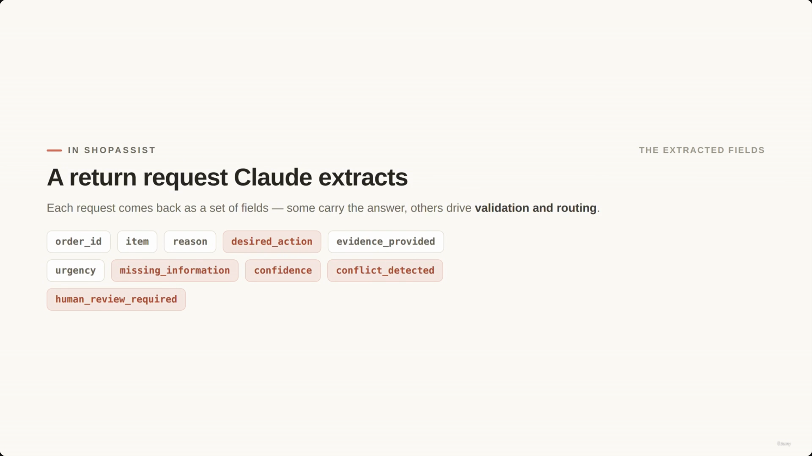

---

## The Retry Loop

- **[The Core Principle]** A good retry is **specific**, not just "try again." A weak retry gives the model no new information, so it tends to repeat the same mistake.
- A strong retry includes:
  1. The original customer message
  2. The failed extraction
  3. The exact validation error
  4. An explicit constraint **not to invent** missing information

> **Example of a specific retry instruction:**
> "Feedback: `desired_action` must be one of `refund` / `replacement` / `store_credit` / `unclear`. You returned `exchange`. Re-extract the return request from the original message. Use `unclear` if the `desired_action` is ambiguous. Do not invent missing information."

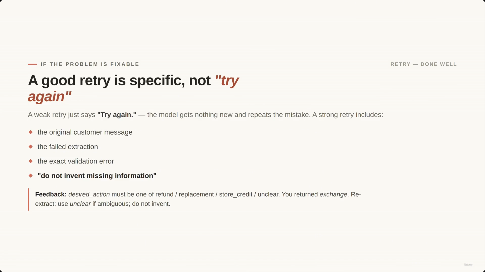

The retry is a closed loop between your backend and Claude: send the message and schema, validate what comes back, and if it fails, resend the original message *plus* the failed extraction *plus* the error *plus* the "do not invent" constraint.

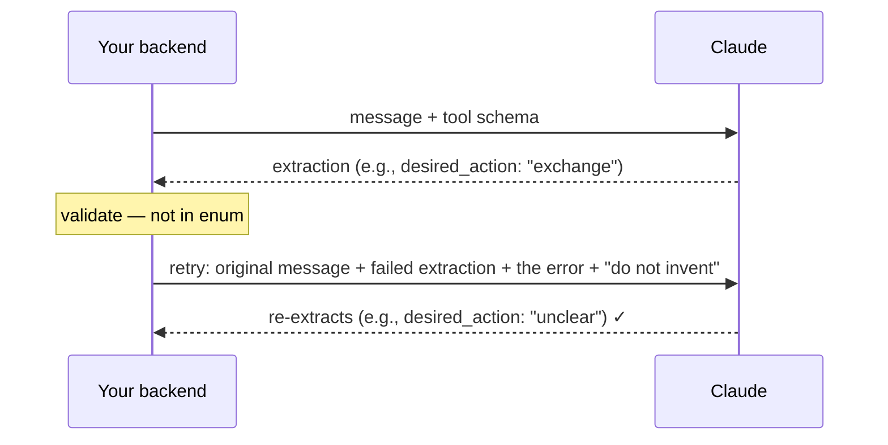
```mermaid
sequenceDiagram
    participant B as Your backend
    participant C as Claude

    B->>C: message + tool schema
    C-->>B: extraction (e.g., desired_action: "exchange")
    Note over B: validate — not in enum
    B->>C: retry: original message + failed extraction + the error + "do not invent"
    C-->>B: re-extracts (e.g., desired_action: "unclear") ✓
```

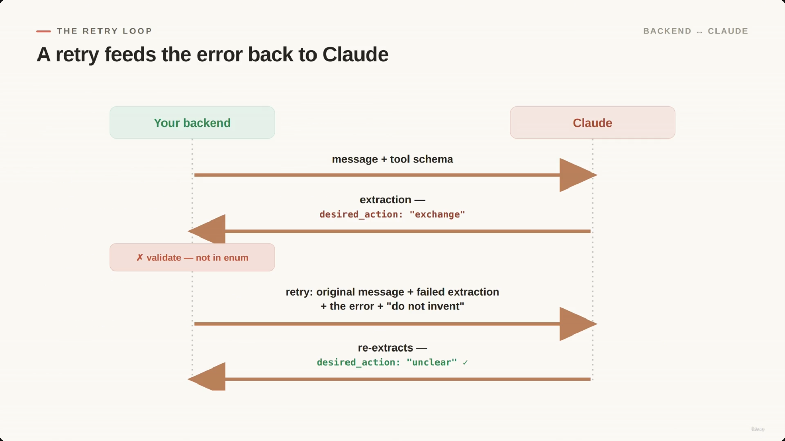

---

## The Limits of the Retry Loop

- **When retries help (fixable mistakes)** — the source contains the right information, but Claude placed it incorrectly or used the wrong format:
  - A wrong enum value
  - A missing required field
  - Wrong field placement
  - A structural mismatch
- **When retries do *not* help (information is absent)** — if the customer never provided the information (e.g. no order ID was ever given), retrying until Claude *guesses* one is the wrong move. Instead:
  - Return `null` for the missing field
  - Add the field to `missing_information`
- **The Golden Rule:** retry when the model made a fixable extraction mistake; do not retry when the source simply does not contain the answer.

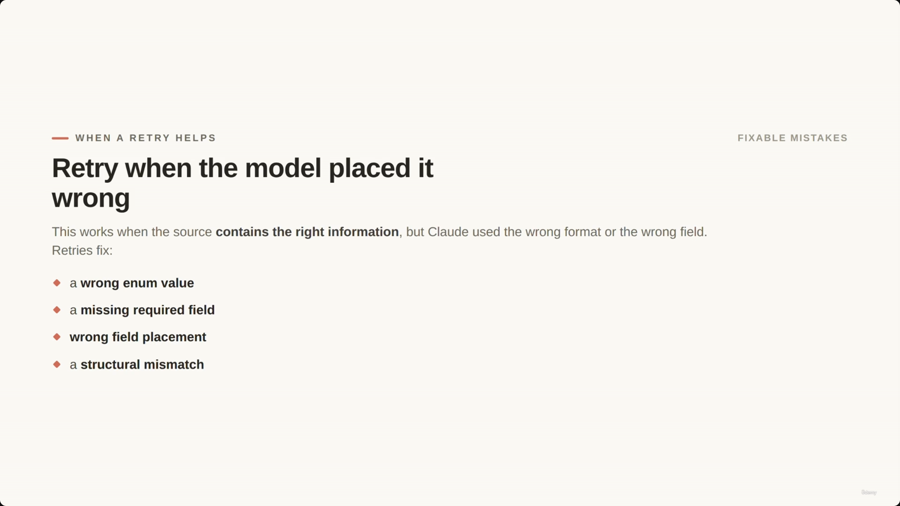

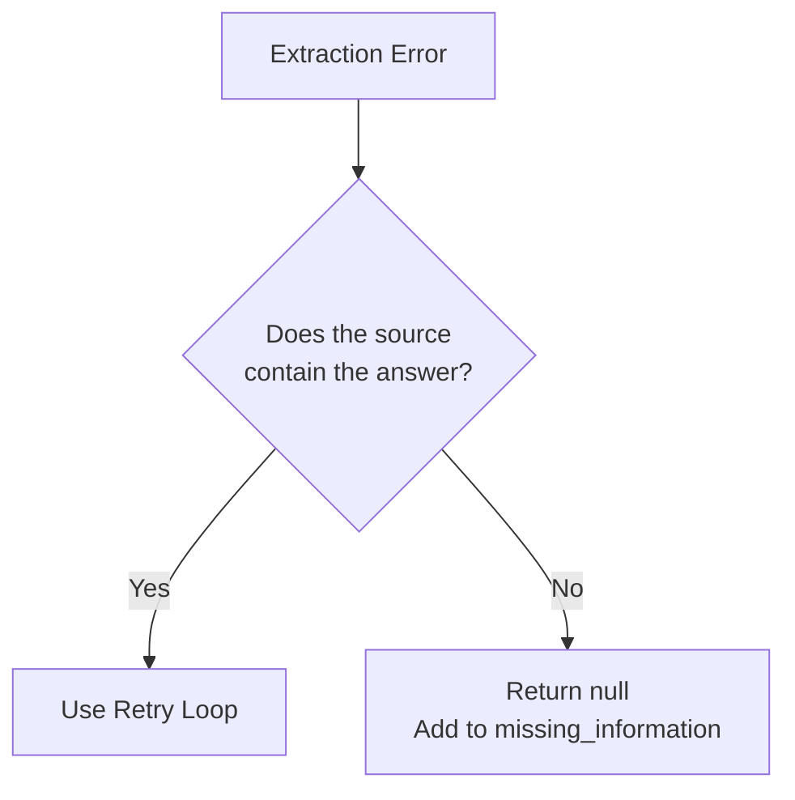
```mermaid
flowchart TD
    A[Extraction Error]
    A --> B{"Does the source<br/>contain the answer?"}
    B -->|Yes| C[Use Retry Loop]
    B -->|No| D["Return null<br/>Add to missing_information"]
```

---

## Handling Contradictions

- **[The Problem]** A message can carry conflicting intent at once — e.g. "I want a refund, but if possible, just send me another one" mentions both refund *and* replacement.
- **[The Solution]** Flag the conflict instead of forcing a single answer; pretending the request is clear is riskier than admitting it isn't.

> **Recommended schema approach:**
> - `desired_action: unclear`
> - `conflict_detected: true`
> - `conflict_reason: "mentions both refund and replacement"`

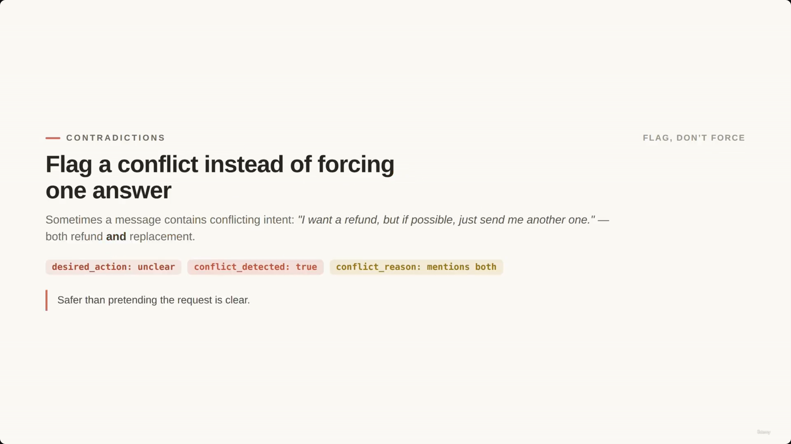

---

## Anatomy of a Production-Ready Prompt

- In production, a prompt is rarely one sentence — it's composed of clear, distinct parts:
  1. **Task** — what should Claude do?
  2. **Context** — what does Claude need to answer correctly?
  3. **Rules** — what should it always/never do?
  4. **Input** — the actual data (e.g. the customer message)
  5. **Output Format** — how should the response look?
  6. **Success Criteria** — what does a good answer look like?
- This structure is what makes the prompt reliable to follow at scale.

**[Gap]** The slide-note text for this section has no matching screenshot in the capture set — every screenshot in this timestamp range (00:03:27–00:03:52, three copies) instead shows the *next* topic, "Verify numbers: stated vs calculated total." The six-part prompt structure above is preserved from the slide note's own bullets, but no slide image of it survives in the capture.

---

## Deterministic Verification for Numbers

- Pattern: separate what a document **claims** from what your code **calculates**, and compare the two.
  - `stated_total` — what the document explicitly says
  - `calculated_total` — what your code sums from the line items
- **[Handling mismatches]** If they don't match, set `conflict_detected: true` and route for review. The model extracts; deterministic code verifies.

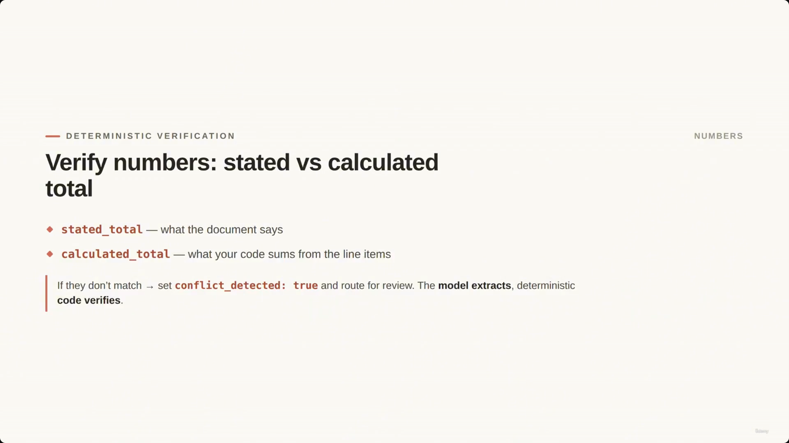

---

## Analyzing Mistakes with Pattern Detection

- A `detected_pattern` field captures the specific reasoning/evidence behind a classification, which helps surface **false positives**.
  - `detected_pattern: damaged_item`
  - `pattern_evidence: "the left side does not work"`
- **[Why use it?]** If ShopAssist keeps misclassifying normal returns as damaged items, this field reveals exactly which words or phrases are driving the mistake — turning a vague accuracy problem into something you can fix in the prompt or logic.

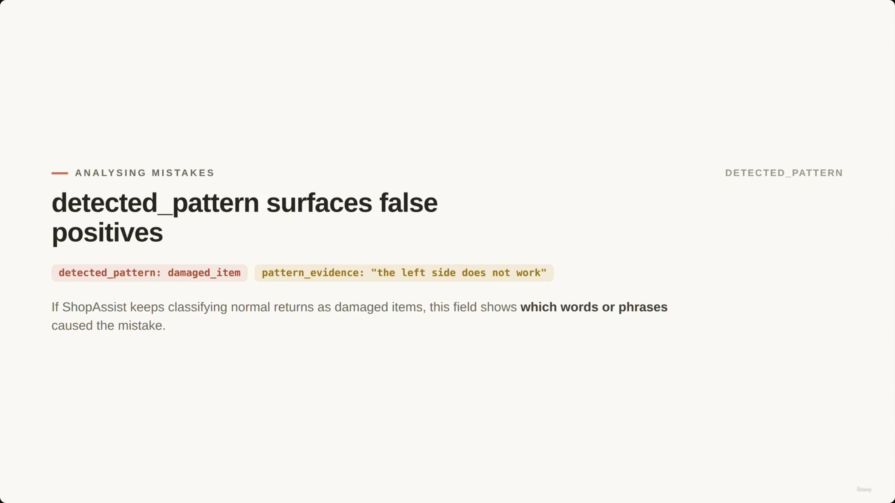

---

## Field-Level Confidence & Calibration

- **[Granularity]** Confidence should be assigned **per field**, not as one global score — an `order_id` may be obvious while `desired_action` is ambiguous.

  ```
  order_id_confidence: high
  item_confidence: high
  reason_confidence: medium
  desired_action_confidence: low
  ```

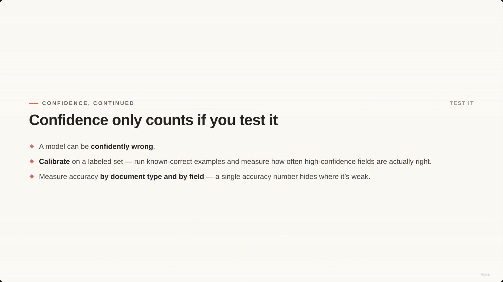

- **[The Risk]** A model can be **confidently wrong** — high confidence does not inherently mean high accuracy.
- **[Calibration]** Test confidence against a labeled validation set: collect examples with a known-correct extraction, run the system, and measure how often "high confidence" fields are actually correct.
- **[Granular accuracy]** Don't rely on one accuracy number — measure it **by document type** (e.g. plain messages vs. receipts/screenshots) and **by field** (e.g. order IDs vs. return reasons), since a single aggregate hides exactly where the system is weak.

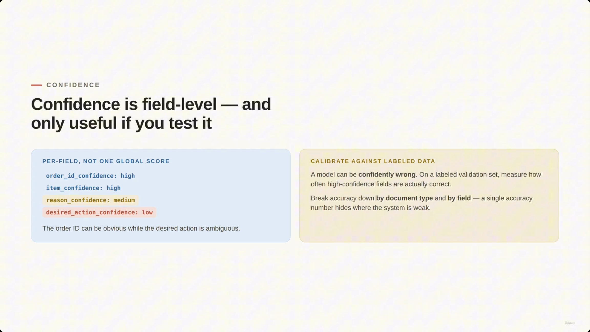

---

## Human Review Routing & Stratified Sampling

- **[The Goal]** Automate the clear cases; escalate the risky ones. Not every case should go to a human — the system should filter for high-certainty work first.
- **Route to a human when:**
  - Confidence is low
  - `conflict_detected` is `true`
  - Required information is missing
  - The customer asks for a policy exception
  - The refund amount is high
  - The extracted request contradicts business rules
- **[Stratified sampling]** Also review a sample of outputs across **high, medium, and low** confidence groups — not just the low-confidence ones. High confidence doesn't guarantee correctness, and sampling across all tiers catches hidden systematic errors that a low-confidence-only review would miss.

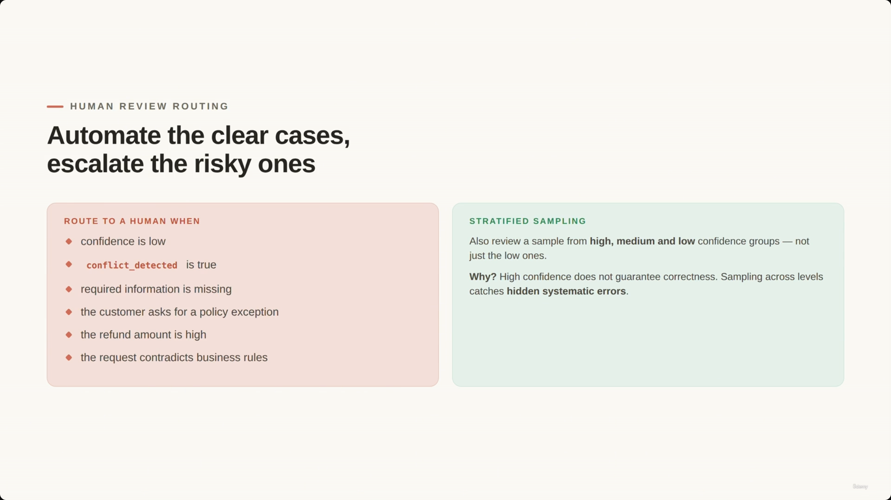

### Confidence/signal → action

| Signal | Example | Action |
|---|---|---|
| High field confidence, no conflicts, no missing info | `order_id_confidence: high` | Automate |
| Medium confidence | `reason_confidence: medium` | Still eligible for stratified sampling review |
| Low confidence on any field | `desired_action_confidence: low` | Human review |
| `conflict_detected: true` | "mentions both refund and replacement" | Human review |
| Required info missing | `order_id` never given | Return `null` + add to `missing_information` (**not** a retry) |
| Policy exception requested | — | Human review |
| High refund amount | — | Human review |
| Contradicts business rules | — | Human review |

---

## The Validation Layer

- **[Core Principle]** Claude extracts — **your application validates**. The LLM owns extraction; the backend owns enforcing business requirements against it.
- **[Error categorization]** different failure types need different recovery strategies:
  - **Fixable (retryable):** the value isn't in the allowed list (e.g. an invalid `desired_action`)
  - **Absent (do not invent):** required information like `order_id` is missing → flag it, never ask the model to invent it
  - **Risky (human review):** the extraction is fundamentally unreliable — `conflict_detected` is `true`, or `desired_action_confidence` is `low`

```python
def validate_return_request(extraction):
    errors = []
    allowed = ("refund", "replacement", "store_credit", "unclear")

# fixable - can be retried
    if extraction["desired_action"] not in allowed:
        errors.append("desired_action invalid")

# absent - do not invent
    if extraction["order_id"] is None:
        extraction["missing_information"].append("order_id")

# risky - require human review
    if extraction["conflict_detected"] or extraction["desired_action_confidence"] == "low":
        extraction["human_review_required"] = True

    return errors, extraction
```

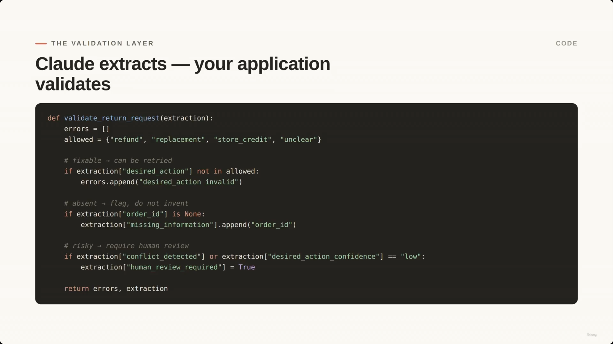

> **Transcript color:** "In a real application, [the] validation layer can include schema libraries, business rules, database checks, policy checks, and review queues. But the architecture stays the same: Claude extracts, your application validates."

---

## The Validation Pipeline (full loop)

Putting the whole lesson together: Claude extracts structured output, schema validation checks its shape, semantic validation checks whether the values make sense, and only then does the result get **routed** — to automation, to a retry with feedback, to a `null`-and-flag, or to a human.

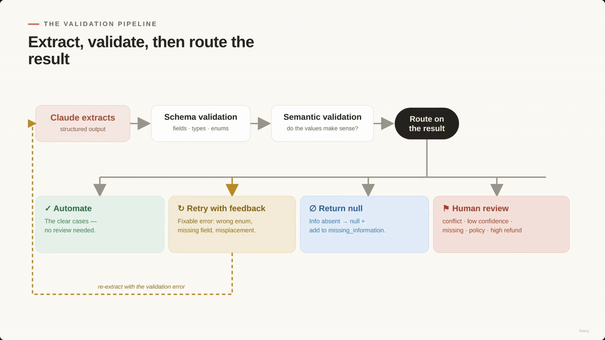

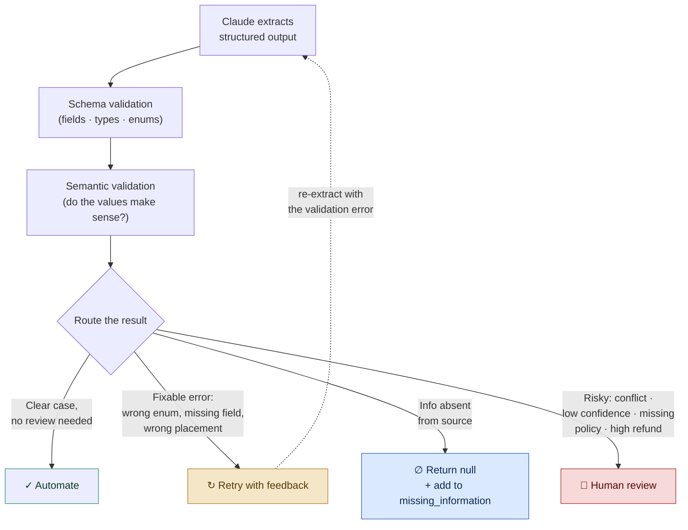
```mermaid
flowchart TD
    A["Claude extracts\nstructured output"] --> B["Schema validation\n(fields · types · enums)"]
    B --> C["Semantic validation\n(do the values make sense?)"]
    C --> D{"Route the result"}

    D -->|"Clear case,\nno review needed"| E["✓ Automate"]
    D -->|"Fixable error:\nwrong enum, missing field,\nwrong placement"| F["↻ Retry with feedback"]
    F -.->|"re-extract with\nthe validation error"| A
    D -->|"Info absent\nfrom source"| G["∅ Return null\n+ add to missing_information"]
    D -->|"Risky: conflict ·\nlow confidence · missing\npolicy · high refund"| H["🚩 Human review"]

    classDef good fill:#dbead e,stroke:#3b9c6b,color:#0b3d24
    classDef retry fill:#f6e6c8,stroke:#b5843b,color:#523d0b
    classDef null fill:#dbe9ff,stroke:#3b6cb5,color:#0b2a52
    classDef risky fill:#f8d9d9,stroke:#b53b3b,color:#520b0b
    class E good
    class F retry
    class G null
    class H risky
```

**Reading it:** the retry arrow is the *only* edge that loops back to the model — and only for fixable errors. A missing value never loops back (it becomes `null` + a flag), and a risky value never gets forced through automation (it goes to a human). The slide note doesn't specify a maximum retry count; treat "retry once with specific feedback, then either accept or escalate" as the safe default implied by the material rather than an invented hard limit.

---

## Lesson Summary: Making Extractions Reliable

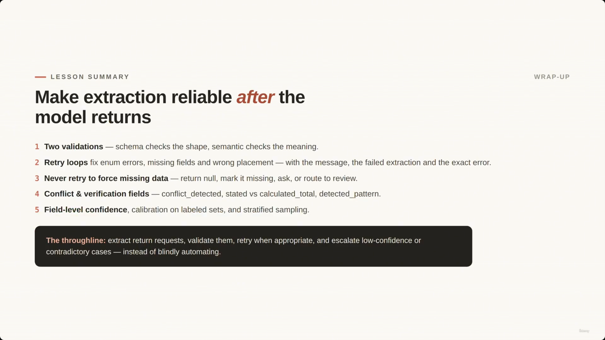

1. **Two validations** — schema checks the shape, semantic checks the meaning.
2. **Retry loops** fix enum errors, missing fields, and wrong placement — by resending the message, the failed extraction, and the exact error.
3. **Never retry to force missing data** — return `null`, mark it missing, ask for clarification, or route to review.
4. **Conflict & verification fields** — `conflict_detected`, `stated_total` vs. `calculated_total`, `detected_pattern`.
5. **Field-level confidence**, calibration on labeled sets, and stratified sampling across confidence tiers.

> **The throughline:** extract return requests, validate them, retry when appropriate, and escalate low-confidence or contradictory cases — instead of blindly automating.

---

## Summary

- **Structured ≠ correct** — a valid JSON shape says nothing about whether the extracted content is accurate. Validation is a separate, mandatory step after the model returns output.
- **Schema validation** checks shape (fields, types, enums); **semantic validation** checks meaning (do the values match the source?).
- **Retry with specific feedback** — original message + failed extraction + exact error + "do not invent" — fixes placement/format mistakes, but only when the source actually contains the answer.
- **Don't retry to manufacture data.** Absent information becomes `null` plus a `missing_information` entry, never a guess.
- **Flag contradictions** (`conflict_detected`) instead of forcing the model to resolve ambiguity on its own.
- **Confidence is per-field**, must be calibrated against labeled data, and should be measured by document type and by field — never trust one aggregate accuracy number.
- **Human review routing** is selective: low confidence, conflicts, missing info, policy exceptions, high refund amounts, or business-rule contradictions — plus stratified sampling across *all* confidence tiers, since high confidence doesn't guarantee correctness.
- **Claude extracts, your application validates** — the same code/model/human division introduced for grading in [[11-Grading-Claude-Outputs-Code-Model-And-Human-Review]], now applied specifically to structured-extraction pipelines built on the tool_use pattern from [[16-StructuredOutput-With-ToolUse-JSONSchema-ToolOutput]] (see that lecture for how the schema itself is defined).

---

*Sources: [slide notes](../17-Validation-RetryLoops-Confidence-And-HumanReview.md) · [[hover-notes-transcripts/17-Validation-RetryLoops-Confidence-And-HumanReview (transcript)|full transcript]]*
