# Batch Processing And Multi-Pass Review Architectures

> This lecture moves from single-item reliability to system-level architecture. [[17-...|Lecture 17]] covered making **one** extraction reliable (validation, retry loops, confidence scores, human review). This lecture asks: what happens when there isn't one document, but 10,000 — and what happens when the output is high-stakes enough that one Claude response reviewing itself isn't good enough?

> **Transcript color:** "In the previous lessons, we learned how to make structured extraction more reliable with validation, retry loops, confidence scores, and human review. Now we need to ask a bigger architecture question."

Two independent problems, two patterns:
- **Scale** — the synchronous Messages API doesn't fit thousands of latency-tolerant requests → the **Message Batches API**.
- **Quality on high-stakes output** — a single Claude call grading its own work has blind spots → **independent multi-pass review**.

---

## Architecture & Scale

### From Single Extractions to Large Batches

- The synchronous Messages API processes **one request at a time** — not ideal for large, latency-tolerant work.
- Scaling to thousands of items (support tickets, audit logs, bulk summary generation) needs a different approach.

### The Message Batches API

- An **asynchronous** method: submit many requests together, retrieve results later.
- **[Key Characteristics]**
  - Asynchronous & latency-tolerant
  - Runs in the background
  - Approximately **50% cheaper**
  - Up to **24h**, no latency SLA

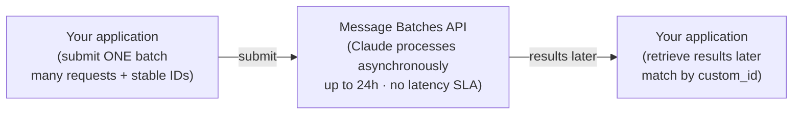


### Benefits of Batch Processing

- **[Cost Efficiency]** ~50% lower cost than standard synchronous API calls.
- **[Suitability]** Ideal for work that doesn't need an immediate answer.

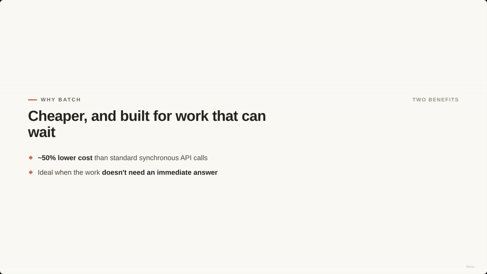

### Choosing Between Synchronous and Batch APIs

| | Use when... | ShopAssist example |
|---|---|---|
| **Synchronous** | A user is actively waiting for a response | Customer chatting: "Can I return this item?" |
| **Batch** | The workload is large and latency-tolerant | Auditing all support tickets from last night |

A nightly ticket audit can run offline to: classify tickets, detect risky refunds, find policy exceptions, and flag cases for human review.


### The Latency Trade-off

- **[The Trade-off]** Batch is built for offline workflows, not blocking ones.
  - A batch can take up to **24 hours**.
  - There is **no guaranteed latency SLA**.
- **Offline (good for batch):** a nightly ticket audit.
- **Blocking (bad for batch):** a task needing an immediate pass/fail, e.g. a pre-merge CI check.

> **Transcript color:** "A pre-merge check in CI should usually not wait on a batch job. If a developer opens a pull request and needs a pass or fail result before merging, that review should use a normal API call or a faster workflow."


### Correlating Results with `custom_id`

- **[Purpose]** Matches each asynchronous result back to its specific input.
- **[Why it's needed]** Batch results may come back **out of order** — stable IDs let you update the correct audit record regardless of return sequence.

```text
Example IDs:
ticket_1001
ticket_1002
ticket_1003
```

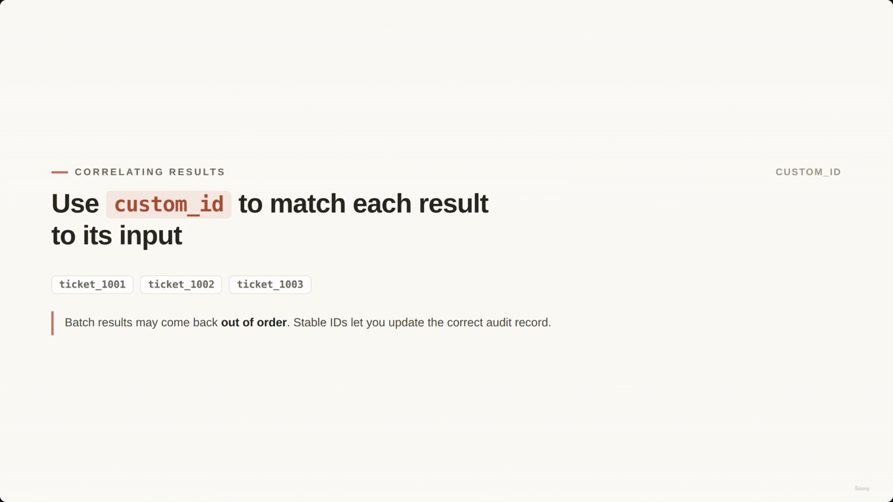

### Tools in Batch

- **[No Live Loop]** A batch request cannot support a mid-request tool loop.
  - In a live workflow: Claude requests a tool → the app executes it → the result is sent back to Claude, in a round-trip.
  - A single batch request **cannot** perform that round-trip during reasoning.
  - If a task needs multiple live tool calls during reasoning, use a different architecture (not batch).

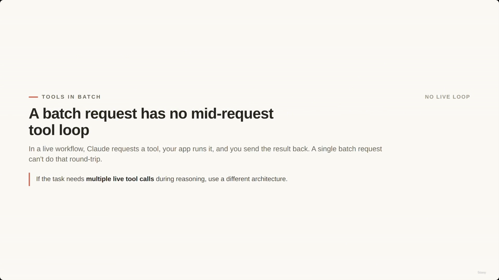

> **[Misfiled in source]** The slide note places this screenshot's timestamp (00:02:41) directly after the `custom_id` code block, chronologically inside the "Correlating Results" section — but the slide it actually captures is this "Tools in Batch" slide. The capture appears to lag the real transition by roughly one topic throughout this stretch of the lecture; content, not timestamp position, decided the placement here (and for several screenshots below).

### Preparing Context for Batch Jobs

- **[The Requirement]** Because a batch request can't run a mid-request tool loop, all context must be assembled **before** submission.
- **Example — auditing a support ticket**, gather upfront: ticket text, customer tier, order status, refund history, policy version.

### Best Practices for Scaling

- **[Test on a Sample]** Don't start by submitting a massive batch (e.g., 10,000 documents).
- **Iterative Refinement Process:**
  1. Start with a small sample
  2. Review the outputs
  3. Identify common mistakes
  4. Improve the prompt, schema, and validation rules
  5. Run the larger batch
- **[The Goal]** Avoid wasting cost on a flawed prompt or incorrect schema across a large dataset.

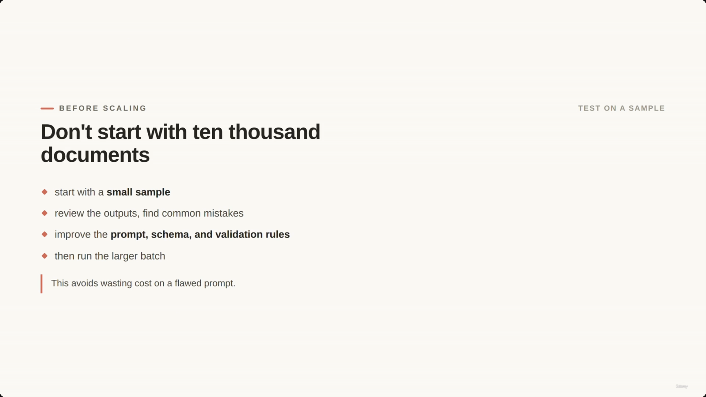

> **[Duplicate noted]** The slide note also references this same "Don't start with ten thousand documents" slide at 00:03:26 (`screenshot-01M1PFE1S38G9FEGK72WRT7KYE.png`), filed one section early under "Tools in Batch." Same slide, no new content — only the 00:03:41 capture above is kept.

### Handling Failures in Batch Jobs

- **[Resubmit Selectively]** If some requests in a batch fail, don't resubmit the entire batch — identify only the failed documents and resend just those.
- **[Connection to Stable IDs]** This selective resubmission works *because* stable IDs let you track and target the specific failed items.

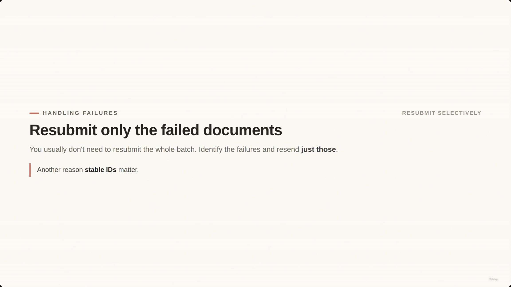

> **[Misfiled in source]** This screenshot's timestamp (00:03:47) sits under "Best Practices for Scaling" in the slide note, but its content ("Resubmit only the failed documents") is this section's slide, not that one.

---

## Review Architecture

- **[The Problem with Self-Review]** Asking the same Claude response to review itself has limits — the model may miss the same assumptions and mistakes baked into the original answer.
- **[Higher Reliability: Independent Instances]** Use **separate** Claude calls for generation and review:
  - One Claude call **generates** the output.
  - A separate Claude call **reviews** it, using a different prompt, role, or more focused criteria.

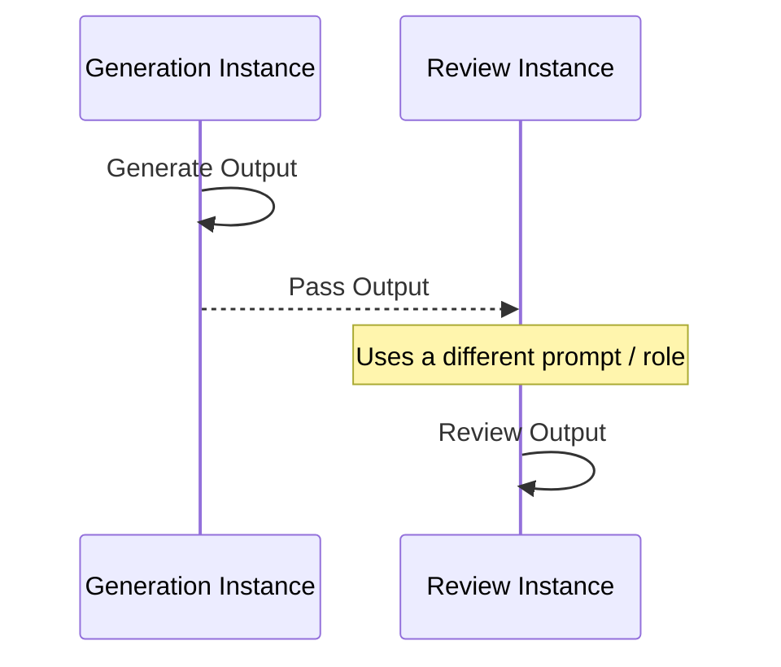


> **[Duplicate noted]** The identical "Review with a separate, independent instance" slide is also captured at 00:04:19 (`screenshot-01M1PFF3QNMBMZQQ6F5SFE1KJP.png`), misfiled one section early under "Best Practices for Scaling." Only the 00:04:26 capture above is kept.

---

## Multi-Pass Review

- **[Concept]** A sequence of distinct Claude calls refines an output:
  - **Pass 1** — produces or analyzes the initial content
  - **Pass 2** — reviews the output using a different prompt, role, or more focused criteria
  - **Pass 3** — integrates findings (e.g., routing to a human)

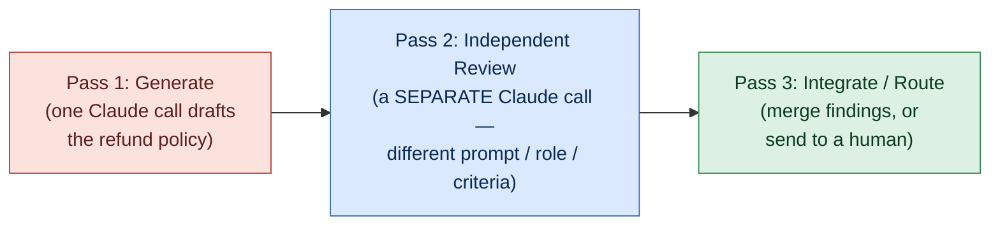

**[Slide detail]** The slide's own caption for this pattern: *"Independent review catches what a response can't catch in itself."* — not spoken verbatim in the transcript or written in the original slide-note bullets, but a clean summary of the whole section's point.

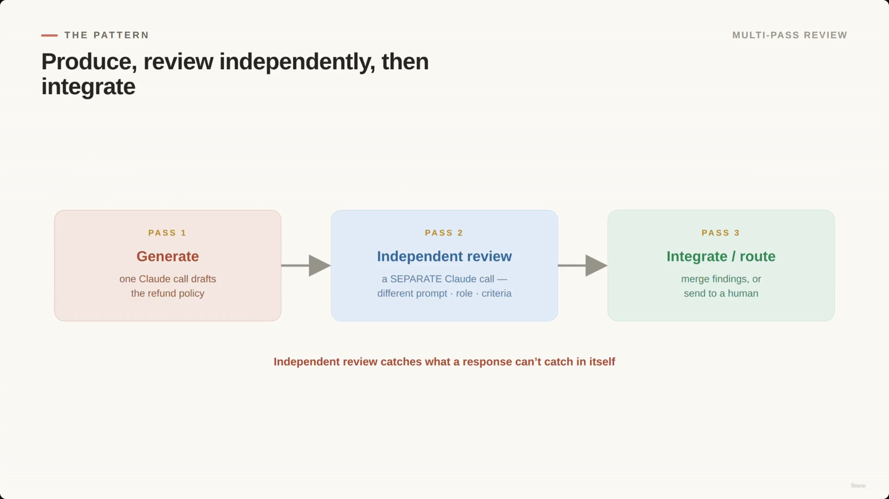

> **[Misfiled in source]** Filed under "Review Architecture" at 00:04:52 in the slide note; content-wise this three-pass diagram belongs to "Multi-Pass Review."

### Example: Policy Review

- **Request 1 (Drafting):** Drafts a refund-resolution policy.
- **Request 2 (Reviewing):** Checks the draft against specific questions:
  - Does it follow the refund rules?
  - Does it create legal or compliance risk?
  - Does it require human approval?
  - Does it contradict any existing policy?

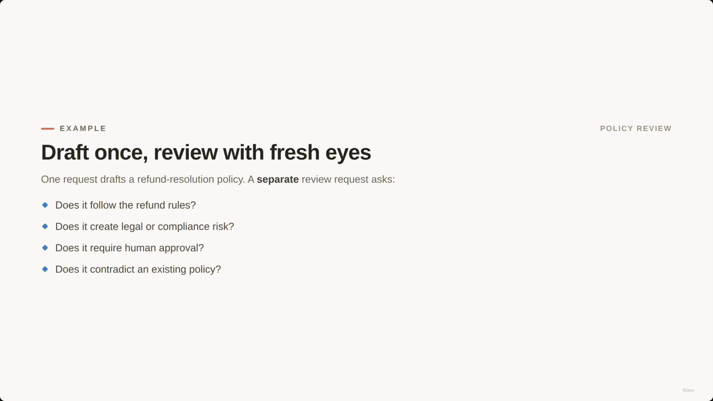

> **[Misfiled in source]** Filed under "Review Architecture" at 00:04:47 in the slide note ("Draft once, review with fresh eyes"); content-wise this is the Policy Review example that belongs here.

- **[Use Cases]** Especially effective for: code review, policy review, support summaries, document analysis.

---

## Large Codebases & Document Sets

> The slide note repeats this section's heading and core diagram twice in immediate succession (once as "Large Codebases & Document Sets," once as "Local-to-Integration Analysis Pattern") — same pattern, same two-pass idea, just restated. Merged here into one section rather than duplicated.

- **[The Pattern]** Analyze individual components locally before looking for systemic patterns.
  - **Pass 1 — Local Analysis:** Claude reviews each file or document separately. Results are small, structured, and focused.
  - **Pass 2 — Integration Analysis:** Runs **only after** every local pass is complete. Looks across the per-file findings for:
    - Conflicts?
    - Repeated issues?
    - Does one file break another's assumptions?
    - Highest-priority findings?

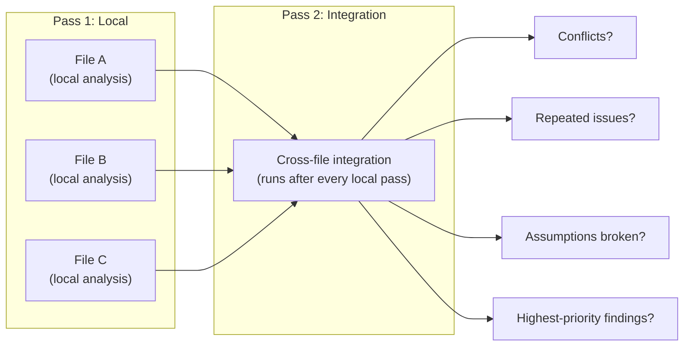

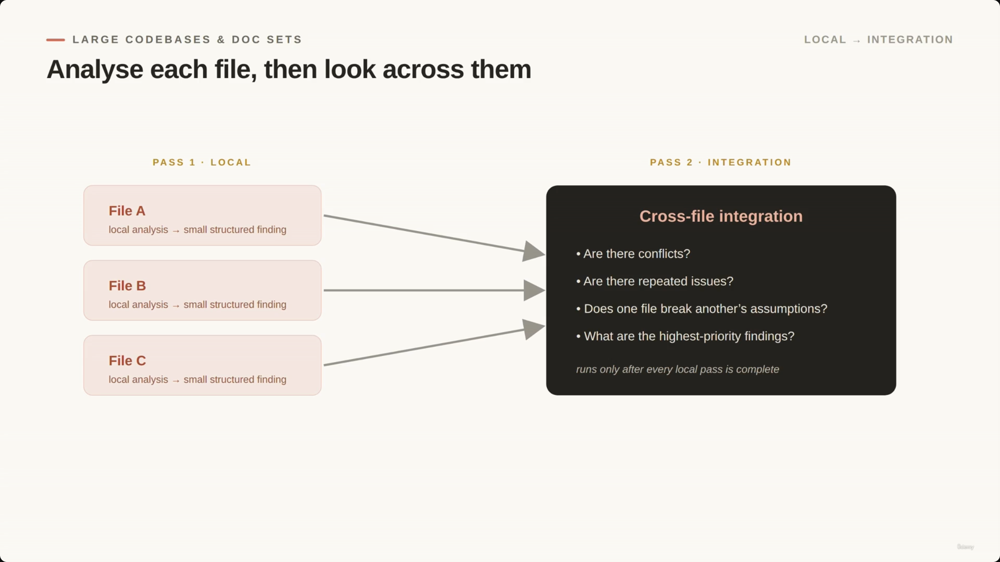

> **[Duplicate noted]** The same "Analyse each file, then look across them" slide is also captured at 00:05:09 (`screenshot-01M1PFHQHWGRZV0V1584B7M5KX.png`), misfiled one section early under "Review Architecture." Only the 00:05:12 capture above is kept.

- **[Why it's better than one giant prompt]**
  - **Traceability** — you know exactly which file produced which finding.
  - **Filtering** — you can filter out low-confidence results before the integration step.
  - **Efficiency** — integration analysis only runs once local analysis is fully complete.


---

## Lesson Summary

### Match the Processing Model to the Requirement

- **Synchronous** — use when the user is actively waiting for a response.
- **Batch** — use when the work is large and latency-tolerant.
- **`custom_id`** — use to correlate asynchronous results.
- **Context Preparation** — prepare all tool context before submitting a batch request.
- **Scaling Strategy** — test prompts on a small sample before scaling to a large dataset.
- **Failure Handling** — resubmit only the specific documents that failed.
- **High-Stakes Review** — prefer independent multi-pass review over simple self-review.

**[Three things to avoid]**

- Batching when an immediate answer is needed.
- Relying only on self-review for high-stakes calls.
- Solving a large review in one giant prompt.


> **[Misfiled in source]** Filed under the second "Large Codebases & Document Sets" occurrence at 00:05:58 in the slide note; content-wise this "Match the processing model to the requirement" slide is the Lesson Summary's opening slide.

### Putting It Together: ShopAssist Use Cases

> The slide note lists this same Task → Method table twice under two different headers ("Putting It Together: ShopAssist Use Cases" and "ShopAssist Implementation Summary") with identical rows. Consolidated into one table here.

| Workload / Task | Recommended Model |
| --- | --- |
| Live customer conversations | Synchronous |
| Nightly support-ticket audits | Batch |
| Generated summaries & policies | Independent review |
| Large analysis jobs | Local passes, then integration |


> **[Misfiled in source]** Filed under the second "Large Codebases & Document Sets" occurrence at 00:06:27 in the slide note; content-wise this "Match each job to the right model" slide belongs to the closing ShopAssist mapping. (An identical copy of this same slide is captured again at 00:06:43, correctly positioned at the very end of the note — not duplicated here.)

---

## Summary

- **Message Batches API** — async, ~50% cheaper, up to 24h with no latency SLA. Use for large, latency-tolerant workloads (nightly audits), never for blocking ones (live chat, pre-merge CI checks).
- **`custom_id`** — the mechanism that lets out-of-order batch results be matched back to their input.
- **No live tool loop in batch** — assemble all context upfront; if a task needs multiple live tool calls mid-reasoning, batch is the wrong architecture.
- **Scale iteratively** — sample → review → refine prompt/schema/validation → then run the full batch. On failure, resubmit only the failed items.
- **Self-review has limits** — for high-stakes output, prefer independent instances: one call generates, a separate call reviews with a different prompt/role/criteria.
- **Multi-pass review** — generate → independently review → integrate/route to a human. Effective for code review, policy review, support summaries, document analysis.
- **Large codebases/document sets** — analyze locally per file first (small, traceable, filterable findings), then run one integration pass across all local results — never one giant prompt.

**Exam framing to remember:** match the *processing model* to the requirement (synchronous vs. batch), and match the *review rigor* to the stakes (self-review vs. independent multi-pass review). Building on [[17-...|Lecture 17]]'s per-item reliability, this lecture is about reliability and cost **at the level of the whole pipeline**.

---

*Sources: [slide notes](../18-Batch-Processing-And-MultiPass-Review-Architectures.md) · [[hover-notes-transcripts/18-Batch-Processing-And-MultiPass-Review-Architectures (transcript)|full transcript]]*
