# Designing Effective Tools and Structured MCP Errors

> Lecture [[03-ClaudeApp-vs-ClaudeAPI-vs-ClaudeCode-vs-MCP-vs-AgentSDK|03]] first listed "clear name & description, typed schema, structured output, useful error handling" as the marks of a good MCP tool, and [[15-ToolSchemas-ToolChoice-And-FirstToolUse|15]] showed how to actually write a schema and read back a `tool_use` block. This lecture goes one level deeper into two of those marks specifically: how a **description** steers Claude toward the *correct* tool when several look similar, and how a tool should shape a **structured error object** so Claude (and the surrounding application) can recover intelligently instead of just seeing "it failed."

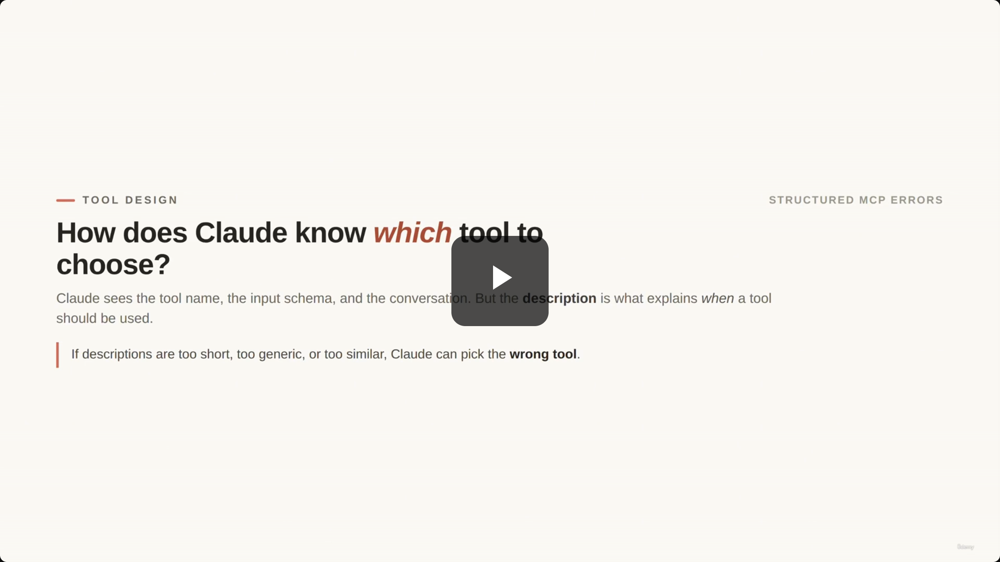

## The Selection Problem: How Claude Picks a Tool

- Claude sees three things when deciding which tool to call: the **tool name**, the **input schema**, and the **conversation context**.
- The **description** is the piece that explains *when* a tool should be used — not just what it returns.
- If descriptions are too short, too generic, or too similar to each other, Claude can pick the wrong tool.

> **Transcript color:** "How does Claude know which tool to choose? ... Claude can see the tool name, the input schema, and the conversation context, but the description explains when the tool should be used."

## Start Weak: Minimal Descriptions

The lecture opens with a deliberately weak pair of tools — two lookups that sound similar and explain nothing about when to use each one:

```json
weak_tools = [
  {"name": "get_customer",
   "description": "Get customer data.",
   "input_schema": {"email": {"type": "string"}}},

  {"name": "lookup_order",
   "description": "Get order data.",
   "input_schema": {"order_id": {"type": "string"}}}
]
```

- Both descriptions are one-line function summaries — they say *what* the tool returns, never *when* to call it.
- Neither explains the boundary between a customer lookup and an order lookup.
- Neither tells Claude what to do when the user gives only partial information.

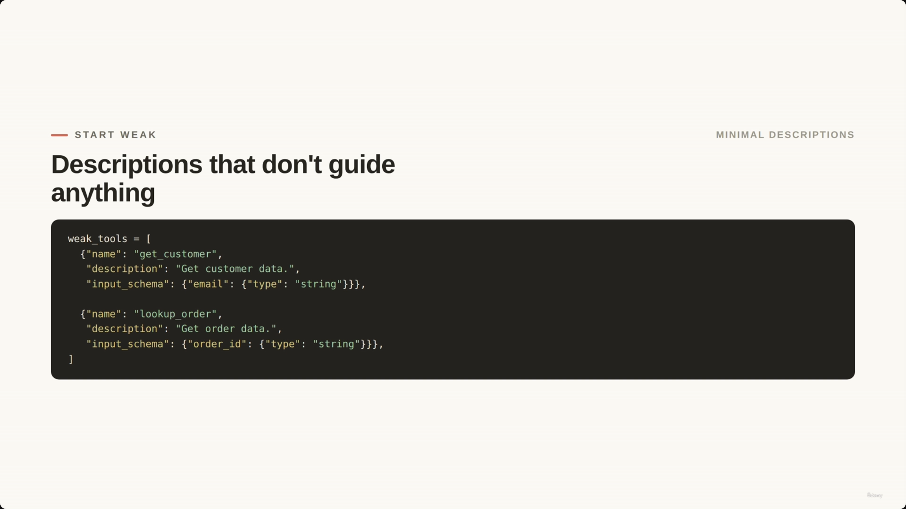

### The Routing Problem: Partial Information

This is where minimal descriptions actually break in practice:

> **Customer message:** *"Can you check my order? My email is alex@example.com."*

- **The trap:** the user said "order," so Claude may reach for `lookup_order`.
- **The problem:** the user never gave an `order_id` — only an email.
- **The correct path:** call the customer lookup tool first to identify the customer, then continue from there once a verified identity (and, eventually, an order ID) exists.

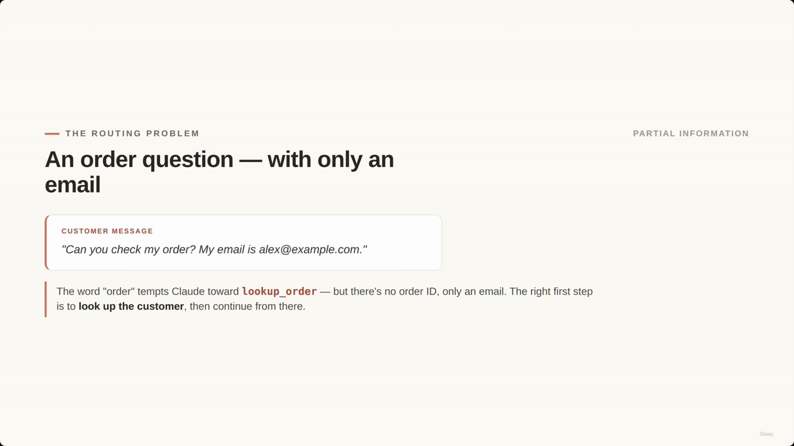

## Improving Tool Design: Specific Names + Guiding Descriptions

The fix has two parts, and both matter:

1. **Specific names** — `get_customer` becomes `get_customer_by_email`; `lookup_order` becomes `lookup_order_by_id`. The name alone now tells Claude what input the tool expects.
2. **Rich descriptions** that go beyond a function summary to cover: **purpose**, **expected inputs/outputs**, **concrete examples**, and — critically — explicit **boundaries** (when *not* to use the tool).

### Tool 1: `get_customer_by_email`

```json
{
  "name": "get_customer_by_email",
  "description": "Find a customer profile by email. Returns identity, account status, and a verified customer ID. Use FIRST when the user gives an email but no order ID. Do NOT use to look up a specific order.",
  "input_schema": {
    "email": {
      "type": "string",
      "description": "e.g. alex@example.com"
    }
  }
}
```

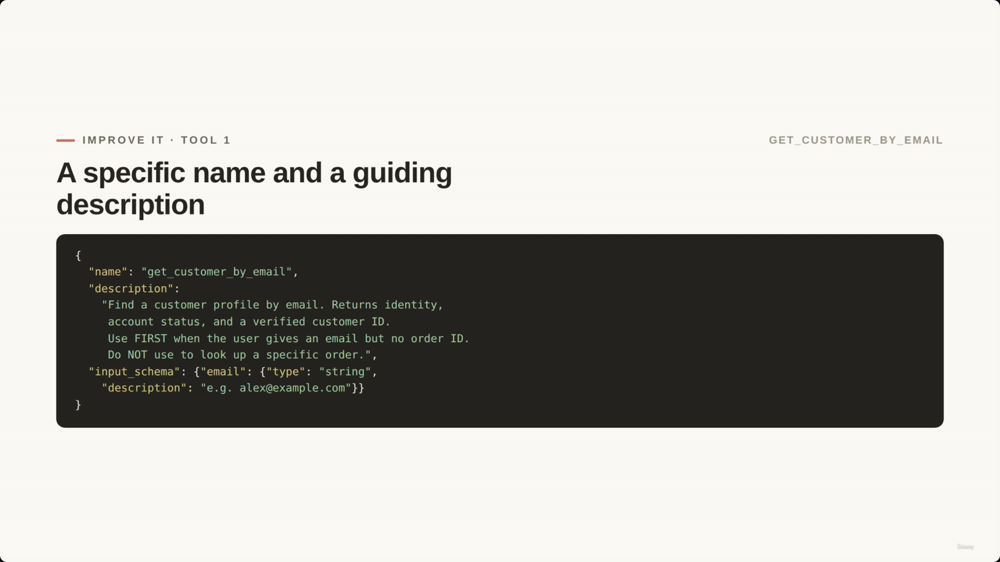

### Tool 2: `lookup_order_by_id`

```json
{
  "name": "lookup_order_by_id",
  "description": "Retrieve a specific order by order ID (for example ORD-12345678). Do NOT use this tool with an email address. If the user only gives an email, call get_customer_by_email first.",
  "input_schema": {
    "order_id": {
      "type": "string",
      "description": "ORD- followed by 8 digits"
    }
  }
}
```

> **[Gap note]** The slide deck's own screenshots only capture a full-slide view of `get_customer_by_email` (Tool 1) — the video never yields a distinct capture of the `lookup_order_by_id` (Tool 2) slide on its own. The JSON above is reconstructed from the original slide note's text (itself apparently transcribed live from the video) plus the transcript's description of the same boundary rule ("lookupOrder by ID... requires an order ID and should not be used with an email address"), so its *content* is well corroborated even though there's no independent screenshot to verify the exact on-slide formatting of Tool 2.

Notice both descriptions do the same three things: state the **purpose**, give an **input example**, and set an explicit **boundary** ("Use FIRST when...", "Do NOT use..."). That boundary language is what actually prevents the routing mistake from the weak-tools example.

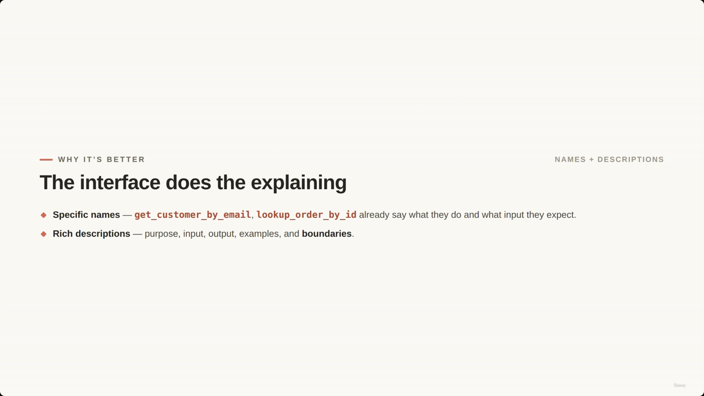

## The Key Idea: Descriptions Guide Routing

> **[Slide detail]** The lecture's own diagram traces the corrected routing path end-to-end, including the failure branch: if `lookup_order_by_id` is ever reached with an email instead of an order ID, the flow explicitly loops back to `get_customer_by_email` rather than failing silently.

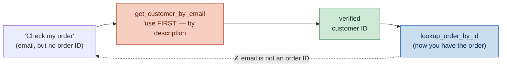

A well-designed interface uses names and descriptions — not just a system prompt — to steer the model through the correct multi-step logic.

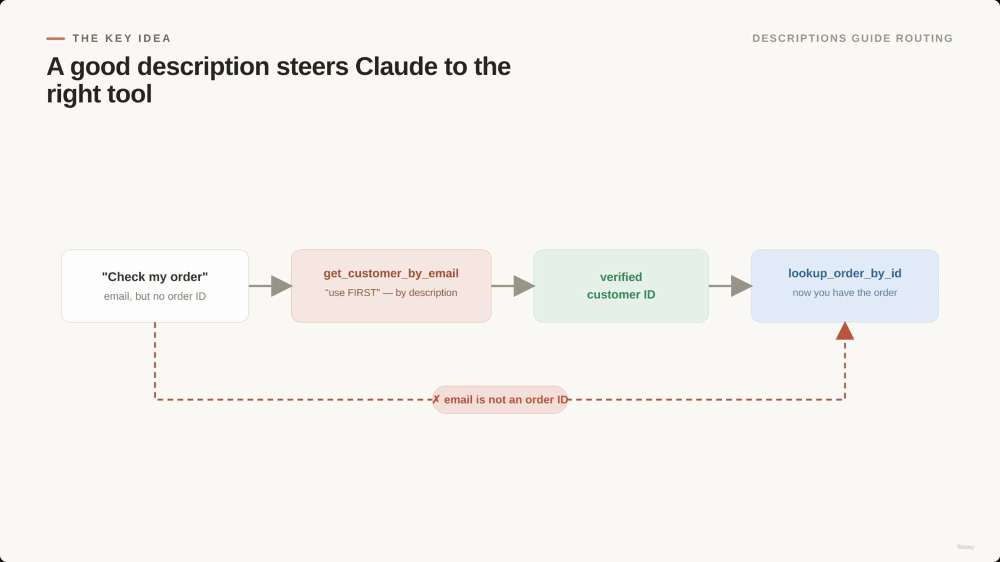

## Tool Granularity: Split vs. Consolidate

> **[The core principle]** Split tools to reduce ambiguity; consolidate tools to reduce complexity.

- **Split for clarity:** one generic tool covering customers, orders, refunds, *and* policy checks becomes too vague for the model to use reliably. Purpose-specific tools give each one a clear, narrow job:
  - `get_customer_by_email`
  - `lookup_order_by_id`
  - `check_refund_eligibility`
  - `create_human_escalation`
- **Consolidate for simplicity:** if several tools are *always* called together, take the same input, and return different parts of one business operation, combining them reduces the number of steps Claude has to manage.

| Direction | Do it when… |
|---|---|
| **Split** | it reduces ambiguity (tools cover genuinely distinct business functions) |
| **Consolidate** | it reduces complexity (tools are always called together, same input, same operation) |

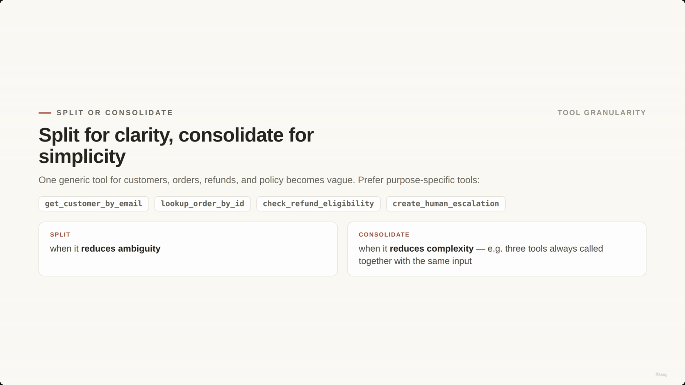

---

## Tool Errors: Weak vs. Structured

- **[The problem]** In production, tools fail constantly — invalid IDs, missing permissions, policy violations, backend timeouts.
- **Weak error example:**

```json
{ "error": "Something went wrong" }
```

- **[Why it matters]** A message like this gives Claude nothing to work with. It can't tell whether it should:
  - retry the request,
  - ask the user for better information,
  - explain a specific policy issue, or
  - escalate to a human.

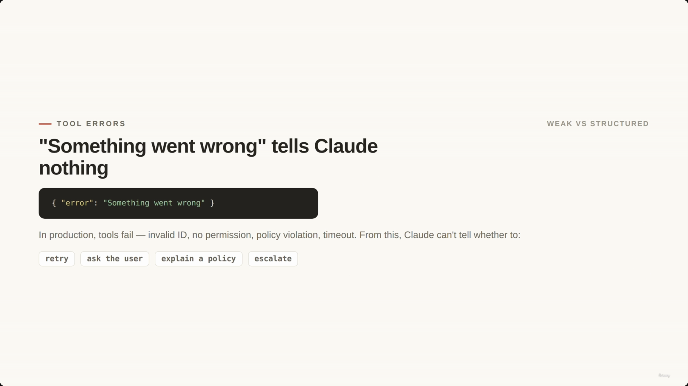

### Implementing Structured Errors

The fix is a **structured error object** with a consistent shape: `isError`, `errorCategory`, `isRetryable`, a `customerMessage` (safe to show the end user), and a `developerMessage` (internal detail). Here's `lookup_order_by_id` handling a **validation** failure — a malformed order ID:

```python
def lookup_order_by_id(order_id: str) -> dict:
    if not order_id.startswith("ORD-"):
        return {
            "isError": True,
            "errorCategory": "validation",
            "isRetryable": False,
            "customerMessage": "The order ID does not look valid. Please check the order number and try again.",
            "developerMessage": "Order ID must start with ORD-."
        }
    # ... further logic for empty results, permission, and timeout cases
```

**[Screenshot-verified]** The code screenshot at 00:03:40 shows this exact function in the ShopAssistAI codebase (file `10_tools_errors.ipynb`), confirming every field name (`isError`, `errorCategory`, `isRetryable`, `customerMessage`, `developerMessage`) matches what the slide note claims — no discrepancies found in this lecture's code screenshots.

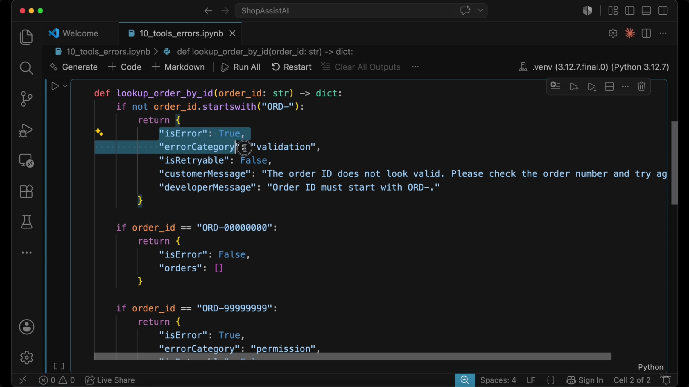

### Handling Specific Scenarios in `lookup_order_by_id`

The same function distinguishes four outcomes, each requiring a different action from Claude:

| Scenario | `isError` | `errorCategory` | `isRetryable` | Claude's action |
|---|---|---|---|---|
| Malformed order ID (`"ORD-..."` prefix missing) | `True` | `validation` | `False` | Ask the user to check/fix the input |
| Valid ID, no matching record (`ORD-00000000`) | `False` | *(n/a — not an error)* | *(n/a)* | Ask for a different ID or email |
| Valid ID, user doesn't own the order (`ORD-99999999`) | `True` | `permission` | `False` | Don't reveal private data; may escalate |
| Backend timeout (`ORD-TIMEOUT`) | `True` | `transient` | `True` | Retry the same request |

- **[Note]** An **empty result is not an error** — the tool executed correctly, it simply found no matching data. This is an easy category to conflate with a real failure, and the lecture calls it out explicitly.

```python
if order_id == "ORD-00000000":
    return {
        "isError": False,
        "orders": []
    }

if order_id == "ORD-99999999":
    return {
        "isError": True,
        "errorCategory": "permission",
        "isRetryable": False,
        "customerMessage": "I can't access this order with the current account information.",
        "developerMessage": "Authenticated customer does not own requested order."
    }

if order_id == "ORD-TIMEOUT":
    return {
        "isError": True,
        "errorCategory": "transient",
        "isRetryable": True,
        "customerMessage": "I'm having trouble checking the order right now. Please try again in a moment.",
        "developerMessage": "Order service timed out."
    }
```

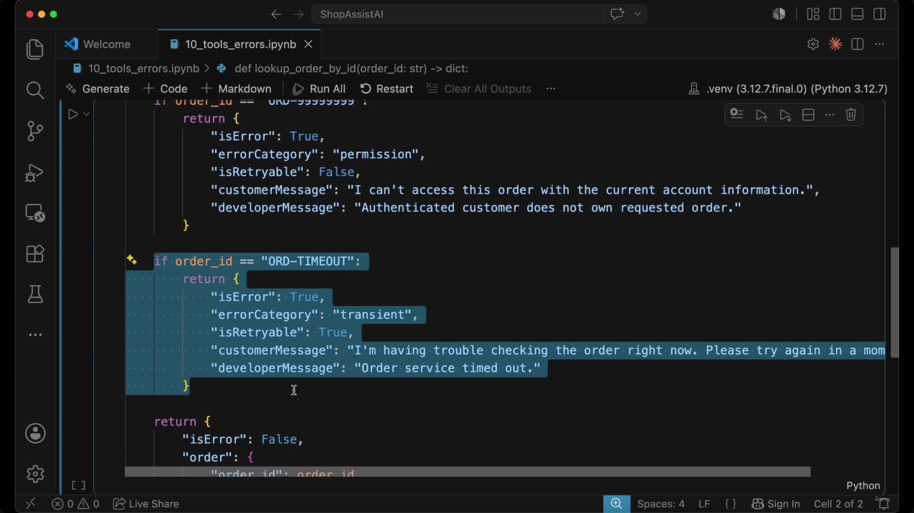

## Error Categories and Recovery

The `errorCategory` field is what lets the surrounding system decide how to respond, independent of the specific error message text. `isRetryable` makes the retry decision explicit rather than something Claude has to infer from the category name.

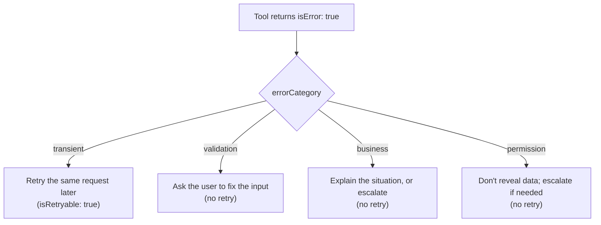

| `errorCategory` | Meaning | Recovery action |
|---|---|---|
| **transient** | Temporary system problem (e.g. a timeout) | Retry the same request later |
| **validation** | Input is malformed or incomplete | Ask the user to fix the input — no retry |
| **business** | Request understood, but business rules disallow it | Explain the situation, or escalate — no retry |
| **permission** | User isn't authorized to access or perform the action | Don't reveal private data; escalate if needed — no retry |

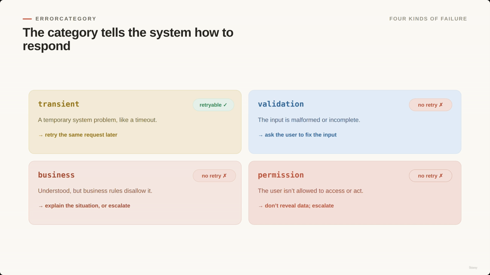

### Example: Refund Eligibility (a Business Error)

`check_refund_eligibility` is the lecture's example of a **business** error: the input is valid, permissions are fine, the backend is healthy — but a policy rule blocks the action. Retrying changes nothing, because the *rule*, not the system state, is what's stopping it.

```python
def check_refund_eligibility(order: dict) -> dict:
    if order["delivered_days_ago"] > 30:
        return {
            "isError": True,
            "errorCategory": "business",
            "isRetryable": False,
            "customerMessage": "This order is outside the standard return window, so I cannot process an automatic refund.",
            "developerMessage": "Refund denied because the order is outside the 30-day return policy."
        }

    return {
        "isError": False,
        "eligible": True,
        "reason": "Order is within the 30-day return window."
    }
```

- **Action:** Claude should use the `customerMessage` to explain the situation, or escalate if the workflow allows manual exceptions.

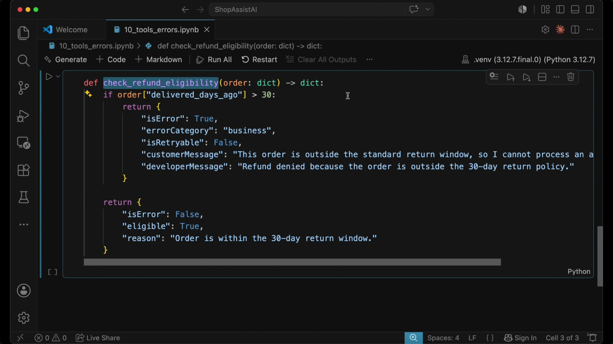

## Production Pattern: Recover, Then Escalate

Not every error should go straight to a human or a coordinator agent — that wastes the whole point of automating the easy cases. The lecture frames recovery as a filter that runs *before* escalation:

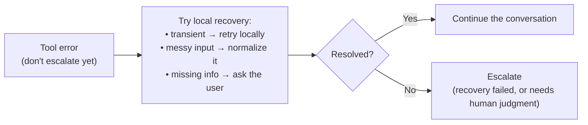

- **Transient errors:** if the backend times out once, retry locally.
- **Messy input:** extra whitespace or lowercase in an ID — normalize it (strip, uppercase) instead of failing.
- **Missing information:** Claude can just ask the user for the missing field directly.
- **Escalation** only happens once local recovery has failed, or the error specifically needs human judgment (e.g. a `permission` or unresolvable `business` error).

This pattern reduces the burden on human operators by letting the application quietly resolve the mechanical failures (timeouts, sloppy formatting) and reserving escalation for cases that actually need it.

---

## Beyond Schemas

Tool design isn't finished once a schema validates. A strong tool interface has to help Claude:

- choose the right tool,
- send the right input,
- understand the result, and
- recover safely from errors.

For ShopAssist, that means: better names, better descriptions, clear input boundaries, and structured MCP errors. The payoff is **less room for the model to guess**, **more control for the backend**, and **a better experience for the customer** when something does go wrong.

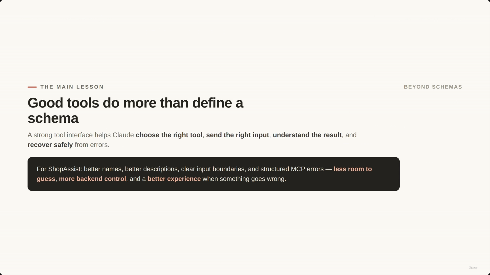

---

*Sources: [slide notes](../21-Designing-Effective-Tools-And-Structured-MCP-Errors.md) · [[hover-notes-transcripts/21-Designing-Effective-Tools-And-Structured-MCP-Errors (transcript)|full transcript]]*
