# Tool Access Scoping, Built-in Tools & MCP Configuration

> Lecture 21 was about writing a *good* tool description. This lecture is one level up: given a set of well-described tools, **which ones should any given agent actually be allowed to call?** The lecture walks a single running example — the ShopAssist support agent — from an over-provisioned, fifteen-tool monolith to a scoped multi-agent design, then pivots to two different tool inventories an architect has to manage: Claude Code's own **built-in development tools** (Read/Write/Edit/Bash/Grep/Glob) and **MCP servers**, configured at project vs. user scope.

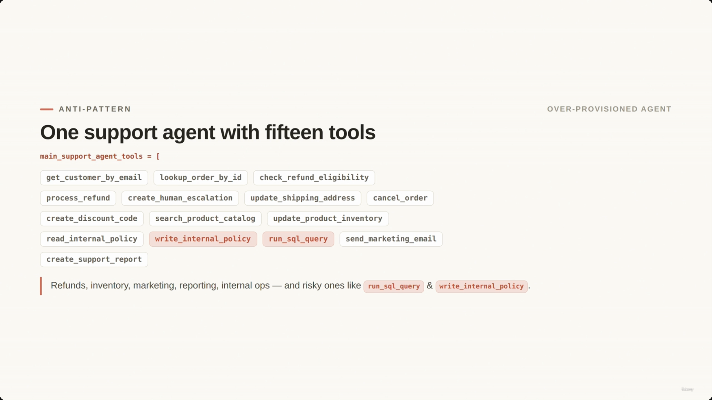

---

## 1. Tool Access Scoping

- **[The Goal]** Decide which specific tools an agent should actually have access to.
- **[The Anti-Pattern]** Over-provisioning an agent with every tool in the system — it looks flexible, but it makes tool *selection* less reliable.

### The anti-pattern: one ShopAssist agent with fifteen tools

```python
main_support_agent_tools = [
    get_customer_by_email, lookup_order_by_id, check_refund_eligibility,
    process_refund, create_human_escalation, update_shipping_address, cancel_order,
    create_discount_code, search_product_catalog, update_product_inventory,
    read_internal_policy, write_internal_policy, run_sql_query, send_marketing_email,
    create_support_report
]
```

- **Risky tools included:** `run_sql_query` and `write_internal_policy` — these belong to internal operations/policy, not a customer-facing support flow.
- **Irrelevant tools included:** refund-, inventory-, marketing-, reporting-, and internal-ops tools that a normal support conversation never touches.

> **Transcript color:** "Some are useful for support. Some belong to refunds, inventory marketing, reporting, or internal operations. And some are risky, like run SQL query or write internal policy."

### Why over-provisioning backfires

- **Reliability, not just security.** The primary failure mode isn't a security hole — it's that too many tools make tool *selection* less reliable.
- Overlapping purposes give Claude more chances to pick the wrong tool.
- A normal return conversation needs **none** of the inventory, marketing, SQL, or policy-writing tools.

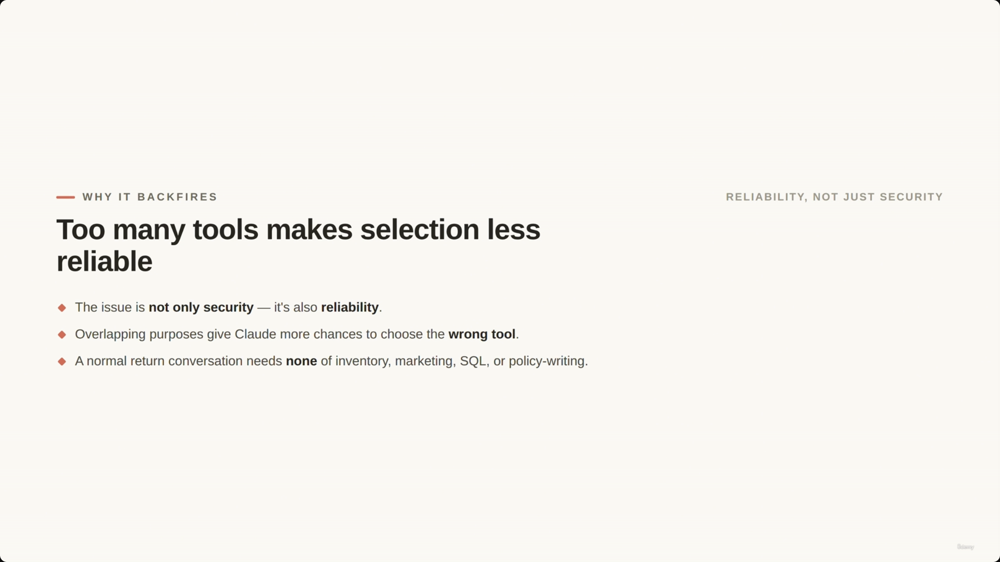

---

## 2. Multi-Agent Design with Scoped Access

- **[The Strategy]** Instead of one agent with all tools, use specialized agents that receive only the tools their specific role needs. This prevents cross-specialization misuse — the support agent should never accidentally update inventory, the inventory agent should never issue refunds, and the policy agent should never modify customer orders.

### Specialized agent tool sets

```python
refund_agent_tools = ["lookup_order_by_id", "check_refund_eligibility", "process_refund"]

inventory_agent_tools = ["search_product_catalog", "update_product_inventory"]

policy_agent_tools = ["read_internal_policy", "create_support_report"]
```

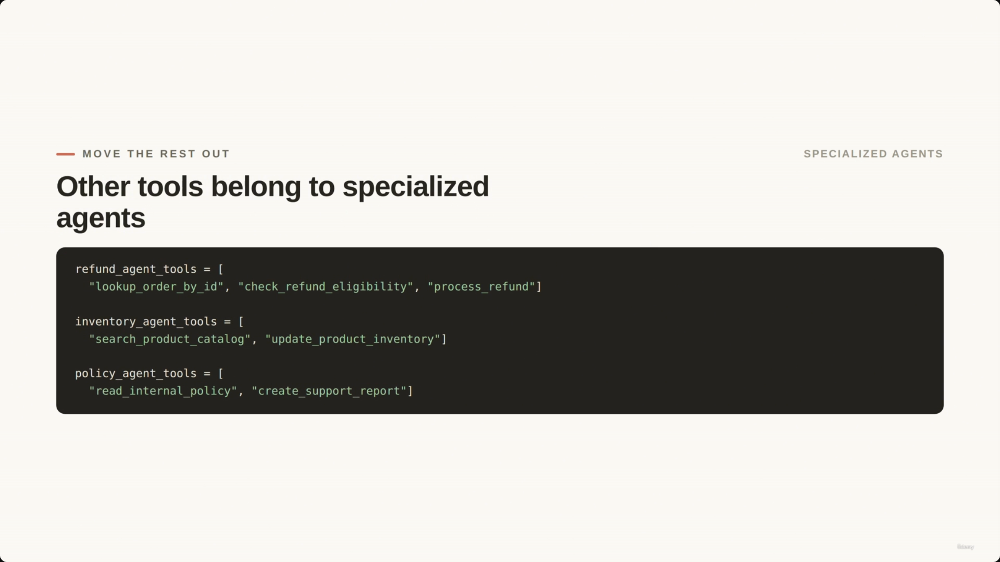

### Scoped tool distribution

The refactored design keeps a lean **main support agent** and hands the rest to specialists:

- **Main Support Agent:** `get_customer_by_email`, `lookup_order_by_id`, `check_refund_eligibility`, `create_human_escalation`
- **Refund Agent:** `lookup_order_by_id`, `check_refund_eligibility`, `process_refund`
- **Inventory Agent:** `search_product_catalog`, `update_product_inventory`
- **Policy Agent:** `read_internal_policy`, `create_support_report`

**[Slide detail]** The diagram (not spelled out as its own code block in the slide-note's bullets) makes the *sharing* concrete: `lookup_order_by_id` is highlighted as the one tool both the Main Support Agent and the Refund Agent hold — everything else stays exclusive to one agent.

- **[The Goal, restated]** Give each agent the smallest useful set of tools for its job. That does not mean every tool must be exclusive to one agent — `lookup_order_by_id` is a case where both the main support agent and the refund agent legitimately need it.

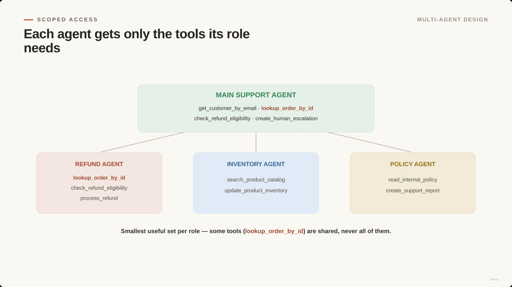

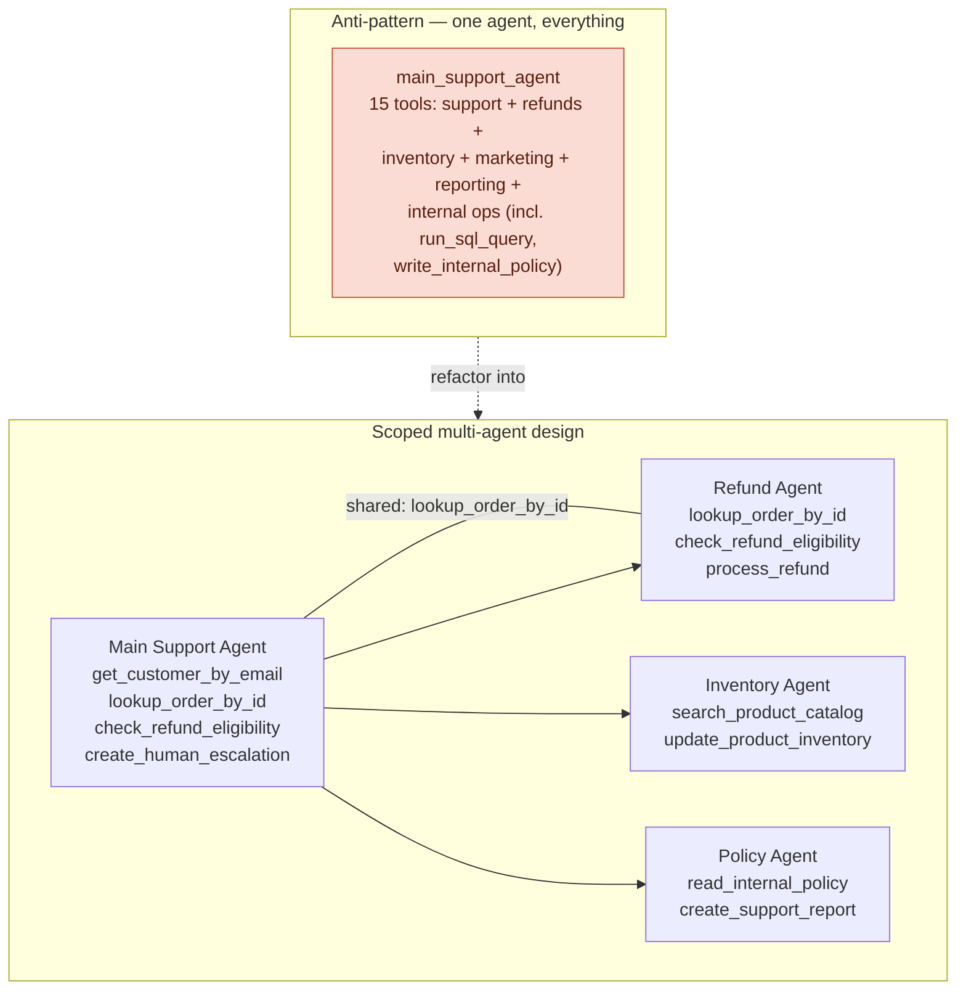

> **Note on the diagram above:** this Mermaid version is a reconstruction that mirrors the slide's own boxes-and-lines diagram, redrawn for clarity — it isn't a screenshot itself, but every tool name in it is taken directly from the slide's code blocks and diagram.

*(The slide note's separate "Multi-Agent Tool Sharing" section restates this same shared-tool point in prose — folded in above rather than repeated.)*

---

## 3. Controlling Agent Freedom with `tool_choice`

`tool_choice` determines how much autonomy Claude has in deciding whether, or when, to call a tool.

| Mode | Behavior | Use case |
|---|---|---|
| `auto` | May answer directly **or** call a tool | Normal, flexible conversations |
| `any` | Must call **one** of the available tools | A tool call is required before continuing (e.g., a refund decision needs back-end order data) |
| `tool` (forced) | Must call a **specific** tool | The application already knows the exact next step |

```python
# may answer directly OR call a tool
tool_choice = {"type": "auto"}

# must call ONE of the available tools
tool_choice = {"type": "any"}

# must call a SPECIFIC tool
tool_choice = {"type": "tool", "name": "lookup_order_by_id"}
```

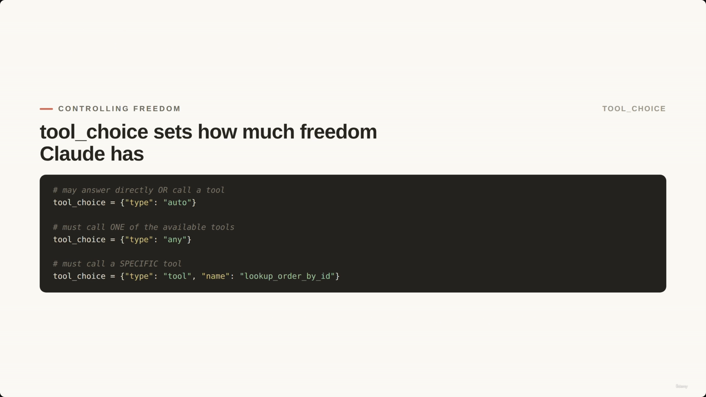

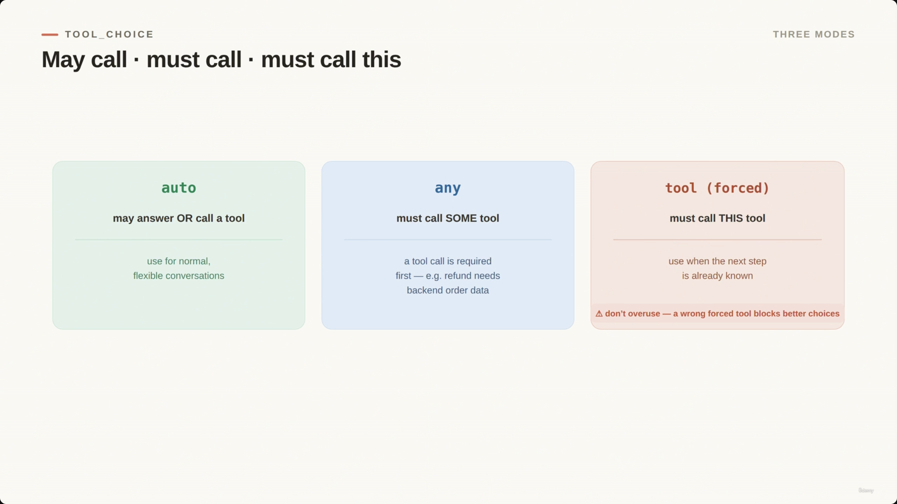

- **[Warning on forced selection]** Do not overuse forced tool choice. If the application forces the wrong tool, Claude cannot choose a better, more appropriate one.

> **Transcript color:** "For example, every refund decision may need back-end order data. Use force tool selection when the application already knows the exact next step. But do not overuse force tool choice."

---

## 4. Built-in Development Tools

These are Claude Code's own tools — they act on a *codebase*, not on ShopAssist's business systems. **[Gap]** The slide note lists these six tools as a bare bullet list, but no screenshot in this lecture actually captures that list-slide itself; the two screenshots that *do* survive for this section (Grep-vs-Glob and the Edit fallback) drill into two of the six individually.

| Tool | What it does | When to use it |
|---|---|---|
| `Read` | Inspects a file | Check current file state before touching anything |
| `Write` | Creates or overwrites a file | Final step of the safe-edit fallback, after Read → understand → modify |
| `Edit` | Makes targeted modifications | When there's a unique text match to target |
| `Bash` | Runs shell commands | General command execution in the dev workflow |
| `Grep` | Searches inside file contents | Find specific text, e.g. locating refund logic |
| `Glob` | Matches file paths | Find files by path pattern, e.g. locating policy files |

> **Transcript color:** "For example, if Claude needs to find refund logic, use grep. If Claude needs to find policy files by path, use glob. The difference is simple. Grep searches content. Glob matches paths."

### Searching the code: Grep vs. Glob

| Tool | Purpose | Example |
|---|---|---|
| `grep` | Search content | `grep -R "refund" ./shopassist` |
| `glob` | Match paths | `shopassist/**/*.policy.md` |

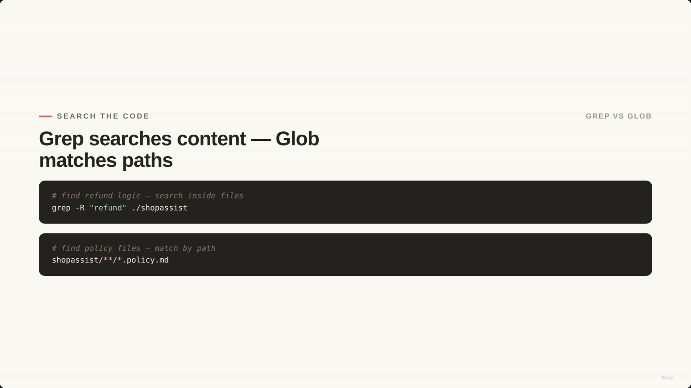

### Making safe changes with Edit

- `Edit` is best used when there is a **unique text match** to target a modification.
- **[Fallback strategy]** If no unique match is found, don't force an edit — fall back to a safer sequence:

  **Read → understand → modify → Write** — inspect the surrounding code, confirm context, plan the smallest safe change, then write the updated file back.

```python
Edit(
    file_path="shopassist/refunds.py",
    old_text="RETURN_WINDOW_DAYS = 14",
    new_text="RETURN_WINDOW_DAYS = 30"
)
```

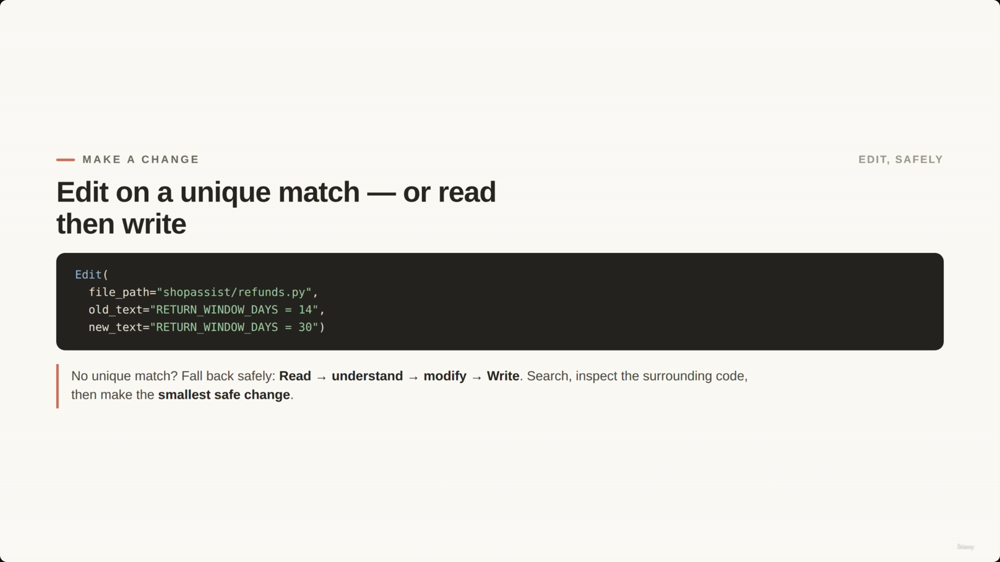

---

## 5. MCP Capabilities

MCP (Model Context Protocol) servers expose external capabilities to Claude, split into two kinds: **tools** and **resources**.

### MCP Tools vs. MCP Resources

| Feature | Definition | ShopAssist examples |
|---|---|---|
| **MCP Tools** | Actions Claude can call to *do work* | `get_customer_by_email`, `lookup_order_by_id`, `process_refund` |
| **MCP Resources** | Content Claude can read for context | `refund-policy.md`, `shipping-policy.md`, `support-macro-catalog.md` |

> **Summary:** Tools **do work**. Resources **provide content**.

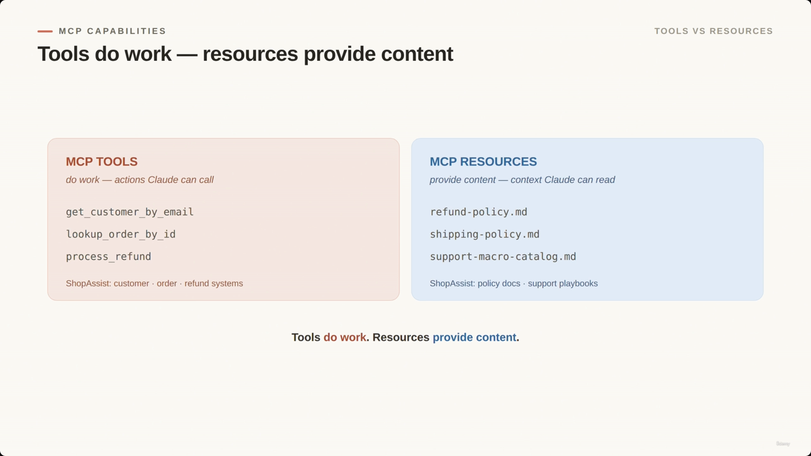

### Project-scoped MCP configuration (`.mcp.json`)

- MCP servers can be defined at the project level in an `.mcp.json` file, which belongs specifically to that project and defines which servers are available for that codebase.
- **[Security best practice]** Use environment-variable expansion for secrets — never hardcode credentials in `.mcp.json`. Reference an env var and let the actual secret come from the developer's environment.

```json
// .mcp.json
{
  "mcpServers": {
    "shopassist-orders": {
      "command": "python",
      "args": ["mcp_servers/orders_server.py"],
      "env": {"ORDERS_API_KEY": "${ORDERS_API_KEY}"}
    },
    "shopassist-policies": {
      "command": "python",
      "args": ["mcp_servers/policies_server.py"]
    }
  }
}
```

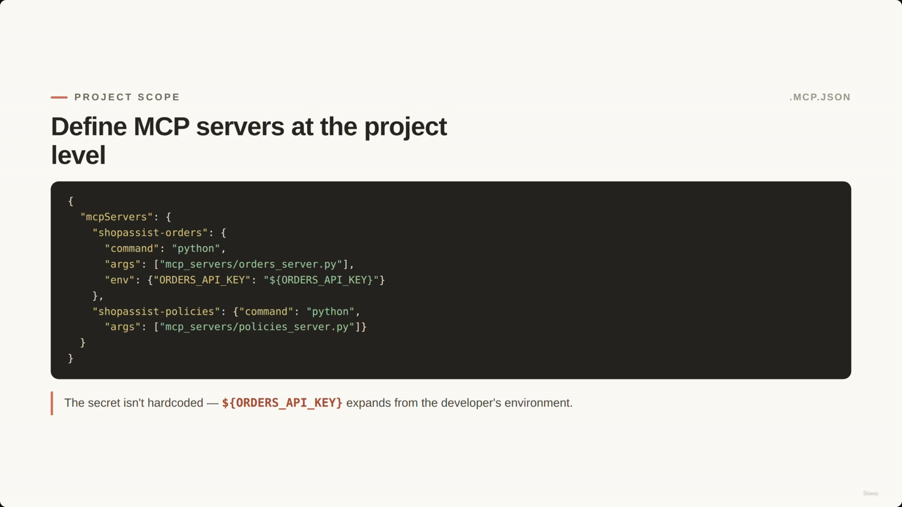

### User-scoped configuration (`~/.claude.json`)

- While `.mcp.json` is project-scoped, personal servers live in the developer's own local setup, in `~/.claude.json`.

**[Slide detail]** The slide note's own bullets only state the scope distinction in prose ("`.mcp.json` belongs to the project; `.claude.json` belongs to the individual developer") — the screenshot additionally shows a concrete worked example not transcribed into the bullet text:

```json
// ~/.claude.json
{
  "mcpServers": {
    "personal-notes": {
      "command": "node",
      "args": ["../personal-notes-server/index.js"]
    }
  }
}
```

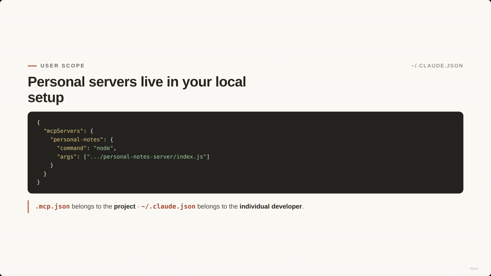

### MCP configuration scopes — the rule that still applies

- `.mcp.json` belongs to the project; `~/.claude.json` belongs to the individual developer's local setup.
- **[Agent tool access]** Even when multiple MCP servers are available simultaneously, that doesn't mean every agent should use every tool from every server. Scope decides what's *available*; agent design still decides what's *allowed* for each role.

### Community vs. custom MCP servers

| Type | Best for | Examples |
|---|---|---|
| **Community** | Common integrations | File systems, GitHub, databases, developer tools |
| **Custom** | Business-specific systems | ShopAssist servers for customers, orders, refunds, and policies |

> **Transcript color:** "For Shopify [ShopAssist], we would likely build custom MCP servers for customers, orders, refunds, and support policies, because those systems have specific permissions, schemas, and error behavior."

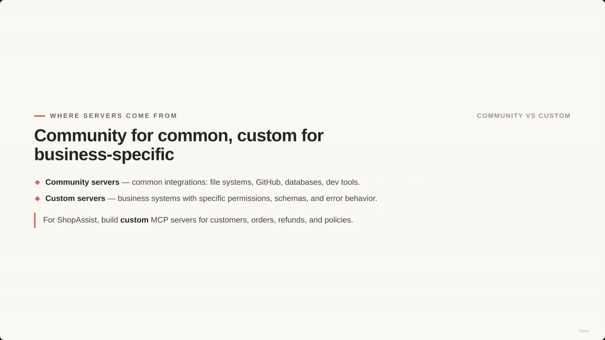

---

## Summary

*(The slide note carries two near-duplicate summary sections — "The Main Lesson: Scoped Tooling" and "Summary of Effective Agent Design" — consolidated here into one.)*

- **Core principle:** Don't give every agent every tool. Give each agent the smallest useful tool set for its specific role.
- **`tool_choice`:** controls whether Claude *may* call a tool (`auto`), *must* call some tool (`any`), or *must* call one specific tool (`tool`/forced) — don't overuse forcing.
- **Tool categories:**
  - **Built-in development tools** (Read/Write/Edit/Bash/Grep/Glob) — used carefully for reading, searching, editing, and running commands in a codebase.
  - **MCP tools** — perform actions.
  - **MCP resources** — provide content/context catalogs.
- **ShopAssist implementation, end to end:** the main support agent gets a small, dedicated set of support tools; specialized sub-agents (refunds, inventory, policy) handle their own domains; backend systems are exposed through MCP servers, configured at project or user scope, with clear boundaries.

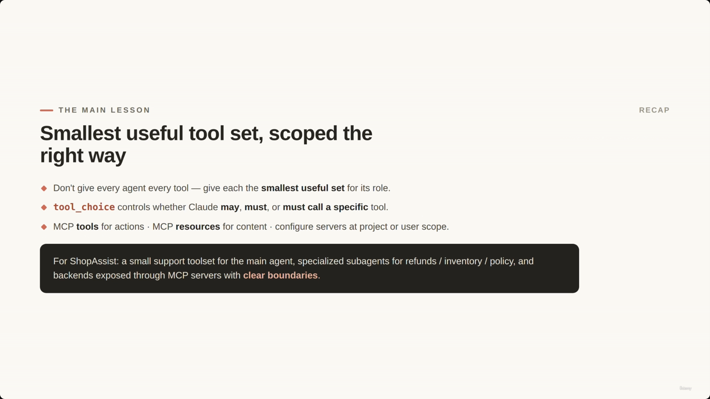

---

## Cross-references

- **Lecture 20** covered the tool-use *lifecycle* (how a tool call and its result flow through a conversation).
- **Lecture 21** covered *tool descriptions* and structured errors — making an individual tool's contract unambiguous (e.g., `getCustomer` vs. `getCustomer_by_email`).
- **This lecture** sits one layer above both: given a set of well-described tools, which subset should any one agent actually be handed, and at what MCP scope should the servers backing them be configured?

---

## In Plain English

Here's the whole file in plain, everyday language:

**The big picture:** even with well-designed tools (lecture 21), giving one single agent access to every tool in your whole system is a mistake — this lecture is about deciding who gets access to what, plus a quick tour of two separate toolkits: Claude Code's own dev tools, and MCP server configuration.

**1. The mistake to avoid**
Don't hand one "do everything" agent all fifteen of your tools (refunds, inventory, marketing, even risky ones like "run SQL query"). It's not really a security problem first — it's that too many overlapping tools make Claude *worse* at picking the right one.

**2. The fix**
Split into specialized agents, each with only the small set of tools its job actually needs — a refund agent doesn't need inventory tools, an inventory agent doesn't need refund tools. It's fine for two agents to share one tool if they both genuinely need it.

**3. `tool_choice` recap (same three modes as before)**
`auto` (Claude decides), `any` (must use something, picks which), `tool`/forced (must use this one specific tool) — with a warning not to overuse the forced mode, since it removes Claude's ability to pick something more appropriate.

**4. Claude Code's own built-in tools (separate from your business tools)**
`Read` a file, `Write`/overwrite a file, `Edit` a specific piece of text, `Bash` to run commands, `Grep` to search file *contents*, `Glob` to find files by *name/path pattern*.

**5. MCP tools vs. MCP resources**
Tools *do things* (look up a customer, process a refund); resources are just reference material Claude can read (a policy document, a support macro list) — resources don't take actions, they just provide context.

**6. Where MCP servers get configured**
`.mcp.json` belongs to the whole project (shared by the team, secrets should come from environment variables, never hardcoded); `~/.claude.json` belongs to one individual developer's own personal setup.

**7. Availability ≠ permission**
Just because a tool is *available* doesn't mean every agent should use it — configuration decides what tools *exist*; your agent design still decides what each specific agent is *allowed* to touch.

**One-sentence summary:** Give each agent only the small set of tools its specific job needs (never "just give it everything"), and remember Claude Code's own dev tools and MCP server configuration are two separate toolkits with their own scoping rules.

---

*Sources: [slide notes](../22-ToolAccess-BuiltInTools-And-MCPConfiguration.md) · [[hover-notes-transcripts/22-ToolAccess-BuiltInTools-And-MCPConfiguration 1 (transcript)|full transcript]]*
