# Coordinator & Subagents: Task Tool and Explicit Context Passing

> [[03-ClaudeApp-vs-ClaudeAPI-vs-ClaudeCode-vs-MCP-vs-AgentSDK|Lecture 03]] introduced the Agent SDK as the layer that provides structure for multi-step orchestration — "agents, tools, hooks, handoffs, and execution flow." This lecture is the first concrete instance of that orchestration: ShopAssist moves from one agent trying to do everything to a **coordinator** that spawns specialized **subagents**, hands each one an explicit slice of work through a `Task` tool call, and stitches their findings back into a single reply.

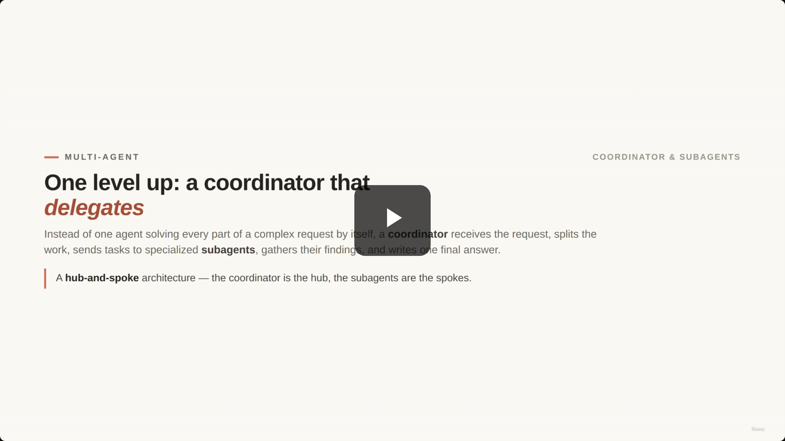

> **Transcript color:** "In the previous lesson, ShopAssist already had backend tools and MCP integration. Now we move one level higher... This is a hub-and-spoke architecture. The coordinator is the hub. The sub-agents are the spokes."

---

## 1. Hub-and-Spoke Architecture

- **The Coordinator's Role**
    - Receives the initial user request
    - Decides how to split the work into tasks
    - Sends tasks to specialized subagents
    - Receives findings from subagents
    - Produces one final consolidated answer
- **Why use this?** It's useful when a single customer message contains several different problems that require different expertise.

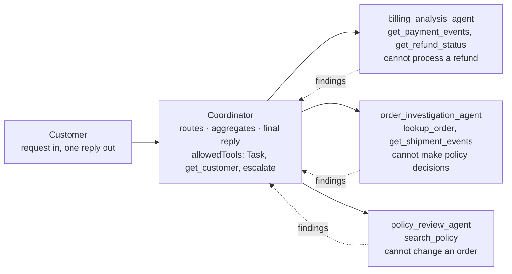

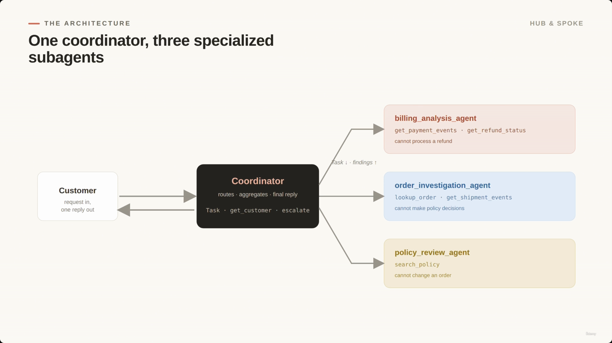

---

## 2. Handling Complex Requests

- A single customer message can contain multiple unrelated issues.
- **Example:** *"I think I was charged twice for order A1042. Also, the headphones arrived damaged, and I want to know if I can still return the charger from my previous order?"*
- This one message triggers three distinct domains: **billing issue**, **order investigation**, **policy review**.
- **[Design Comparison]**
    - **Weak design:** one agent attempts to handle everything within a single, long context.
    - **Better design:** the coordinator delegates specific parts of the request to specialized subagents.

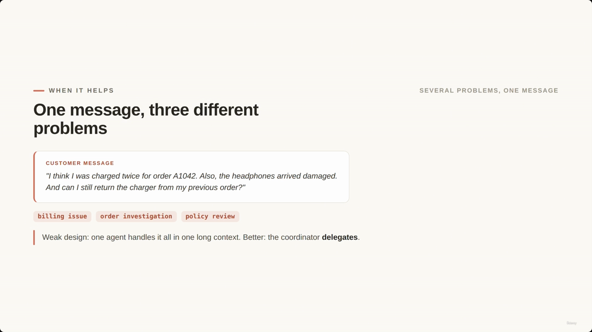

> **Transcript color:** "This is not one issue. It is a billing issue, an order investigation issue, and a policy review issue. A weak design would ask one agent to handle everything in one long context. A better design is to let the coordinator delegate."

---

## 3. Defining the Coordinator Hub

- To enable delegation, the coordinator must be explicitly given the ability to spawn subagents via the **`Task` tool**.
- Without `Task` in `allowedTools`, the coordinator can *reason* about the need to delegate but **cannot actually execute** the command to spawn a subagent.

```json
coordinator_agent = {
    "name": "shopassist_coordinator",
    "description": "Routes complex requests and writes the reply.",
    "allowedTools": ["Task", "get_customer", "escalate_to_human"],
    "system": "Break complex requests into meaningful tasks. Use subagents for investigation. All communication with the customer goes through you."
}
```

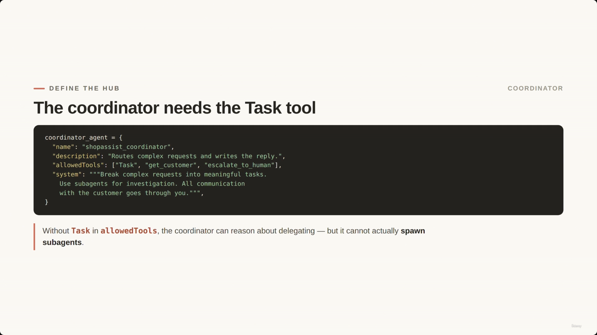

---

## 4. Defining the Spokes: Tool Restrictions

- Each specialist is granted only the specific tools required for its domain — this limits the scope of what an agent can do, preventing unintended actions.

```python
billing_analysis_agent
      allowedTools = ["get_payment_events", "get_refund_status"]
# analyze billing facts only · do not contact the customer

order_investigation_agent
      allowedTools = ["lookup_order", "get_shipment_events"]
# report what happened, the evidence, and what is missing

policy_review_agent
      allowedTools = ["search_policy"]
# return the rule, exception conditions, and confidence
```

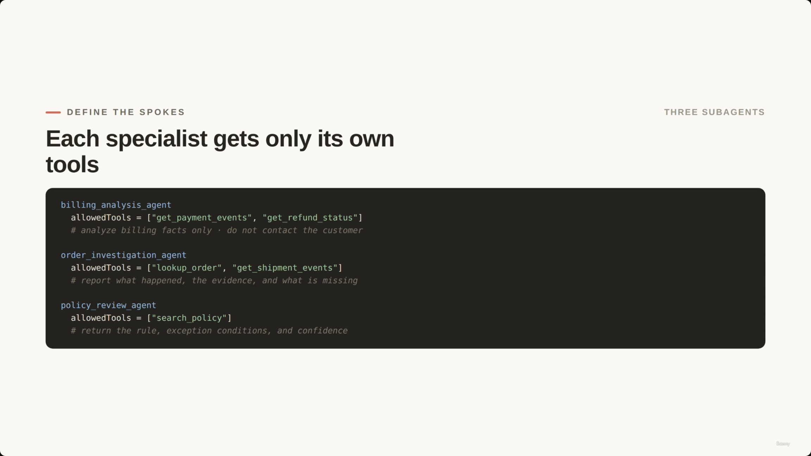

> **Transcript color:** "The billing agent can inspect payment events, but it cannot process a refund. The order agent can inspect shipment data, but it cannot make policy decisions. The policy agent can read policy, but it cannot change an order. This is one of the main practical benefits of sub-agents. Each agent receives only the tools it needs."

---

## 5. The Key Gotcha: Isolated Context

- Subagents start with a **blank slate** — they do not automatically inherit the full conversation history from the coordinator.
- **[Requirement]** The coordinator must pass necessary context explicitly within the `Task` prompt so the subagent understands the user's situation.

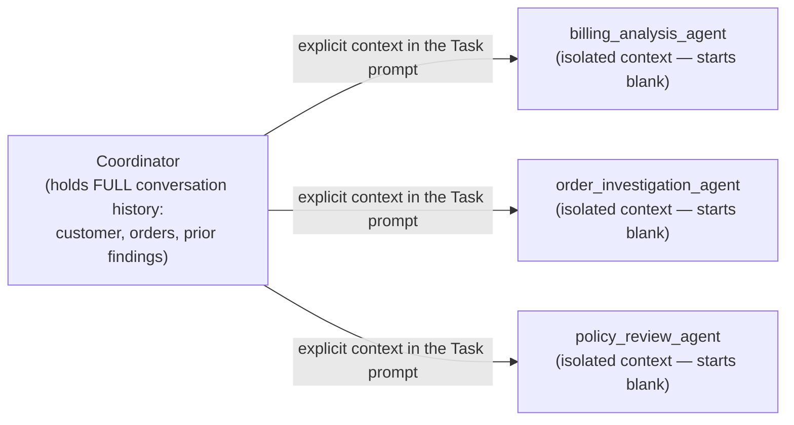

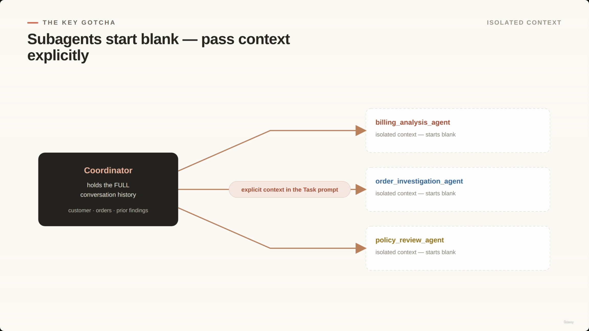

> **Transcript color:** "The coordinator should not assume sub-agents automatically know the full conversation. Sub-agents have isolated context. They do not automatically inherit the parent conversation history. So the coordinator must pass context explicitly."

---

## 6. Explicit Context Passing

This is the mechanic the lecture title emphasizes: nothing is inherited automatically. The coordinator must **deliberately construct** what it hands off in the `Task` prompt.

- **[The Problem] Vague tasks** — a generic prompt results in a subagent that lacks critical details like the customer identity, order ID, or the original user message.

```json
// Too vague: the subagent lacks context
{
  "subagent": "billing_analysis_agent",
  "prompt": "Check the billing problem."
}
```

- **[The Solution] Explicit & complete tasks** — instead of relying on "hidden memory," the coordinator must provide the exact facts needed for the task.

```json
// Better: passing complete context explicitly
billing_task = {
  "tool": "Task",
  "subagent": "billing_analysis_agent",
  "prompt": """Investigate a possible duplicate charge.
Customer context: customer id C-8821 - verified: true
Original message: \"...charged twice for A1042...\"
Relevant issue: possible duplicate charge for A1042
Return: {issue, evidence, conclusion, recommended_next_step, missing_information}"""
}
```

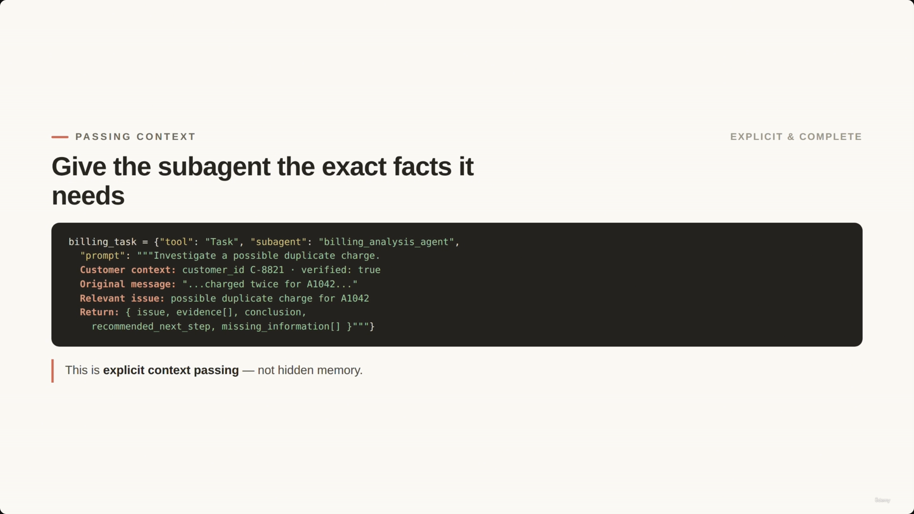

The sequence below makes the contrast explicit — a naive assumption that context "just flows" versus what actually has to happen:

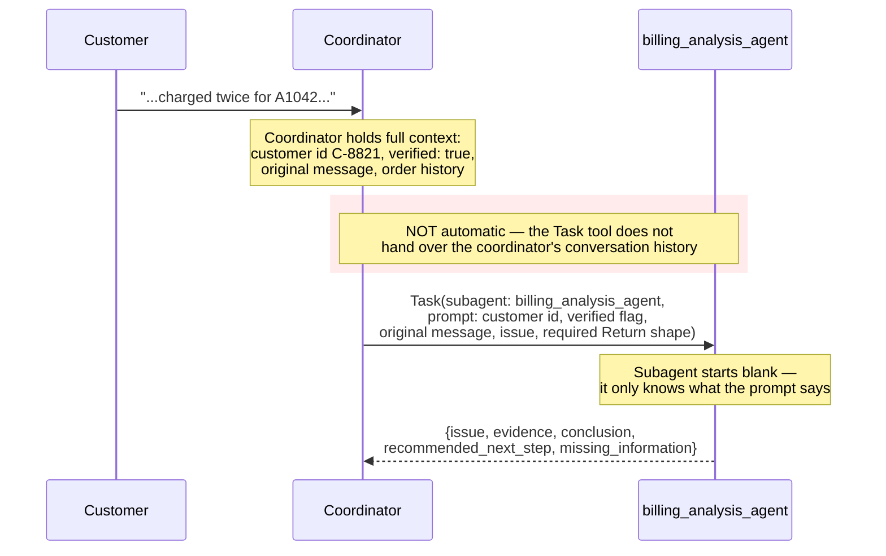

> **Transcript color:** "This is explicit context passing. We are not relying on hidden memory. We are giving the subagent the exact facts it needs."

---

## 7. Scaling Larger Workflows

- For complex workflows, it's beneficial to separate **content** from **metadata** and **prior findings**.
- **[Why?]** This prevents the subagent from mixing source text, system facts, and previous findings — which makes the final synthesis much easier.

```python
policy_task["prompt"] = """Review return eligibility.
CONTENT: can they still return a charger from a past order?
METADATA: customer id C-8821 | order A0977 | item charger | purchase_date 2026-05-12 | current_date 2026-06-30
PRIOR FINDINGS: verified customer | no refund issued yet
Return: rule | eligibility | missing facts | human review"""
```

**[Gap]** No screenshot exists for this slide — the slide-note captures a screenshot immediately before this section (00:02:25) and one immediately after it (the parallel-execution diagram), but the "Scaling Larger Workflows" slide itself was never captured. The code block above comes from the slide-note's own transcription rather than a verified screenshot.

---

## 8. Parallel Task Execution

- If the coordinator identifies that multiple issues are independent, it can execute subagents **in parallel** by emitting multiple `Task` tool calls in a single response.

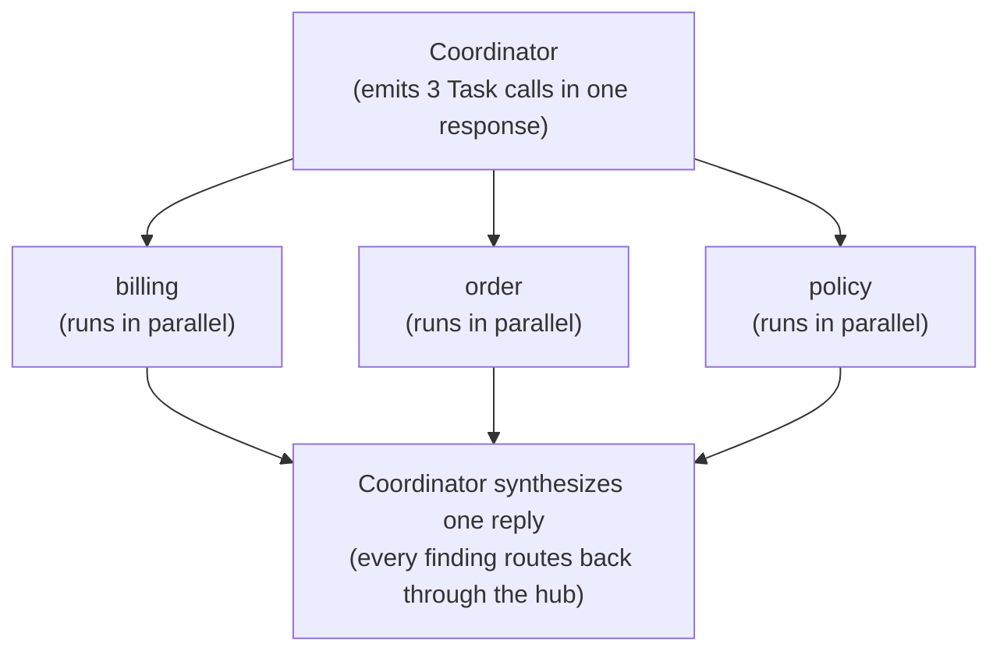

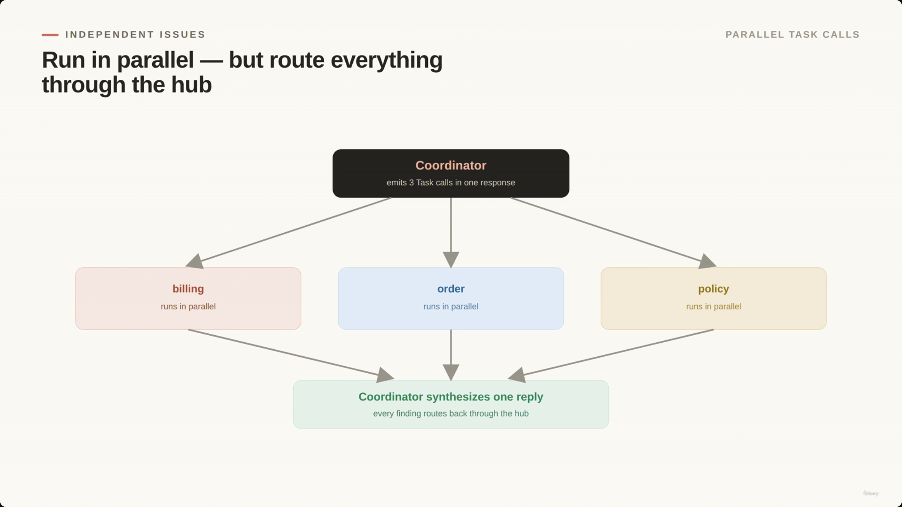

> **Transcript color:** "The key idea is that the coordinator is not waiting for billing before it starts order investigation because these tasks do not depend on each other."

**[Duplicate capture]** `screenshot-01M1PMER8RK3JPJM041WCFGT4V.png` (00:02:58) is the identical slide, recaptured 9 seconds later while the narrator kept talking — it is not embedded separately.

---

## 9. Managing Parallel Execution

- **[The Flow] Routing through the hub** — parallel execution does not mean chaotic communication. All subagents return their findings to the coordinator, and the coordinator is responsible for aggregating them into one unified response.
- **[Responsibilities] What the coordinator owns:** routing tasks to subagents, aggregating results, ensuring final response quality.

```json
// Example of structured findings returned to the coordinator
subagent_findings = {
  "billing": {"conclusion": "two authorizations, only one captured",
    "next": "explain the 2nd auth drops off automatically"},
  "order": {"conclusion": "delivered yesterday, damage evidence needed",
    "next": "ask the customer to upload a photo"},
  "policy": {"conclusion": "charger is outside the 30-day window",
    "next": "escalate only if defect / warranty"}
}
```

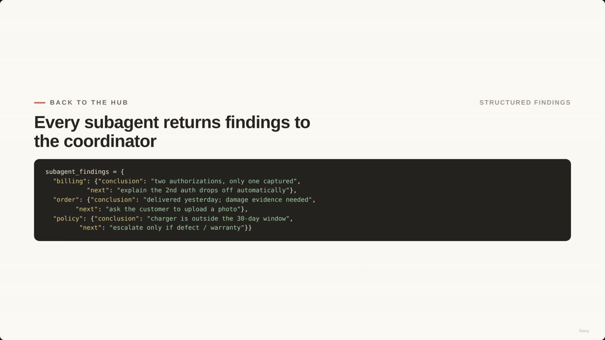

> **Transcript color:** "All communication still routes through the coordinator. Subagents return findings to the coordinator. The coordinator decides what to tell the customer... This is what the coordinator owns: routing, aggregation, and final response quality."

---

## 10. Design Warning: Avoid Over-Decomposition

- **Split on meaningful business boundaries.**
    - **Good boundaries:** `billing`, `order investigation`, `policy review`, `escalation`.
    - **Too narrow:** creating subagents for tiny fields like `check customer name` or `check order date` (unless they are part of a larger workflow).
- **[Why?]** Decomposing too narrowly adds unnecessary overhead and makes the system harder to reason about.

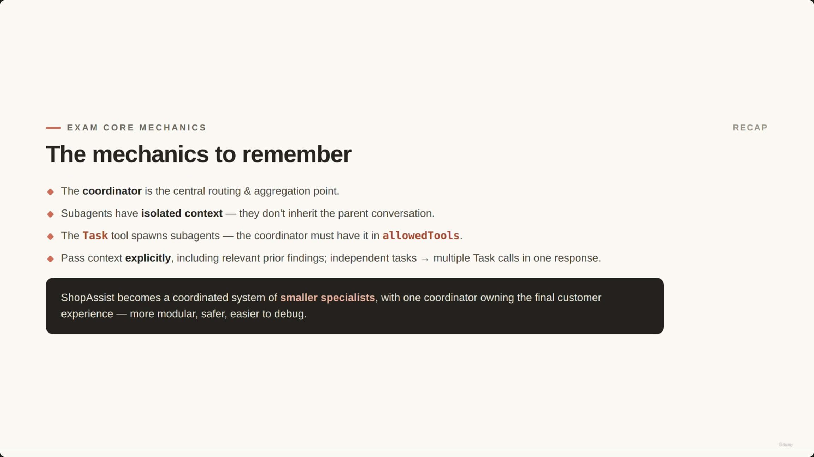

**[Duplicate capture]** `screenshot-01M1PMER8R0YFT1AY1DWASFGQ3.png` (00:03:37) is the identical slide, recaptured 30 seconds earlier — it is not embedded separately.

---

## 11. Exam Core Mechanics

- **The coordinator** is the central routing and aggregation point.
- **Subagents have isolated context** — they do not automatically inherit the parent conversation.
- **The Task tool** spawns subagents — the coordinator must have this tool in its `allowedTools` list.
- **Pass context explicitly** — include relevant prior findings; independent tasks can trigger multiple `Task` calls in a single response.


**[Slide detail]** The closing slide's dark callout box reads: *"ShopAssist becomes a coordinated system of smaller specialists, with one coordinator owning the final customer experience — more modular, safer, easier to debug."* This phrasing isn't in the slide-note's own bullets, though it closely mirrors the transcript's closing lines below.

> **Transcript color:** "In production, this architecture keeps complex support workflows more modular, safer, and easier to debug. Instead of one large agent with every tool and every responsibility, ShopAssist becomes a coordinated system of smaller specialists, with one coordinator responsible for the final customer [reply]."

---

## Quick comparison

| Concept | What it does | Who defines it |
|---|---|---|
| **Coordinator** | Central hub — routes, aggregates, owns the final customer reply | `allowedTools` includes `Task`, plus any customer-facing tools (e.g. `get_customer`, `escalate_to_human`) |
| **Subagent** | Specialist spoke — narrow tool access, returns structured findings | `allowedTools` limited to its domain (e.g. `search_policy` only) |
| **`Task` tool** | The mechanism that spawns a subagent | Must be explicitly present in the coordinator's `allowedTools`, or delegation is impossible even if the model "wants" to |
| **Context passing** | Never automatic — subagents start blank | The coordinator constructs the `Task` prompt by hand: customer id, verified flag, original message, relevant issue, expected return shape |
| **Parallelism** | Independent subagent tasks can run concurrently | Coordinator emits multiple `Task` calls in a single response; results still route back through the hub |

---

## Cross-reference: Agent SDK (Lecture 03)

Lecture 03 defined the Agent SDK's purpose as providing structure for multi-step orchestration — "agents, tools, hooks, **handoffs**, and execution flow" — and framed the key architectural question as *control*: what the agent decides vs. what the application enforces. The coordinator/subagent pattern here is that same control question applied concretely:

- The **handoff** Lecture 03 mentioned in the abstract is, here, a specific mechanism: a `Task` tool call carrying an explicitly-written prompt.
- The tool restrictions on each subagent (`billing_analysis_agent` cannot process a refund, `policy_review_agent` cannot change an order) are the same kind of enforced boundary as the prerequisite gates in Lecture 03 — deterministic limits the architecture guarantees, not something left to a system prompt's persuasive power.

---

## Summary

- **Hub-and-spoke:** the coordinator is the hub; specialized subagents are the spokes.
- **The `Task` tool is the delegation mechanism** — without it in `allowedTools`, the coordinator can reason about delegating but cannot execute it.
- **Tool restrictions per subagent** keep each specialist scoped to its domain and unable to take actions outside it.
- **Context is never inherited** — subagents start blank. The coordinator must explicitly construct the facts each subagent needs (customer id, verification status, original message, prior findings) inside the `Task` prompt.
- **Separating content / metadata / prior findings** in larger prompts keeps the subagent from conflating source text with system facts, easing final synthesis.
- **Independent tasks can run in parallel** via multiple `Task` calls in one coordinator response — but every finding still routes back through the hub for aggregation.
- **Decompose on business boundaries**, not on every tiny field or lookup — over-decomposition adds overhead without adding clarity.

---

*Sources: [slide notes](../24-Coordinator-Subagents-TaskTool-And-ExplicitlyContextPassing.md) · [[hover-notes-transcripts/24-Coordinator-Subagents-TaskTool-And-ExplicitlyContextPassing (transcript)|full transcript]]*
