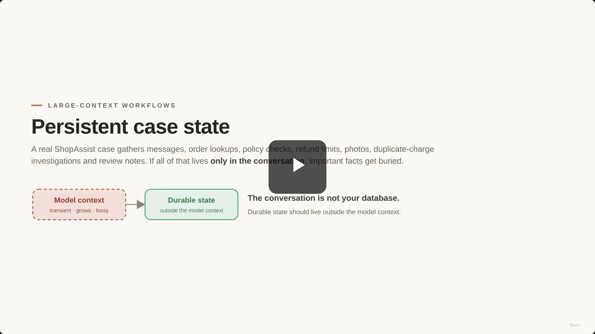
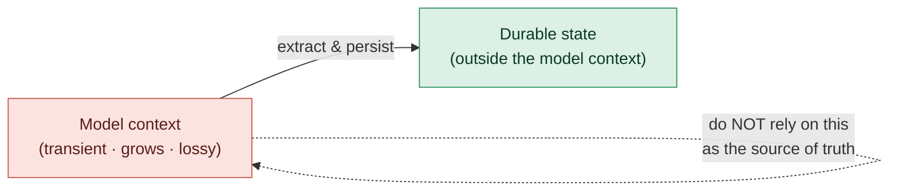
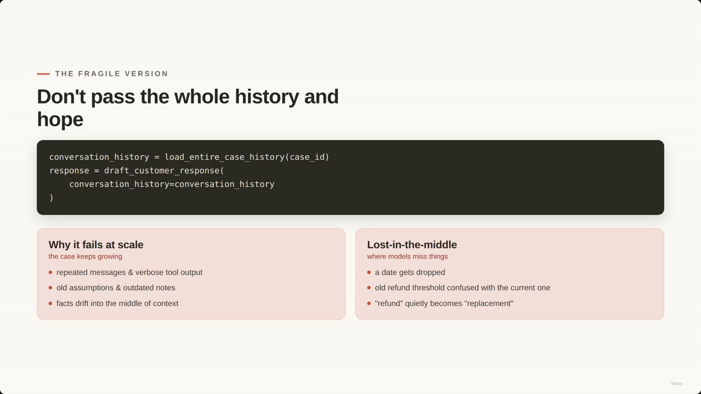
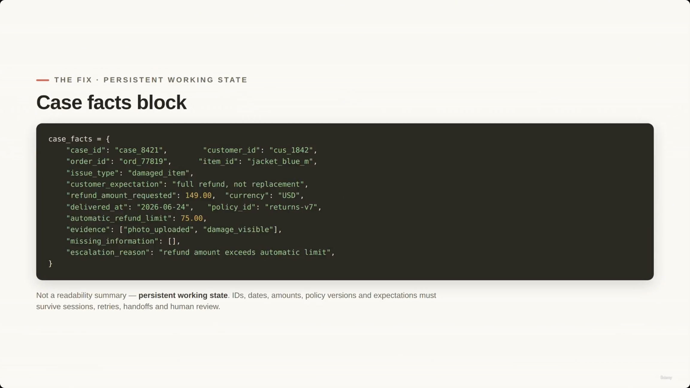
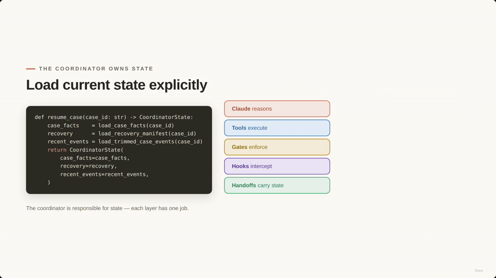
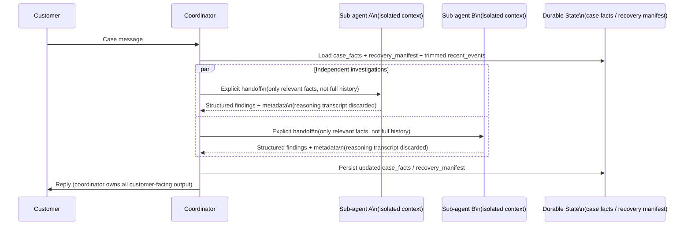
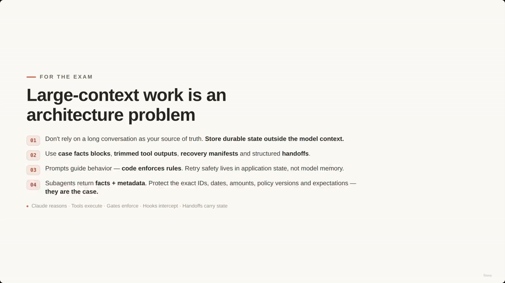

# Session State, Forking, Scratchpads & Large-Context Workflows

> This lecture's central production rule: **the conversation is not your database.** For long-running ShopAssist-style support cases, durable state — IDs, dates, amounts, policy versions, recovery progress — must live *outside* the model context, not just inside a growing chat history. The lecture builds this up through five ideas: the fragile "pass the whole history" approach, the lost-in-the-middle failure mode, a structured **case facts block**, a **recovery manifest** for safe resumption, and **sub-agent isolation** (agents don't inherit the parent's history — the coordinator hands them exactly what they need).

> **[Note on the title]** The lecture title promises "forking" and "scratchpads," but neither the slide text nor the transcript ever uses those words literally. The closest real analogues in the actual content are: (1) the **case facts block / recovery manifest** pattern — structured state parked outside the model context and re-loaded on demand, functioning like a scratchpad; and (2) **sub-agent isolation with explicit handoffs** — spinning off an agent with a scoped, isolated context rather than the full conversation, which is the substance behind "forking" a session. The diagrams below are built strictly from these described mechanics, not from a specific forking/scratchpad API the source doesn't describe.



---

## The core pattern: durable state outside the model context



This is the slide's own diagram, reproduced faithfully. Everything else in the lecture is an elaboration of the right-hand box: *what* durable state looks like and *how* it's loaded back in.

---

## 1. Persistent Case State — why the naive approach breaks

- In long-running workflows, passing the entire conversation history (recent messages, tool results, user requests) into every model call is risky.
- A real ShopAssist support case accumulates disparate data over time:
  - Customer messages
  - Order lookups
  - Policy checks
  - Refund limits
  - Photos of damaged items
  - Duplicate-charge investigations
  - Human review notes
  - Internal decisions
- If all of this lives *only* in the conversation history, important facts get buried.

> **Transcript color:** "In short cloud workflows, we can often pass the recent conversation, tool results, and user requests directly into the next model call. But in long-running workflows, that becomes risky... So in this lesson, we'll focus on one production rule. The conversation is not your database."

---

## 2. The Fragile Version & the Lost-in-the-Middle Problem

The naive pattern looks deceptively simple:

```python
conversation_history = load_entire_case_history(case_id)
response = draft_customer_response(
    conversation_history=conversation_history
)
```

**Why it fails at scale** (as the case keeps growing):
- Repeated messages and verbose tool output pile up
- Old assumptions and outdated notes linger
- Facts drift into the *middle* of the context — the zone models are statistically most likely to miss (the **lost-in-the-middle problem**)

**Concrete failure modes called out on the slide:**
- A date gets dropped
- An old refund threshold gets confused with the current one
- "Refund" quietly becomes "replacement"

> **Transcript color:** "As a case grows, the model sees more repeated messages, verbose tool output, old assumptions, and outdated intermediate nodes... This is often called the lost-in-the-middle problem."



---

## 3. The Fix: Case Facts Block

- A **structured, persistent working state** — explicitly *not* just a summary for readability.
- **Why it's necessary:** critical data must survive long sessions, retries, handoffs, and human review.
- **Key data to include:** IDs and dates, refund amounts, policy versions and percentages, customer expectations.

```python
case_facts = {
    "case_id": "case_8421",
    "customer_id": "cus_1842",
    "order_id": "ord_77819",
    "item_id": "jacket_blue_m",
    "issue_type": "damaged_item",
    "customer_expectation": "full refund, not replacement",
    "refund_amount_requested": 149.00,
    "currency": "USD",
    "delivered_at": "2026-06-24",
    "policy_id": "returns-v7",
    "automatic_refund_limit": 75.00,
    "evidence": ["photo_uploaded", "damage_visible"],
    "missing_information": [],
    "escalation_reason": "refund amount exceeds automatic limit",
}
```

Screenshot-verified — every field name and value above matches the on-slide code exactly (no transcription drift).



---

## 4. The Coordinator Owns State

The coordinator (from Lecture 24/25's coordinator/sub-agent pattern) is responsible for *explicitly* loading current state — nothing is assumed to still be "in the model's head":

```python
def resume_case(case_id: str) -> CoordinatorState:
    case_facts = load_case_facts(case_id)
    recovery = load_recovery_manifest(case_id)
    recent_events = load_trimmed_case_events(case_id)
    return CoordinatorState(
        case_facts=case_facts,
        recovery=recovery,
        recent_events=recent_events,
    )
```

Each layer has exactly one job:

| Layer | Responsibility |
|---|---|
| Claude | reasons |
| Tools | execute |
| Gates | enforce |
| Hooks | intercept |
| Handoffs | carry state |

> **Transcript color:** "The coordinator is responsible for state. Claude reasons. Tools execute, gates enforce, hooks intercept, handoffs carry structured state."



*(The slide note also references this same "Load current state explicitly" slide at 00:01:29 and 00:01:45 — both are the identical, unchanged slide captured while the narrator kept talking; only the one representative image above is kept.)*

---

## 5. Recovery Manifest vs. Chat Transcript

- **Why it's necessary:** if a workflow is interrupted, you cannot rely on guessing the state from a long chat transcript.
- A **recovery manifest** stores the exact progress, giving a reliable way to resume without re-running dangerous or non-idempotent actions.
- **Safety distinction:** some actions are safe to retry, others are not.
  - Drafting a customer response is usually safe to retry.
  - Processing a refund is **not safe** to retry blindly.
  - This decision must be stored in application state — not left to the model's memory.

```python
recovery_manifest = {
    "last_completed_step": "check_return_policy",
    "pending_step": "escalate_to_human",
    "safe_to_retry": [
        "draft_customer_response",
        "process_refund"
    ],
    "last_tool_results": {
        "status": "requires_human_review",
    },
}
```

**[Inconsistency in source]** The example `safe_to_retry` list above places `"process_refund"` alongside `"draft_customer_response"` — but this directly contradicts the slide's own preceding bullet (and the transcript, which independently repeats the same rule): *"Processing a refund is not safe to retry blindly."* This looks like a copy/paste error in the course's example data. Treat the stated rule as authoritative: refund processing should **not** be in a `safe_to_retry` list; only clearly idempotent/non-destructive actions (like drafting a response) belong there.

There is no screenshot for this slide in the source material — the note's bullets and code are used as-is (with the caveat above flagged).

---

## 6. Backend Enforcement

- Prompts can *instruct* a model to follow rules (e.g., "do not process large refunds automatically"), but if a rule must **always** hold, the backend must enforce it in code — not just in the system prompt.
- A model might recommend an action that violates a hard rule; the application layer is the final gatekeeper.

> **Transcript color:** "Claude may recommend a refund. But the tool validates the session, checks the amount, applies business rules, and returns a structured result. That is the correct boundary. Prompts guide behavior. Code enforces rules."

This is the same "prerequisite gate" idea from Lecture 25's hooks/gates material, applied here specifically to refund amounts and case state rather than tool authorization generally.

---

## 7. Reducing Context Pressure

- **Problem:** weak tool implementations often return entire internal records (e.g., a full order record with payment logs, warehouse scans, and audit fields) that the agent doesn't actually need.
- **Solution — trimmed tool outputs:** tools should return only the relevant facts required for the specific reasoning task, preventing the context window from flooding with noise.
- **Optimization — strategic information ordering:** when aggregating inputs, place key summaries at the very beginning of the context, rather than burying them after pages of logs — directly combating the lost-in-the-middle effect described above.

---

## 8. Risks of Long-Running Workflows

- **Problem:** text-based workflows degrade gradually as the conversation grows. The model may keep a confident tone while quietly failing on specifics — missing dates, confusing outdated thresholds, misremembering whether the customer wanted a refund or a replacement.
- **Risk — progressive summarization decay:** if a workflow relies on repeatedly summarizing prior summaries, small but critical details can vanish over successive rounds.
- **Solution:** critical facts must be preserved in **structured state** (the case facts block), not solely in natural-language summaries.

---

## 9. Sub-Agent Architecture — the "forking" pattern in practice

- Sub-agents are effective for splitting work into independent investigations (multiple can run **in parallel** when the work is independent).
- **Constraint — isolated context:** sub-agents do *not* automatically inherit the parent conversation's history. The coordinator must explicitly pass the relevant facts and state for the sub-agent to do its job.
- Sub-agents should return **structured findings and metadata** — not long reasoning transcripts. Structured output is easier to verify, store, compare, and pass forward.
- The coordinator still owns final integration: **all customer-facing communication routes through the coordinator**, never directly from a sub-agent.

> **Transcript color:** "We are not asking [sub-agents] for a long reasoning transcript. We are asking for structured findings and metadata... Another agent, a human reviewer, or a later workflow step can continue without reconstructing the entire conversation."

This is where the lecture title's "forking" concept actually lives: a sub-agent is effectively a forked branch of work that starts from a clean, scoped context (not the full parent history), does its investigation, and returns a small structured result — its internal reasoning transcript is discarded rather than merged back wholesale.



**Reading it:** each sub-agent branch starts from a deliberately narrow slice of state, not a fork of the entire conversation object — that narrowness is the whole point. Nothing about a copy-on-write session object or a specific "fork" API is described in the source; this diagram illustrates the *isolation + structured handoff* mechanics the transcript actually describes.

---

## 10. Architecture for Large-Context Work (exam framing)

- **Key principle:** large-context work is an **architecture problem**, not just a prompting problem.
  - Don't rely on a long conversation as your source of truth.
  - Store durable state outside the model context.
- **Core strategies for reliability:**
  1. Don't rely on a long conversation as your source of truth — **store durable state outside the model context.**
  2. Use **case facts blocks**, **trimmed tool outputs**, **recovery manifests**, and structured **handoffs**.
  3. Prompts guide behavior — **code enforces rules.** Retry safety lives in application state, not model memory.
  4. Sub-agents return **facts + metadata**. Protect the exact IDs, dates, amounts, policy versions, and expectations — they *are* the case.



---

## Summary

| Strategy | Implementation detail |
|---|---|
| Source of truth | Store durable state outside the model context |
| Rule enforcement | Prompts guide behavior; code enforces rules |
| Sub-agent output | Return facts + metadata (IDs, dates, amounts, etc.), not reasoning transcripts |
| Handoffs | Use specific, structured findings — easy to verify, store, compare, and pass forward |
| Retry safety | Store safe-to-retry decisions in application state, never in model memory |

- **Reliability comes from architecture, not just prompting.** Long conversations are not a database.
- **Protect exact details.** In production, identifiers (customer/order IDs), financials (refund amounts), temporal/policy data (dates, policy versions, percentages), and context (missing information, customer expectations) are not "small details" — they are the case itself, and progressive summarization can quietly erode them if they aren't held in structured state.
- **Cross-reference:** this builds directly on Lecture 24's coordinator/sub-agent pattern and Lecture 25's gates/hooks/handoffs — this lecture adds the *state* dimension (case facts block, recovery manifest) that makes those patterns safe to use across long-running, interrupted, or retried workflows.

---

## Screenshot audit notes

- The slide note references 9 screenshot timestamps; only **5 unique slide states** exist. Two slides ("Load current state explicitly" and "For the exam") were each captured three and two times respectively while the narrator kept talking over an unchanged slide — duplicates were dropped, keeping one representative image per unique state.
- One duplicate capture (00:00:48) happened to include the Hover Notes browser-extension overlay showing the video title "26-SessionState-Forking-..." — useful confirmation that no lecture-bleed occurred; all 9 captures belong to this lecture.
- No screenshots exist for the Recovery Manifest, Backend Enforcement, Reducing Context Pressure, Risks/Progressive-Summarization-Decay, or Sub-Agent Architecture sections — the slide note's own bullets have no corresponding image reference there either, so this is a genuine gap in the source capture, not an omission introduced here.
- The `safe_to_retry` code example listing `process_refund` as safe to retry directly contradicts the explicit "processing a refund is not safe to retry blindly" rule stated in both the slide bullets and the transcript — flagged above under Recovery Manifest as a likely copy/paste error in the original course material.

---

*Sources: [slide notes](../26-SessionState-Forking-Scratchpads-And-LargeContextWorkflows.md) · [[hover-notes-transcripts/26-SessionState-Forking-Scratchpads-And-LargeContextWorkflows (transcript)|full transcript]]*
