# BUILD: ShopAssist Becomes An Agentic System

> ShopAssist stops being "one prompt, one tool call" and becomes a **controlled loop**: Claude reads the customer request, chooses tools, reviews tool results, continues when it needs more information, and stops when the case is ready for a response or human escalation. This lecture is the capstone of the agentic-system arc — it wires together tool-use lifecycle, effective tool design, gates/hooks, and structured handoffs (from the prior lectures) into one working notebook, `13_shopassist_agents.ipynb`.

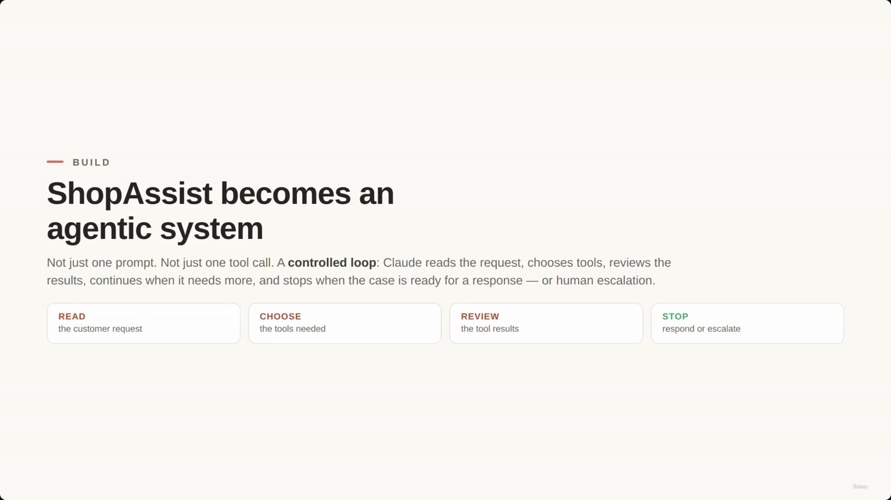

## The agentic loop: READ → CHOOSE → REVIEW → STOP

- **READ** — Claude reads the customer request.
- **CHOOSE** — Claude chooses the necessary tools.
- **REVIEW** — Claude reviews the tool results.
- **STOP** — the process stops when the case is ready for a response or human escalation.

> **Transcript color:** "Not just one prompt, not just one tool call. A controlled loop where Claude reads the customer request, chooses tools, reviews tool results, continues when more information is needed, and stops when the case is ready for a response or human escalation."

---

## The Architecture Rule — five layers, one job each

The system enforces a strict separation of responsibility so Claude never executes business actions directly — it only **reasons and requests tools**.

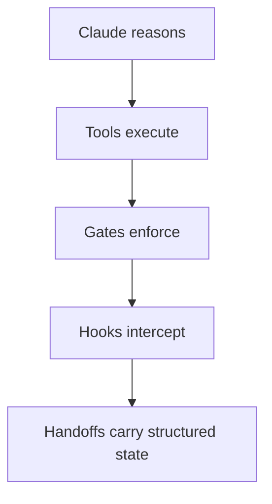

- **Claude reasons** — decides what to do next, never touches a real system.
- **Tools execute** — the backend runs the actual function for a requested tool.
- **Gates enforce** — deterministic backend checks (e.g. is the customer verified?) that a tool call must pass before proceeding.
- **Hooks intercept** — backend logic that can block or redirect a tool's own execution (e.g. a refund limit).
- **Handoffs carry structured state** — escalation to a human is a data-rich handoff, not a vague fallback.

**Demo vs. production:**
- In the demo, backend tools return **mock data**.
- In production, the same functions call real systems: customer DB, order API, payment provider, refund service, or ticketing system.

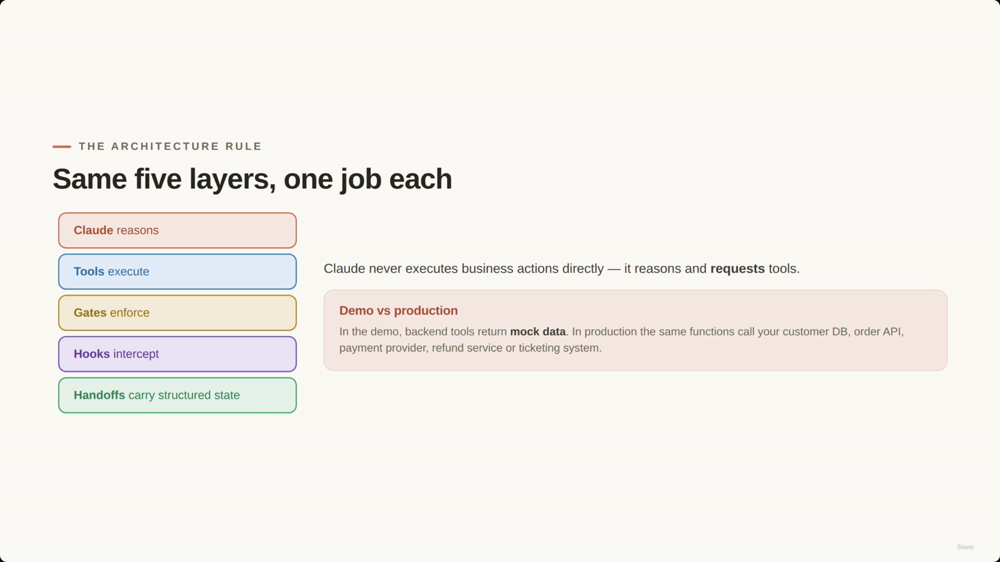

This five-layer split is the same "which layer guarantees the behavior" question from the [[03-ClaudeApp-vs-ClaudeAPI-vs-ClaudeCode-vs-MCP-vs-AgentSDK|Claude API vs Agent SDK lecture]] — Claude decides, but the backend still owns enforcement.

---

## The customer case (multi-concern request)

**Customer message:**
> "Hi, I received my blue jacket yesterday and it arrived damaged. I also think I was charged twice. I want a full refund, not a replacement. My order number is ORD-77819."

**Identified concerns, all in one message:**
1. Damaged item issue
2. Refund request
3. Possible duplicate charge

**[Why an agentic workflow, not a fixed pipeline?]** A fixed pipeline could miss or mismanage one of these overlapping concerns. An agentic workflow lets Claude decide which tools are needed and in what order — but Claude still does not execute business actions directly. It reasons about the situation and requests specific tools to do the work; the backend performs the work with typed arguments.

> **Transcript color:** "This is a multi-concern request... A fixed pipeline could miss one of those concerns. An identity workflow is useful because Claude can decide which tools are needed and in what order. But Claude does not execute business actions directly."

---

## Demo tool definitions

Six tools map to backend functions, each with a typed `input_schema` (the same tool-contract discipline from the MCP discussion in lecture 03):

| Tool | Purpose |
|---|---|
| `verify_customer` | Checks the currently authenticated customer session |
| `lookup_order` | Retrieves order details using `customer_id` and `order_id` |
| `check_return_policy` | Validates a specific item and reason against return rules |
| `investigate_duplicate_charge` | Checks payment records for a potential double charge |
| `process_refund` | Creates a refund, subject to verification and policy gates |
| `escalate_to_human` | Creates a structured handoff for human intervention |

**[Screenshot-verified schema]** The slide bullets don't spell out the exact JSON schemas — the notebook does. Reconstructed from the two schema screenshots below:

```python
tools = [
    {
        "name": "verify_customer",
        "description": "Verify the currently authenticated customer session.",
        "input_schema": {
            "type": "object",
            "properties": {},
            "required": []
        }
    },
    {
        "name": "lookup_order",
        "description": "Look up an order for a verified customer.",
        "input_schema": {
            "type": "object",
            "properties": {
                "customer_id": {"type": "string"},
                "order_id": {"type": "string"}
            },
            "required": ["customer_id", "order_id"]
        }
    },
    # ... check_return_policy, investigate_duplicate_charge, process_refund ...
    {
        "name": "escalate_to_human",
        "description": "Create a structured human escalation handoff.",
        "input_schema": {
            "type": "object",
            "properties": {
                "customer_id": {"type": "string"},
                "order_id": {"type": "string"},
                "root_cause": {"type": "string"},
                "refund_amount": {"type": "number"},
                "recommended_action": {"type": "string"},
                "evidence": {"type": "array", "items": {"type": "string"}},
                "missing_information": {"type": "array", "items": {"type": "string"}},
                "escalation_reason": {"type": "string"}
            },
            "required": ["customer_id", "order_id", "root_cause", "..."]
        }
    }
]
```

**[Slide detail]** `verify_customer` takes **no input properties at all** (`"properties": {}`) — it isn't given a customer ID by Claude, it checks a session the backend already holds. This is the concrete embodiment of "the backend decides, not the agent." The `escalate_to_human` schema is considerably richer than the slide bullets imply: it carries `root_cause`, `recommended_action`, `evidence` (array), `missing_information` (array), and `escalation_reason` alongside the order identifiers — the `required` list is cut off in the captured frame, so the full required-fields list is not fully confirmed.

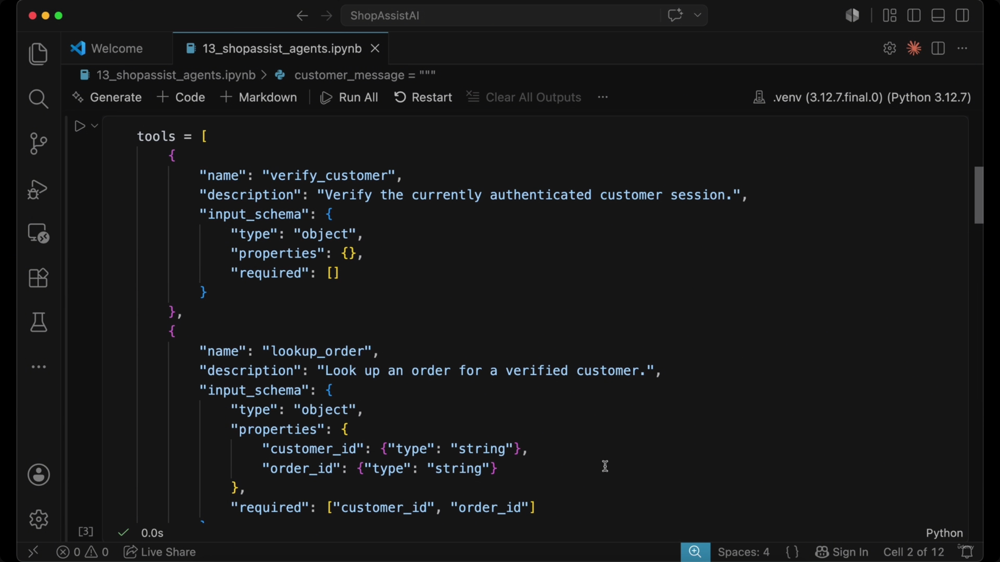
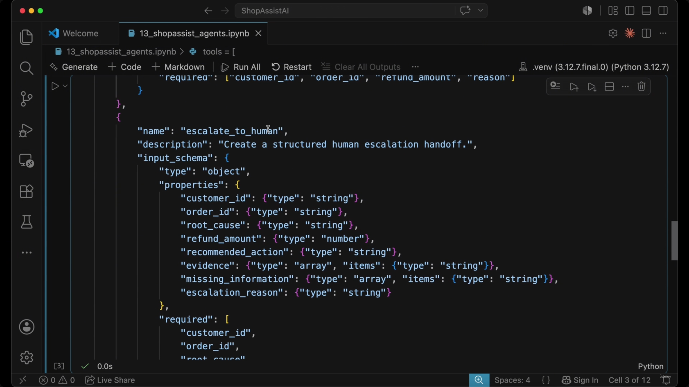

> **Note on misfiling:** in the original slide note, the 00:01:16 screenshot (tool schemas) was captured under "The Architecture Rule" heading and the 00:01:44 screenshot (the `escalate_to_human` schema) was captured under a separate "Tool Execution Principle" heading. Both actually belong here, together — they're two scroll positions of the same `tools = [...]` array. Filed by content, not by capture timestamp.

---

## Case facts — workflow memory

- A persistent block of data that acts as the **memory** for the agentic workflow.
- **[Purpose]** Protects and carries forward critical details through the reasoning loop, outside the model's own context.
- **Key data points stored in case facts:** order IDs and item IDs, refund amounts, evidence and missing information, escalation reasons.
- The `update_case_facts` function stores this information outside the immediate model context, so the block survives the loop and gives the coordinator a stable, persistent view of the case.

**[Gap]** No screenshot actually shows the `case_facts` dict's literal structure or its initial values — only the notebook breadcrumb (`case_facts = {`) confirms the cell exists. The exact keys/shape of `case_facts` are not visible in any captured frame; the "key data points" list above is the note's only source for its contents.

---

## Backend function logic & gates

### Customer verification gate
- Acts as a prerequisite for sensitive actions like processing refunds.
- **[Process]** Claude requests verification, but the **backend** evaluates the session and returns a definitive status — the backend decides pass/fail, not the agent.

### Order lookup
- Uses explicit, typed arguments (`customer_id`, `order_id`) so the agent can't guess or infer identifiers from unstructured customer text.

**[Screenshot-verified code]** The slide note doesn't show the actual verification/lookup function bodies — the notebook does (this screenshot was captured under a "Case Facts" heading purely by chronological lag; it's filed here by content instead):

```python
def verify_customer():
    if SESSION["session_token"] != "valid_session":
        return {
            "status": "error",
            "error_code": "CUSTOMER_NOT_VERIFIED",
            "message": "Customer verification failed."
        }
    return {
        "status": "success",
        "customer_id": "CUS-1842"
    }

def lookup_order(customer_id: str, order_id: str):
    if customer_id != "CUS-1842" or order_id != "ORD-77819":
        return {
            # ... error branch (not fully visible in frame)
        }
```

**[Slide detail]** `verify_customer()` takes **zero arguments** — it checks a module-level `SESSION` dict, not anything Claude supplies. The demo hardcodes `customer_id = "CUS-1842"` and `order_id = "ORD-77819"` as the only valid combination for the mock lookup to succeed. Neither the exact `SESSION` dict shape nor the `error_code` string (`CUSTOMER_NOT_VERIFIED`) appears in the slide-note bullets or the transcript — only in the code itself.

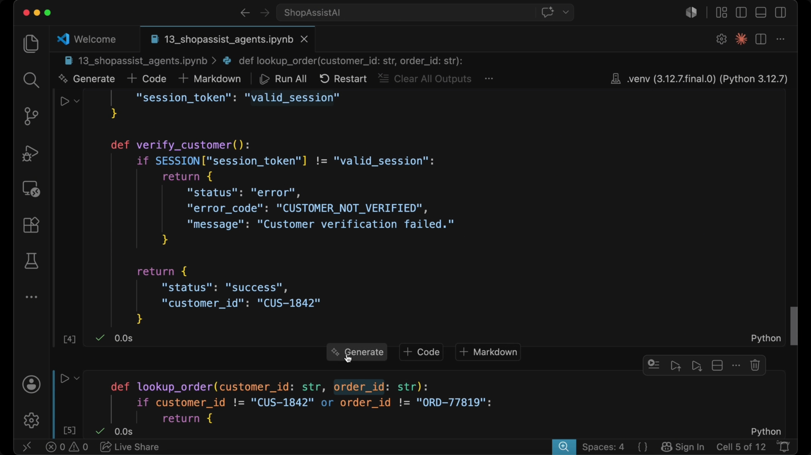

### Return policy check
- Evaluates item eligibility and specific return rules.
- **[Logic hook]** The return value includes an `automatic_refund_limit` (e.g. 75.00). If a requested refund exceeds this limit, it triggers additional logic/gates in the subsequent refund process.

```python
# Example of the structured return from a policy check
def check_return_policy(customer_id: str, order_id: str, item_id: str, reason: str):
    return {
        "status": "success",
        "policy_id": "returns-v7",
        "eligible": True,
        "automatic_refund_limit": 75.00,
    }
```

*(This function body is transcribed from the slide note's own code block; no screenshot in this capture set independently confirms it.)*

### Duplicate charge investigation
- A distinct concern, handled by a specialized tool (`investigate_duplicate_charge`).
- **[Advanced note]** In a larger system, the coordinator could run the policy check and the payment investigation **in parallel**, since the two do not depend on each other.

> **Transcript color:** "The item is eligible, but the refund amount is above the automatic limit. That limit will matter in the refund hook... In a larger system, the coordinator could run the policy check and payment investigation in parallel because they do not depend [on] each other."

---

## Refund tool & enforcement

**[The rule]** Prompts guide behavior, but code enforces the rules. Claude might decide a refund is appropriate, but the backend implements a **refund limit hook**: if the amount exceeds `automatic_refund_limit`, the backend blocks automatic processing and requires a different path (escalation).

```python
def process_refund(customer_id: str, order_id: str, refund_amount: float, reason: str):
    return {
        "status": "blocked",
        "error_code": "REFUND_LIMIT_EXCEEDED",
        "message": "Refund amount exceeds automatic approval limit.",
        "next_step": "escalate_to_human"
    }
```

*(Transcribed from the slide note's own code block; not independently confirmed by a screenshot in this set.)*

---

## The tool runner & the agentic loop

- **Tool Runner** — the backend execution layer. It receives tool requests from the agent, executes them, and returns structured results (`success`, `blocked`, or `error`).
- **The agentic loop pattern** — the cycle of reasoning and action, driven by `stop_reason`:
    1. Claude identifies a need for a tool and returns `stop_reason: "tool_use"`.
    2. The backend identifies the requested tool and its input.
    3. The backend executes the tool via `run_tool`.
    4. The system updates `case_facts` with the new information.
    5. Tool results are appended to the message history and sent back to Claude to continue reasoning.

**[Screenshot-verified code — corrects the slide note]** The slide note's inline code block for this step is a simplified paraphrase. The notebook's actual cell is more complete:

```python
if message.stop_reason == "tool_use":
    tool_results = []

    for block in message.content:
        if block.type != "tool_use":
            continue

        result = run_tool(block.name, block.input)

        tool_results.append({
            "type": "tool_result",
            "tool_use_id": block.id,
            "content": json.dumps(result)
        })

        update_case_facts(case_facts, block.name, result)

        print("Claude requested:", block.name)

    messages.append({
        "role": "user",
        # ... (content: tool_results, continued off-frame)
    })
```

**[Discrepancy flagged]** The slide note's version of this snippet omits the `tool_results = []` initialization, uses a positive `if block.type == "tool_use":` check instead of the actual `if block.type != "tool_use": continue` early-exit, and drops both the `print("Claude requested:", block.name)` line and the trailing `messages.append({"role": "user", ...})` call that feeds tool results back to Claude. The version above is reconstructed from the screenshot and is the authoritative one.

Also visible on-screen, immediately preceding this block in the same cell, is a system-prompt-style instructions string and the top of the main loop:

```python
# (top of the instructions string is off-frame — exact variable name/assignment not confirmed)
"""
Then verify the currently authenticated customer session.
After verification, inspect the order, check return policy, and investigate duplicate charge if needed.
If the customer requests a refund and the item is policy-eligible, request process_refund.
Do not decide by yourself whether the refund is allowed.
The backend refund tool will enforce refund limits and return success or a structured blocked result.
If process_refund returns a blocked result, use escalate_to_human with a structured handoff.
Do not produce the final customer response until either:
- the refund has been processed successfully, or
- the refund was blocked and the case was escalated to a human.
"""
    }
]

while True:
    message = client.messages.create(
        model=model,
        max_tokens=1200,
        tools=tools,
        messages=messages
    )
```

**[Slide detail — not in the bullets or transcript at all]** Neither the slide note nor the transcript mentions this instructions block, but it's the actual policy text steering Claude's behavior — explicitly telling it not to decide refund eligibility itself and not to draft a final response until the case is resolved one way or the other. The top of the string (before "Then verify...") is cut off in the captured frame, so its opening lines and exact variable name are not confirmed.

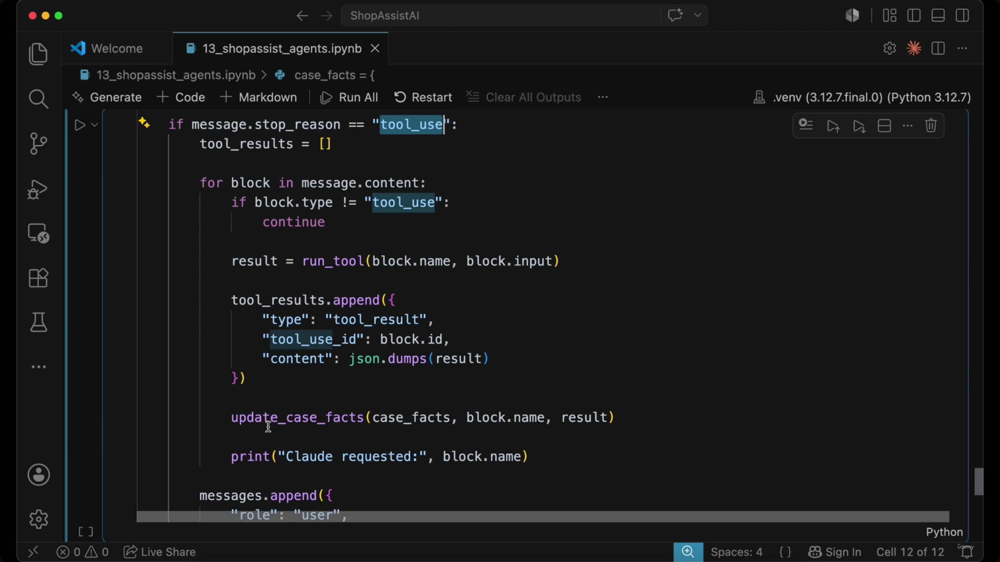
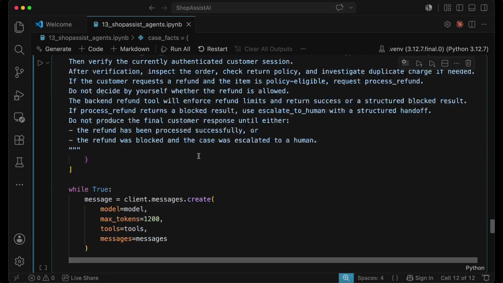

---

## Safe escalation & case fact persistence

**[Handling unexpected behavior]** If `stop_reason` is anything other than `tool_use` or `end_turn`, the system must not improvise — it performs a safe escalation to a human instead.

```python
if message.stop_reason == "end_turn":
    print(message.content[0].text)
    break

handoff = run_tool("escalate_to_human", {
    "case_facts": case_facts,
    "escalation_reason": f"Unexpected stop reason: {message.stop_reason}"
})
```

*(Transcribed from the slide note; no screenshot in this capture set independently confirms this exact snippet.)*

- **Case fact persistence** — `update_case_facts` stores critical information outside the immediate model context, so `case_facts` survives the loop and gives the coordinator a stable, persistent view of the case.

---

## Multi-concern workflow walkthrough

When a customer message contains multiple concerns, the agent treats them as (partially) independent tasks:

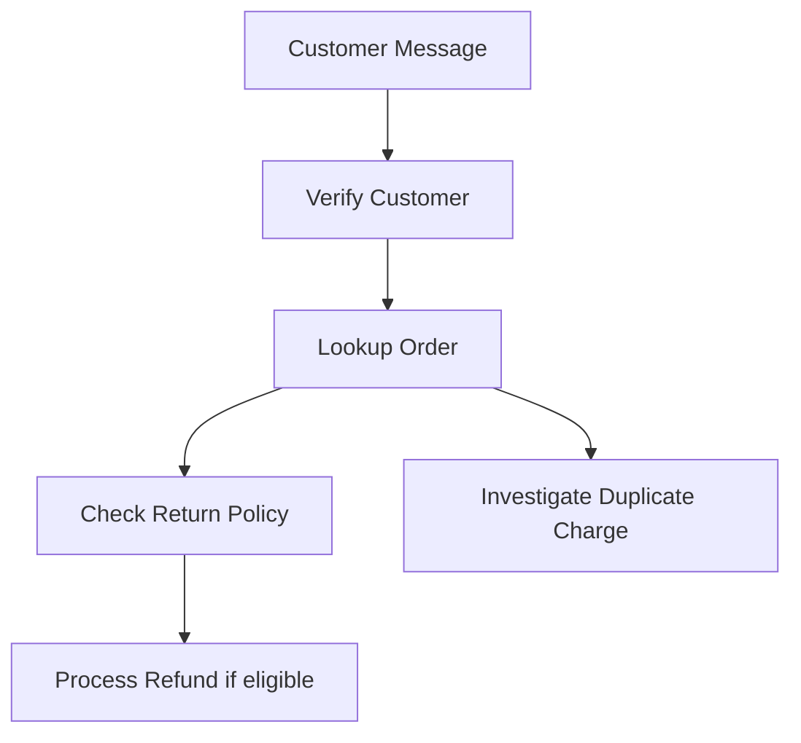

**Step-by-step execution:**
1. **Verification & lookup** — Claude requests verification and order lookup to establish the baseline.
2. **Policy & investigation** — once the order is retrieved, Claude can independently request a return policy check and a duplicate charge investigation.
3. **Resolution** — based on the findings (e.g. a damaged item), Claude may then proceed to request a refund.

**[Gap]** The slide note originally placed a screenshot here (timestamp 00:04:46), but on inspection that frame is an exact duplicate of the customer-response draft shown later (00:05:03, see below) — it shows no workflow diagram or additional content, just an early capture of the same text under the wrong heading. No unique screenshot exists for this walkthrough step; the diagram above is reconstructed from the slide note's own Mermaid source and bullets.

---

## Refund enforcement & human escalation

**[Enforcement via tool errors]** A refund tool can act as a safety hook by blocking requests that exceed a threshold. Here, the requested amount ($149) exceeds the automatic limit ($75), so `process_refund` returns a structured error instead of processing the refund. **This error is a feature of the system, not an agent failure** — it gives the agent the context it needs to stop and escalate correctly.

**Structured human escalation** — when a tool limit is hit, the agent calls `escalate_to_human` with a comprehensive context block: customer and order details, root cause, requested refund amount and supporting evidence, missing information, and the specific escalation reason.

**Drafting the customer response** — to ensure accuracy, the agent drafts its final response from `case_facts` (the verified state) — not from scattered intermediate reasoning or unverified assumptions.

> **Transcript color:** "This error is not a failure of the agent. It is the system working correctly. The tool tells Claude what happened and what the next safe step is... ShopAssist drafts a customer response from verified state, not from scattered intermediate reasoning, not from unverified assumptions."

**[Screenshot-verified]** The drafted response, confirmed on-screen:

```text
## Here's where things stand, [customer]

Thank you for reaching out — I'm sorry to hear your Blue Jacket arrived damaged.
I've reviewed your case thoroughly and here's what I found:

### ✅ What We Confirmed
| Item | Detail |
|---|---|
| **Order** | ORD-77819 — Blue Jacket, delivered June 24 |
| **Damage Claim** | Logged and flagged on your order ✔ |
| **Refund Eligibility** | Your item **is eligible** for a return/refund |
| **Suspected Duplicate Charge** | No second charge was actually captured — there is a **pending authorization** on your account, but it has **not been billed**. It should drop off automatically, but our team will monitor it. |

### ⏳ Why Your Refund Needs Human Review
Your full refund of **$149.00** exceeds the threshold our system can approve
automatically. This doesn't mean your refund is denied — it simply requires a
**manual approval from our specialist team**.

### 📋 One Thing That May Help Speed Things Up
If you're able to **share a photo of the damage**, that can help the team expedite
your manual refund approval. You can reply here or send it to our support team
referencing **HANDOFF-3087**.
```

**[Discrepancy flagged]** The slide note's own reproduction of this text renders the table as a flat bullet list with double-dash emphasis (e.g. `--Order-- | ORD-77819...`) rather than a real Markdown table, and it doesn't include the ✅/⏳/📋 emoji headers or the ✔ checkmark that are actually on screen. The version above is reconstructed from the screenshot.

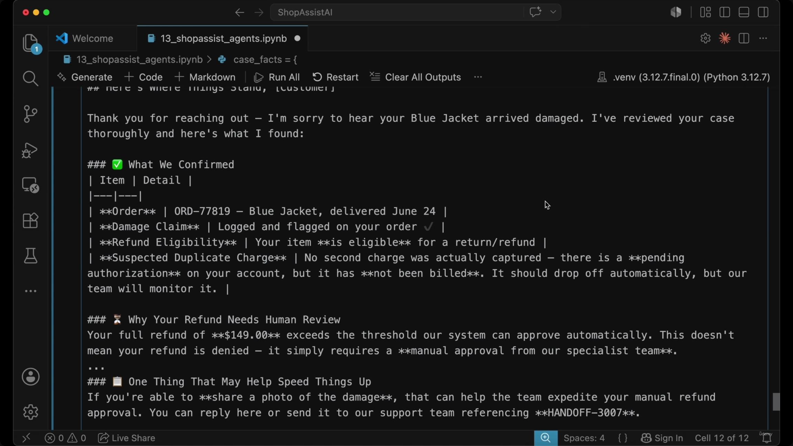

---

## Principles of an agentic system (for the exam)

An agentic system is defined as a **controlled loop**, not simply "letting the model do anything."

- **Core execution logic**
    - Claude chooses steps and reasons over tool results; the backend executes tools using typed arguments.
    - `stop_reason` controls whether the loop continues or ends.
- **Safety and control mechanisms**
    - **Gates** verify identity and permissions.
    - **Hooks** block policy-sensitive or unsafe actions.
    - **Structured errors** guide the agent's recovery process.
    - **Case facts** preserve critical context across the loop.
- **Workflow management**
    - **Parallel investigation** handles independent concerns simultaneously.
    - **Structured handoff** — human escalation is a formal, data-rich process, not a vague fallback.

**[Slide/note correction]** This closing summary slide was originally filed under "Refund Enforcement & Human Escalation" (its capture timestamp, 00:05:08, immediately follows the customer-response screenshot), but its content is the lecture's own "for the exam" wrap-up and belongs with this section instead.

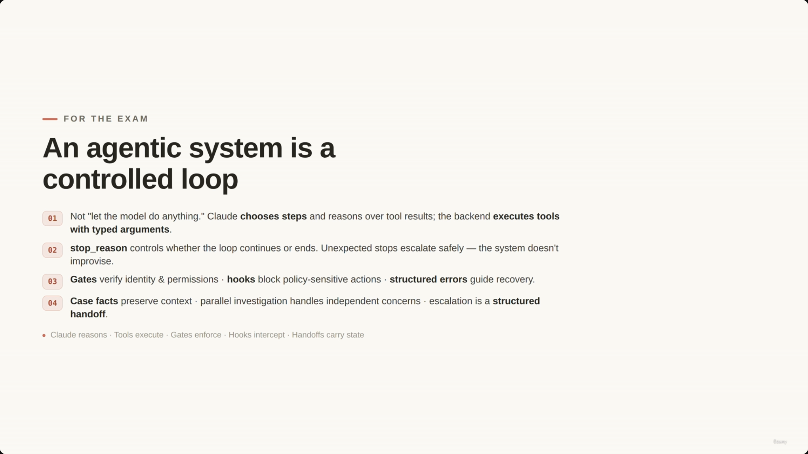

> **Transcript color:** "For the exam, remember the pattern. An agentic system is not 'let the model do anything.' It is a controlled loop... That is how ShopAssist becomes an agentic system without giving up production control."

---

## Architecture: how it all fits together

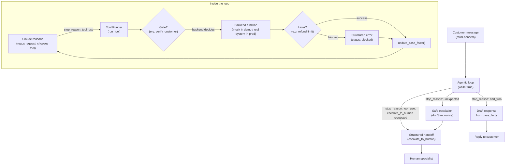

### End-to-end example: the ORD-77819 case

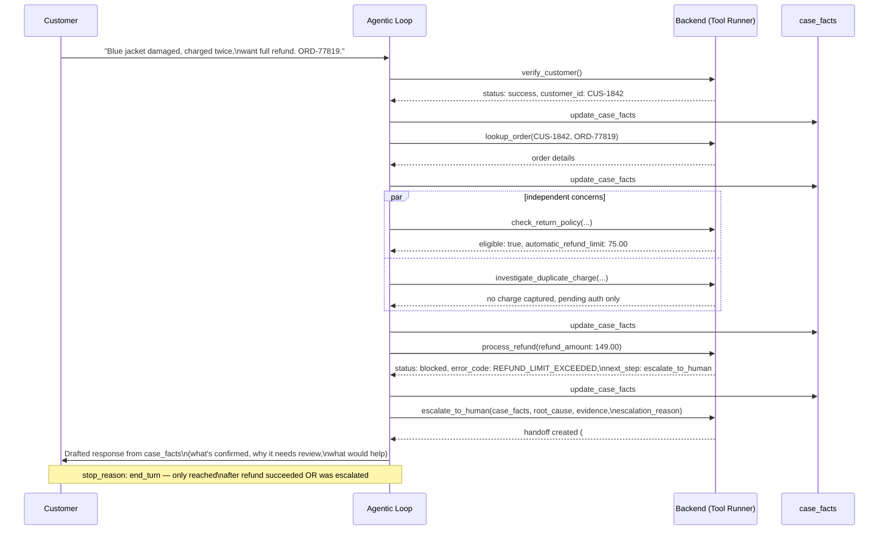

---

## Summary

- ShopAssist's agentic loop: **READ → CHOOSE → REVIEW → STOP**, driven entirely by `stop_reason`.
- Five layers, one job each: **Claude reasons, tools execute, gates enforce, hooks intercept, handoffs carry structured state.**
- Tools carry typed `input_schema`s; some (`verify_customer`) intentionally take no input because the backend — not Claude — owns that check.
- A refund-limit **hook** turning a Claude-approved action into a structured `blocked` error is a feature, not a bug — it hands the agent exactly what it needs to escalate correctly.
- `case_facts` is the loop's memory, living outside the model's context so it survives across turns.
- Independent concerns (policy check, duplicate-charge investigation) can run in parallel.
- Human escalation is a **structured handoff** with root cause, evidence, and a clear escalation reason — never a vague fallback.
- The final customer response is drafted only from verified `case_facts`, once the loop reaches a real stopping point (refund succeeded, or escalated).

---

*Sources: [slide notes](../27-BUILD-ShopAssist-Becomes-An-Agentic-System%201.md) · [[hover-notes-transcripts/27-BUILD-ShopAssist-Becomes-An-Agentic-System 1 (transcript)|full transcript]]*
