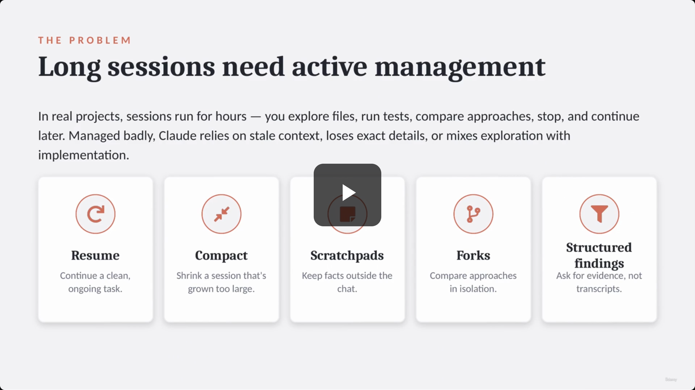
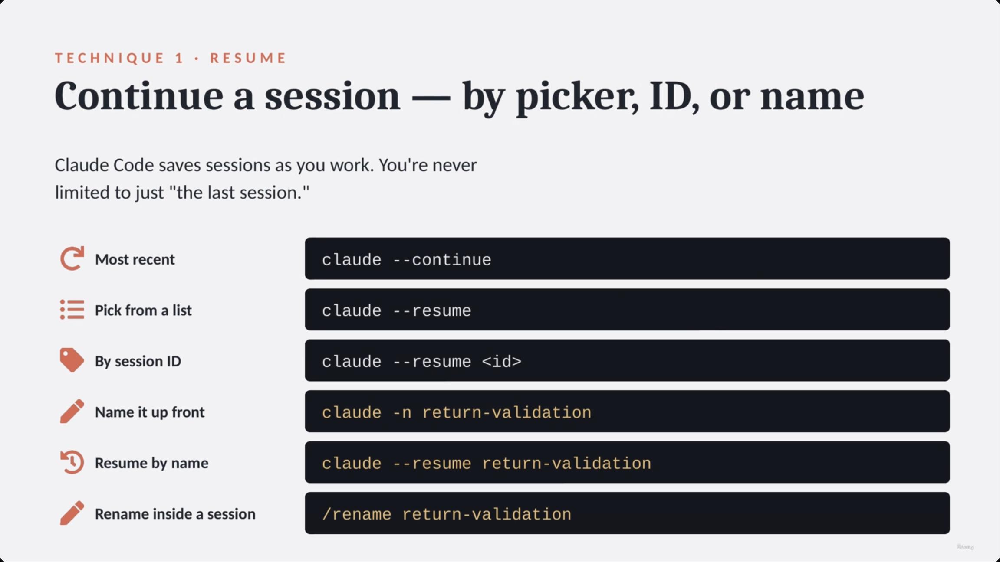
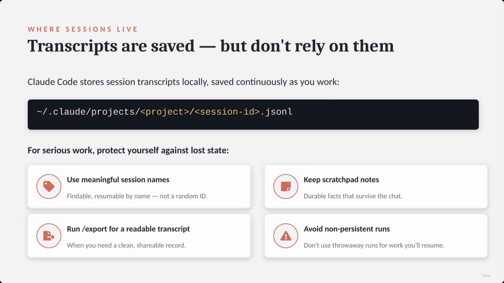
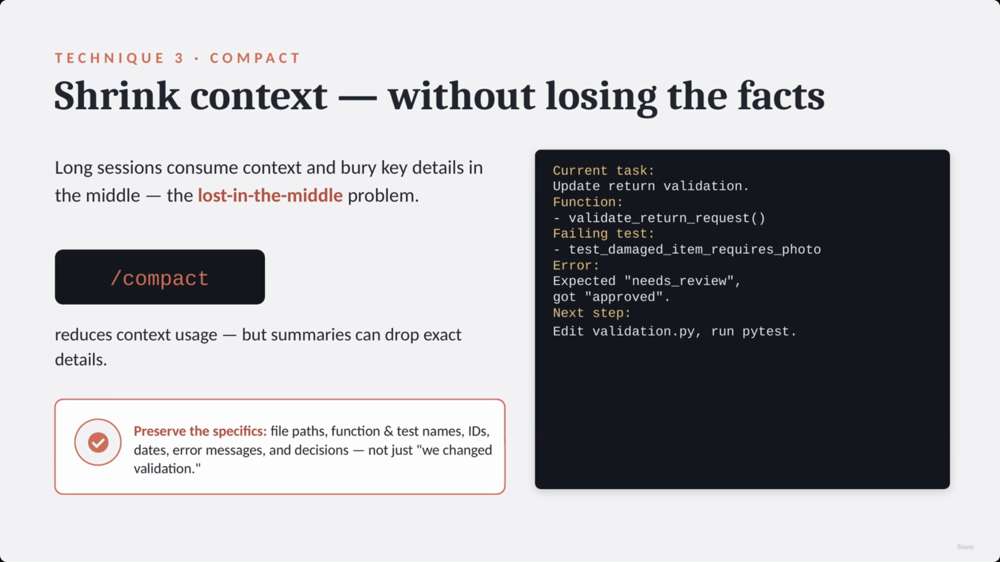
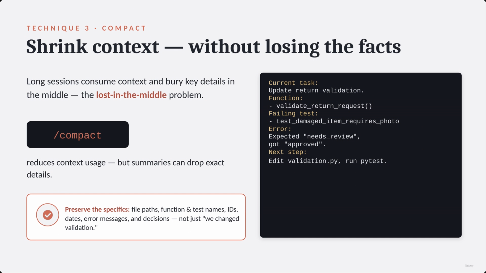
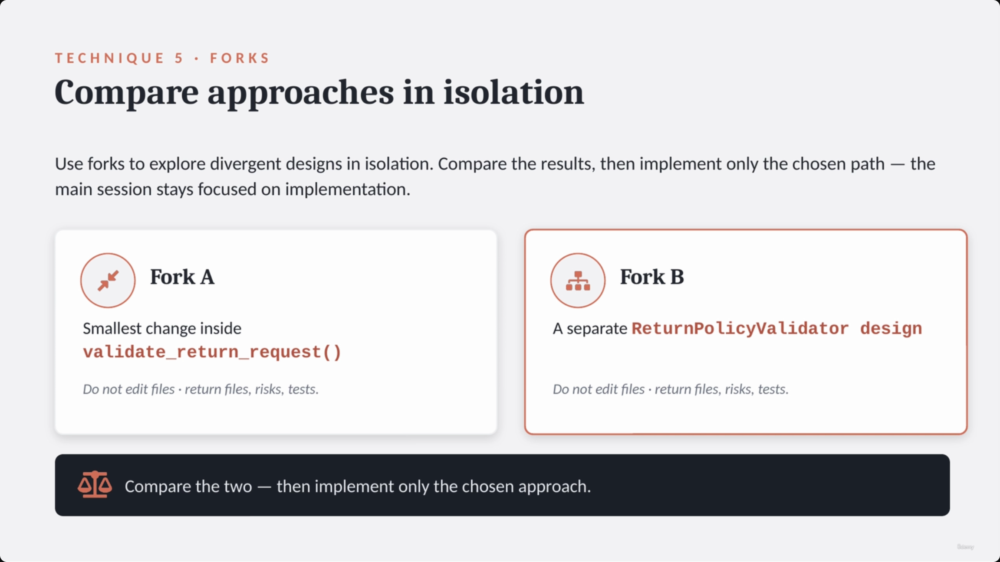
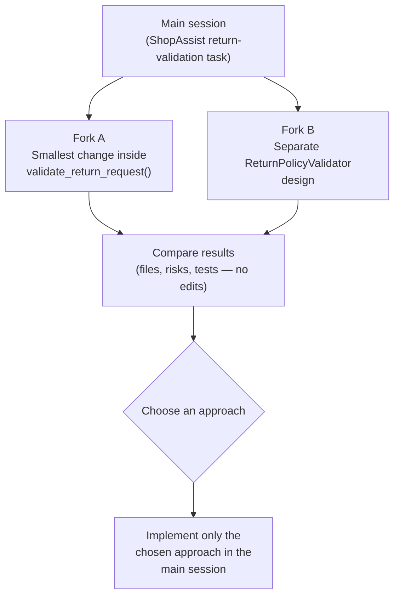
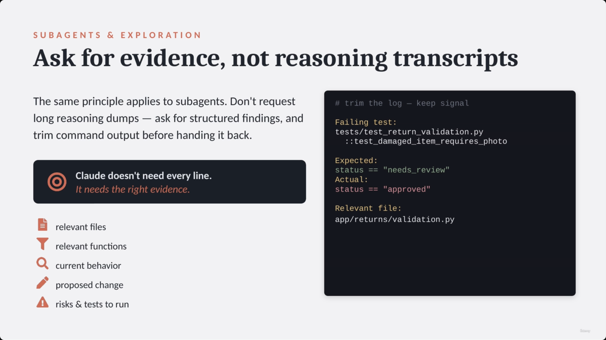
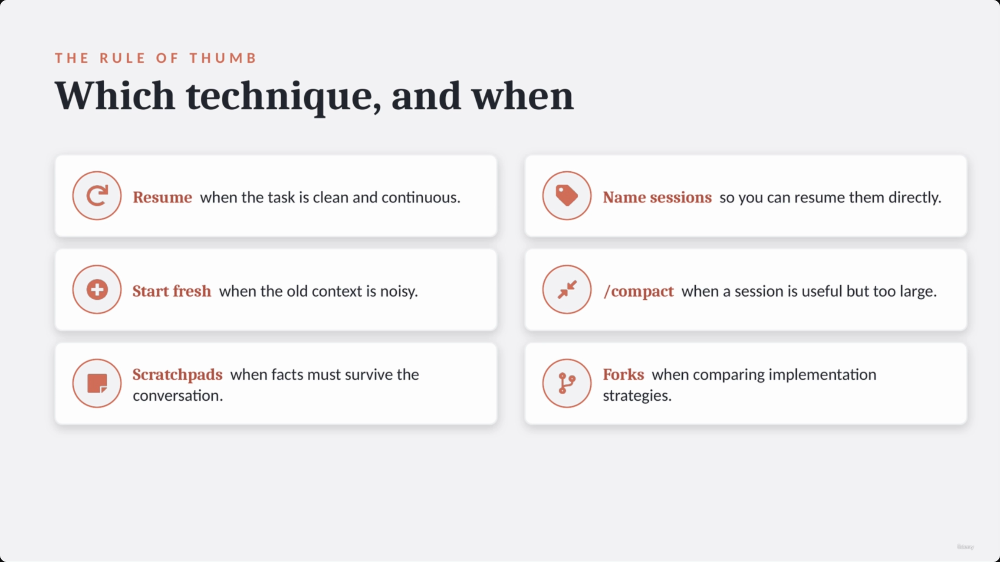
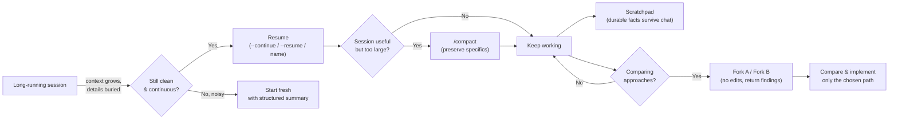

# Claude Code Session Management: Resume, Compact, Forks & Scratchpads

> This lecture is about **Claude Code's own session-management UX** — the real `--continue`, `--resume`, `/compact`, `/rename`, and `/export` mechanics built into the CLI tool itself. This is a different layer from [[26-SessionState-Forking-Scratchpads-And-LargeContextWorkflows|Lecture 26]], which covered forking/scratchpads/large-context handling as an **architectural pattern you implement yourself** when building an agentic app on the API. Here, "fork" and "scratchpad" are things *you do inside Claude Code as a developer tool*, not something your production system implements. The underlying idea — keep durable facts out of a bloated, ephemeral context — is the same; the mechanism and the runtime are not.



## The problem: long sessions need active management

- Real Claude Code sessions run for hours: exploring files, running tests, comparing approaches, stopping and picking back up later.
- Managed badly, Claude:
  - relies on **stale context**
  - **loses exact details**
  - **mixes exploration with implementation**
- **Five practical techniques** (per the overview slide and the slide-note's own bullet list):
  1. **Resume** — continue a clean, ongoing task
  2. **Compact** — shrink a session that has grown too large
  3. **Scratchpads** — keep facts outside the chat
  4. **Forks** — compare approaches in isolation
  5. **Structured findings** — ask for evidence, not transcripts

> **Transcript color:** "If you manage the session badly, Claude may rely on stale context, lose exact details, or mix exploration with implementation."

**Note on numbering:** the deck's technique headers only number four of these explicitly (Technique 1 = Resume, Technique 3 = Compact, Technique 4 = Scratchpads, Technique 5 = Forks). "Know when to start fresh instead of resuming" sits logically as **Technique 2**, between Resume and Compact, but its slide has no visible technique number — and, as noted below, no screenshot survives for it either.

---

## Technique 1: Resume

- Claude Code **saves sessions automatically** so you can continue later — you are never limited to just "the last session."
- **Ways to resume, exactly as shown on the slide:**

| Method | Command |
|---|---|
| Most recent | `claude --continue` |
| Pick from a list | `claude --resume` |
| By session ID | `claude --resume <id>` |
| Name it up front | `claude -n return-validation` |
| Resume by name | `claude --resume return-validation` |
| Rename inside a session | `/rename return-validation` |



> **Transcript color:** "This is useful for the exam — you are not limited to the last session. You can resume by picker, by session ID, or by a user-defined session name."

**Duplicate-capture note:** this exact slide was captured three times in a row (00:00:26, 00:00:40, 00:01:17) with no content change — consolidated to one image above. The 00:00:26 capture actually landed just before the "Managing Long Claude Code Sessions" intro text in the slide-note's chronological ordering, even though its content is squarely Technique-1 material — a capture-lag artifact, not a distinct slide.

### Where sessions live on disk

- Session transcripts are stored **locally**, saved continuously as you work:

```text
~/.claude/projects/<project>/<session-id>.jsonl
```

- **Best practices for serious work** (four cards on the slide):
  - **Use meaningful session names** — findable, resumable by name, not a random ID
  - **Keep scratchpad notes** — durable facts that survive the chat (see Technique 3 below)
  - **Run `/export`** for a readable, shareable transcript
  - **Avoid non-persistent runs** for work you intend to resume later



> **[Caution]** Do not rely solely on chat history for serious work — the JSONL transcript is a record, not a substitute for the durability strategies above.

### Resume safely: the golden rule

- **Use resume when the task is still the same** — but the repository may have changed while the session was inactive, so always **re-verify the workspace**, don't trust the stale mental model in the transcript.
- **Recommended resume workflow:**
  1. Re-establish context: *"Resume the return-validation task."*
  2. Re-check the workspace before editing anything: `git status`, `git diff`, relevant files, failing tests.
  3. Summarize the current state back to Claude.



> **The Golden Rule:** Resume the conversation, but verify the code.

---

## Technique 2: Know when to start fresh instead

- If the previous session's context is **noisy**, resuming it can hurt more than help.
- **Signs you should start fresh, not resume:**
  - You explored multiple conflicting designs
  - You opened many unrelated files
  - You canceled a major refactor mid-way
  - You pasted long, irrelevant logs
- **Instead of dumping the noisy history into a new session**, seed it with a clean, structured summary containing: the goal, relevant files, important functions, failing tests, decisions made, and next steps.

```text
Goal: Require photo evidence for damaged-item returns.
Relevant files:
  - app/returns/validation.py
  - tests/test_return_validation.py
Function:
  - validate_return_request()
Failing test:
  - test_damaged_item_requires_photo
Decision:
  - Backend validation only; keep API.
```

> **[Gap]** No screenshot survives for this slide — the slide-note's code block above (and the "signs you should start fresh" bullets) appear to have had a dedicated slide between the "Resume Safely" slide (00:02:51) and the "Compact" slide (00:02:56), but no capture exists in that ~5-second window. Content is preserved here from the slide-note text and transcript narration only.

---

## Technique 3: Compact

- Long sessions consume context and bury key details in the middle — the **"lost-in-the-middle" problem**.
- `/compact` reduces context usage by summarizing the conversation so far.
- **Caution:** summaries can drop exact details. **Preserve the specifics** — file paths, function/test names, IDs, dates, error messages, and decisions — not just "we changed validation."



**[Slide detail]** The slide's example of a *good* compact summary (not spelled out verbatim in the slide-note's own bullets, only described abstractly as "preserve specifics") reads exactly:

```text
Current task:
Update return validation.
Function:
- validate_return_request()
Failing test:
- test_damaged_item_requires_photo
Error:
Expected "needs_review",
got "approved".
Next step:
Edit validation.py, run pytest.
```

> **Transcript color:** "Good compaction preserves file paths, function names, test names, IDs, dates, error messages, and decisions. Not just 'we changed validation.'"

*Duplicate-capture note: this slide was captured twice (00:02:56, 00:03:42) with no change — consolidated to one image.*

---

## Technique 4: Scratchpads

- For long tasks, keep **persistent notes in a project file** — the key facts shouldn't live only inside the ephemeral chat context.
- **Example scratchpad locations (exact paths from the slide):**
  - `.claude/scratchpad.md`
  - `docs/ai_work/session_notes.md`
- **Benefits:**
  - Crash recovery
  - Handoff between people
  - Seeding fresh sessions
  - A living work manifest


Example scratchpad content shown on the slide:

```markdown
# ShopAssist Session Notes
## Goal
Damaged-item returns require photo evidence.
## Decisions
- Keep public API unchanged
- Backend validation
## Status
- Done: found flow, added test
- In progress: validate_return()
- Next: run focused test suite
```

---

## Technique 5: Forks

- Use forks to **explore divergent designs in isolation**, without polluting the main session with experimental context.
- **Workflow:** create forks to explore different paths → compare the results → implement only the chosen approach in the main session.

| Fork A | Fork B |
|---|---|
| Smallest change inside `validate_return_request()` | A separate `ReturnPolicyValidator` design |
| Do not edit files — return files, risks, tests | Do not edit files — return files, risks, tests |



> Both forks are explicitly told **not to edit files** — they return findings only (files touched, risks, tests to run), so the comparison is cheap and the main session stays clean until a choice is made.

*Duplicate-capture note: this slide was captured twice (00:04:27, 00:04:47) with no change — consolidated to one image.*



---

## Sub-agents & exploration: ask for evidence, not reasoning transcripts

- The same discipline that governs forks applies to **sub-agents** and any exploratory delegation:
  - **[Avoid]** requesting long reasoning transcripts — large reasoning dumps add noise and consume unnecessary context.
  - **[Instead]** ask for **structured findings**: relevant files, relevant functions, current behavior, proposed change, risks and tests to run.
- The same principle applies to **command output** — don't paste full test logs back into the chat; trim to the useful signal.



> **[Rule]** "Claude doesn't need every line. It needs the right evidence."

Example of a trimmed log, exactly as shown on the slide:

```text
# trim the log — keep signal
Failing test:
tests/test_return_validation.py
  ::test_damaged_item_requires_photo

Expected:
status == "needs_review"
Actual:
status == "approved"

Relevant file:
app/returns/validation.py
```

---

## Summary comparison: which technique, and when

| Technique | What it does | When to use it |
|---|---|---|
| **Resume** (`--continue` / `--resume`) | Reopens a saved session (most recent, from a picker, by ID, or by name) | Task is still clean and continuous |
| **Name sessions** (`-n <name>` / `/rename`) | Gives a session a readable, findable identity | So you can resume it directly later, instead of hunting for an ID |
| **Start fresh** | Seeds a brand-new session with a structured summary instead of resuming | Old context is noisy — conflicting designs, unrelated files, canceled refactors, long pasted logs |
| **Compact** (`/compact`) | Summarizes/shrinks the conversation to reduce context usage | Session is useful but has grown too large ("lost-in-the-middle") |
| **Scratchpads** (`.claude/scratchpad.md`, etc.) | Persists durable facts in a project file, outside the chat | Important facts must survive the conversation — crash recovery, handoff, reseeding |
| **Forks** | Runs isolated, read-only explorations of divergent designs, compared before implementing | Comparing different implementation strategies without polluting the main session |
| **Structured findings** (sub-agents & logs) | Requests evidence (files, functions, behavior, risks, tests) instead of full transcripts/logs | Any delegation to a sub-agent, or any large command output being reported back |



*Duplicate-capture note: this summary slide was captured twice (00:05:30, 00:05:57) with no change — consolidated to one image.*



---

## Session management as correctness

- For **high-risk work**, session management stops being a productivity nicety and becomes a **correctness requirement**. High-risk domains called out on the slide/transcript:
  - Payments
  - Authentication
  - Migrations
  - Production bugs
  - Large refactors
- For small tasks, good session hygiene is about productivity. For high-risk domains, it's what keeps Claude Code **useful, focused, and safe** across long engineering sessions.

> **Transcript color:** "For small tasks, this is productivity. For high-risk work like payments, auth, migrations, production bugs, or large refactors, this becomes correctness."

**[Gap]** No screenshot was captured for this closing section (the lecture's final ~15 seconds, 5:56–6:11) — content here comes from the transcript and the slide-note's closing bullets only.

---

## Summary

- **Resume** — `--continue`, `--resume`, `--resume <id>`, `-n <name>` / `--resume <name>`, `/rename` — for continuing a clean, ongoing task. Always re-verify the workspace (`git status`, `git diff`, tests) after resuming; the repo may have moved on.
- **Start fresh** — when old context is noisy, seed a new session with a structured summary instead of resuming a messy one.
- **Compact** (`/compact`) — shrinks a bloated session, but summaries can drop exact details, so explicitly preserve file paths, function/test names, IDs, dates, errors, and decisions.
- **Scratchpads** — durable, out-of-chat notes (`.claude/scratchpad.md`, `docs/ai_work/session_notes.md`) for crash recovery, handoff, and reseeding.
- **Forks** — isolated, no-edit explorations of divergent designs, compared before implementing only the winner in the main session.
- **Structured findings** — the same "evidence, not transcripts" discipline applied to sub-agents and trimmed command output.

**Exam framing to remember:** this lecture is about Claude Code's *own* session-management commands and conventions — the tool's UX for managing a long dev session. Compare/contrast with [[26-SessionState-Forking-Scratchpads-And-LargeContextWorkflows|Lecture 26]], where "forking" and "scratchpads" are patterns *you* build into a production agentic system via the API — a different layer, the same underlying instinct: keep durable facts out of a bloated, ephemeral context window.

---

*Sources: [slide notes](../29-ClaudeCode-SessionManagement-Resume-Compact-Forks-And-Scratchpads.md) · [[hover-notes-transcripts/29-ClaudeCode-SessionManagement-Resume-Compact-Forks-And-Scratchpads (transcript)|full transcript]]*
