# Claude Code Workflows: Commands, Skills, Plan Mode, and Refinement

> This lecture moves from *configuring* Claude Code (CLAUDE.md, sessions — lectures 28–29) to *operationalizing* it: how a whole team, not just one developer, gets consistent, reusable value out of it. Five tools are covered — custom slash **commands**, **Skills**, **Plan mode**, **direct execution**, and **refinement** technique — all illustrated against the recurring ShopAssist AI example.

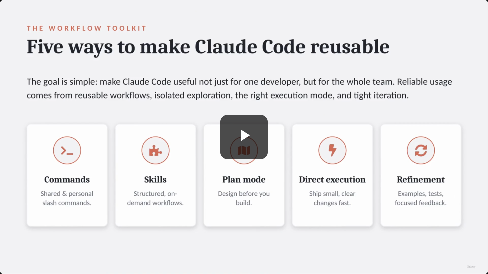

## The goal: reusable Claude Code, not one-off prompting

> **Transcript color:** "The goal is simple. Make Claude Code useful not only for one developer, but for the whole team."

**Five ways to make Claude Code reusable:**

| # | Tool | One-line purpose |
|---|---|---|
| 1 | **Commands** | Shared & personal slash commands |
| 2 | **Skills** | Structured, on-demand workflows |
| 3 | **Plan mode** | Design before you build |
| 4 | **Direct execution** | Ship small, clear changes fast |
| 5 | **Refinement** | Examples, tests, focused feedback |

---

## 1. Slash commands: project-scoped vs. user-scoped

- **Project-scoped commands**
  - Live in `.claude/commands/` inside the project repository.
  - Because the file lives in the repo, it's **shared through version control** — every developer on the team gets the same command.
- **User-scoped commands**
  - Live in `~/.claude/commands/` (the home directory).
  - **Private to the individual** — useful for personal workflows that shouldn't be shared with the team.
- **The core distinction:** a project command is a *shared team workflow*; a user command is a *personal workflow*.

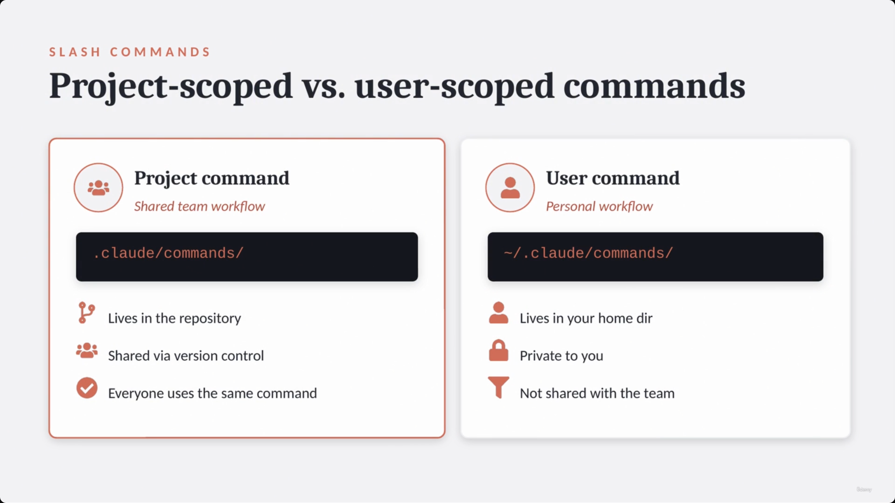

### Example: `/shopassist-review`

A single markdown file — `.claude/commands/shopassist-review.md` — gives the whole team a consistent review command. The screenshot shows the file's exact prompt content:

```text
/shopassist-review

Review the current changes in
ShopAssist. Focus on:
  - refund logic
  - escalation behavior
  - customer messaging
  - missing tests

Return findings with file paths,
risk level, and suggested fixes.
```

- **Focus areas:** refund logic & escalation behavior, customer messaging, missing tests.
- **Output contract:** findings returned with file paths, risk level, and suggested fixes.

> **Transcript color:** "Because this file is inside the repository, it can be shared through version control. Every developer on the team can use the same command."

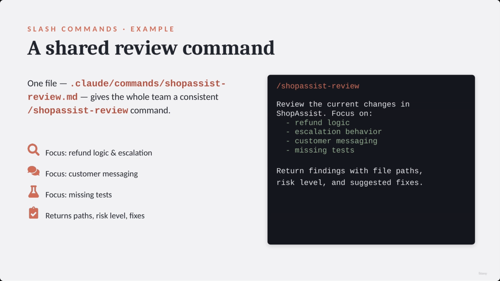

*(This same slide is held on-screen for roughly a minute while the narrator elaborates — three consecutive captures in the source material, `00:00:26`, `00:00:42`, `00:01:13`, all show this identical "A shared review command" slide; only one is kept here.)*

---

## 2. Skills: structured, on-demand workflows

- Skills live in the project folder under `.claude/skills/`.
- Each skill is defined in a **`SKILL.md`** file.
- Use a Skill when the task is **more complex/structured than a simple command** — e.g., a ShopAssist skill for support-workflow analysis.

**[Slide detail — exact SKILL.md frontmatter shown on screen]** The slide note's own code fence renders this as generic ` ```markdown ` text without the delimiters; the actual screenshot shows it as real YAML frontmatter, bounded by `---`:

```yaml
---
name: support-workflow-analysis
description: Analyze refund,
  escalation & response behavior.
context: fork
allowed-tools: Read, Grep
argument-hint: "path to changed
  workflow or PR summary"
---
```

| Field | Purpose |
|---|---|
| `name` | Skill identifier |
| `description` | Defines **when the skill should run** |
| `context: fork` | Runs the skill **in isolation**, returning a summary |
| `allowed-tools` | **Limits what the skill is permitted to do** |
| `argument-hint` | Specifies **what input to provide** |

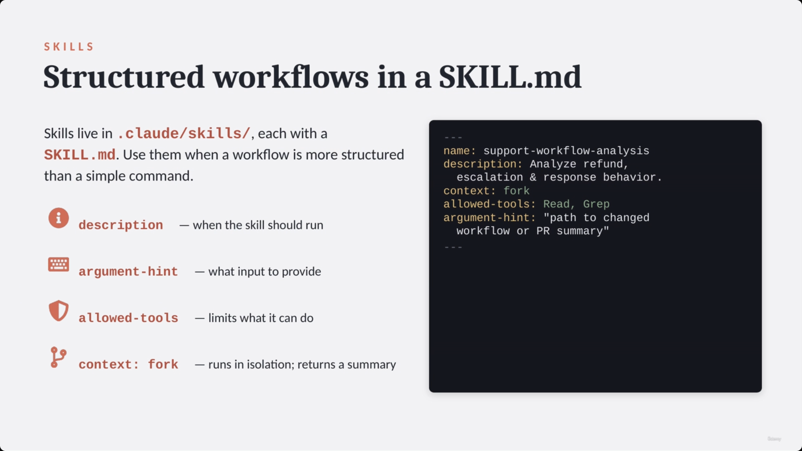

### Safety through tool restriction

- For an **analysis-only** skill, restrict `allowed-tools` to something like `Read, Grep` and omit editing tools (`Edit`, `Write`).
- This ensures the skill can **inspect the codebase without making unauthorized changes** — the same SKILL.md example above is the reference case (read + grep only, no edit).

### `context: fork` and personal Skills

- **`context: fork`** runs the skill in an **isolated context**.
  - **Why:** useful for verbose exploration — reading many files, comparing alternatives — without cluttering the main conversation. The main conversation gets a **concise summary** instead of the full discovery output.
- **Personal Skills** can also be created under `~/.claude/skills/`.
  - **[Note]** Use **unique names** to avoid conflicting with teammates' names or existing project skills.

### Choosing between CLAUDE.md and Skills

| Feature | CLAUDE.md | Skills |
|---|---|---|
| Purpose | Always-loaded project knowledge | On-demand workflows |
| Examples | Coding standards, test commands, architecture rules, naming conventions | Security review, migration analysis, support workflow review, release notes |

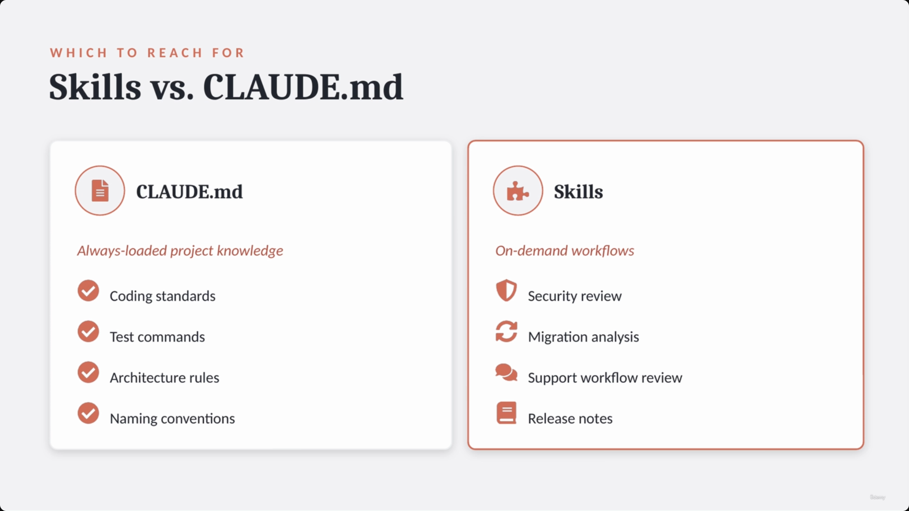

> **Transcript color:** "Now, when do we use skills vs. Claude.md? Use Claude.md for always loaded project knowledge... Use skills for on-demand workflows." This directly complements lecture 28's coverage of CLAUDE.md as always-loaded project context — Skills are the on-demand counterpart for workflows too specific or too verbose to keep permanently loaded.

---

## 3. Execution modes: Plan mode vs. direct execution

- **Plan mode** — used when the task is complex, multi-file, or architectural, and involves multiple possible solutions. Requires exploration, design, and approval *before* implementation.
  - **Example:** refactoring the ShopAssist refund flow so billing disputes, damaged items, and policy exceptions use separate decision paths.
- **Direct execution** — used for small, clear changes with one obvious path. Does not require a long planning phase.
  - **Example:** adding a validation check so a refund amount cannot be negative.

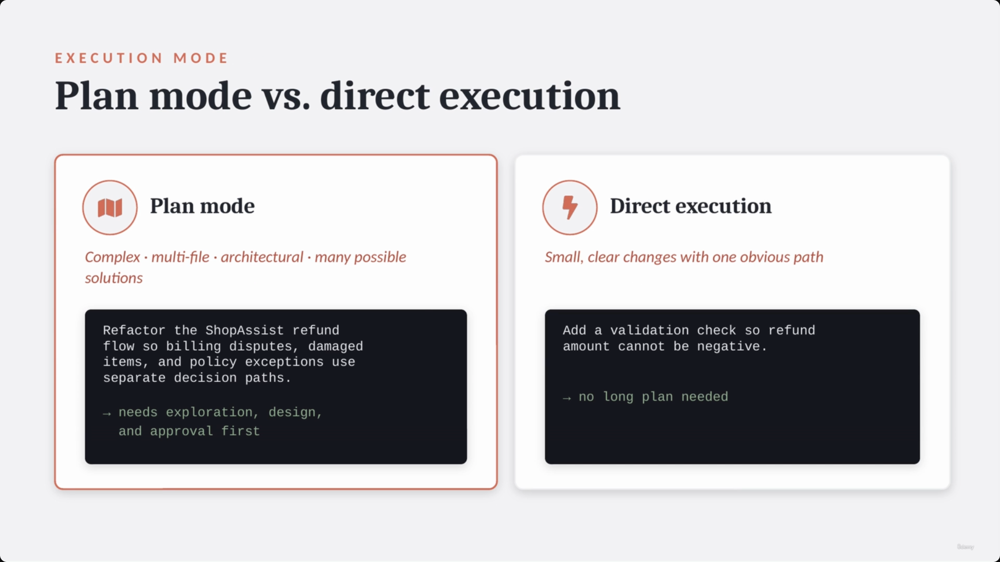

### A strong default workflow


- **[Tip]** For noisy discovery, use an **Explore subagent**.
  - It can inspect files, trace dependencies, and return a compact, structured map — keeping the main conversation clean.
  - **[Slide detail — exact discovery prompt shown]**

```text
Use an Explore subagent to find:
  - where refund eligibility is set
  - where responses are generated
  - which tests cover damaged items
→ returns a structured map
```

- **Expected structured output** (per the slide/transcript): refund logic location, response generation location, test coverage locations, missing coverage details.

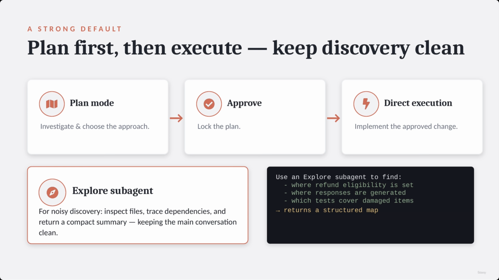

> **Transcript color:** "This keeps the main conversation clean... The output should be structured. Refund logic is here. Response generation is here. Tests are here. Missing coverage is here."

---

## 4. Refinement: getting better output out of Claude Code

### Concrete examples beat vague descriptions

- **[Principle]** "Improve refund classification" is a vague instruction. Instead, give direct input → expected-outcome mappings.

| Input | Expected category |
|---|---|
| "I was charged twice." | billing dispute |
| "The item arrived broken." | damaged item |
| "I changed my mind after 45 days." | policy exception |

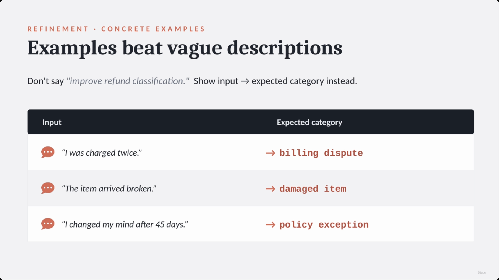

### Advanced refinement patterns

Three named patterns are shown together on one slide, each with a literal example string:

| Pattern | When to use | Example |
|---|---|---|
| **Test-driven iteration** | Write tests first, let Claude implement; on failure, share the exact target | `expected: escalation=true` / `actual: false` |
| **Interview pattern** | Domain/requirements unclear — have Claude interview you before implementing | `Interview me on: cache, failures, rollout, tests` |
| **Focused feedback** | Manage complex/interacting issues deliberately | Interacting issues → `1 msg: class + escalation`. Independent issues → `1-by-1: typo, import, fmt` |

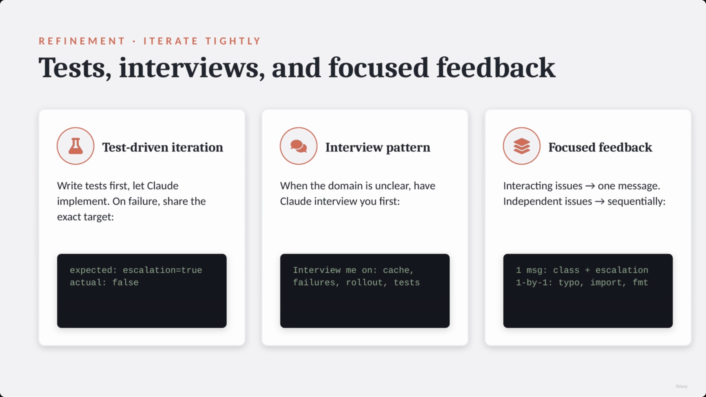

> **Transcript color, on the interview pattern:** "Ask me the key questions about caching, validation, failure behavior, rollout risk, and testing before implementing this change. This helps surface assumptions before code is written."
>
> **Transcript color, on focused feedback:** "If issues interact, send them in one message... If issues are independent, fix them sequentially."

---

## Putting it together: the practical rule

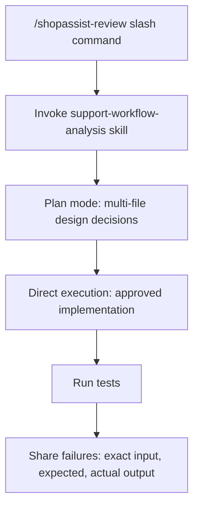

| Tool / Feature | Best use case |
|---|---|
| Project commands | Shared team workflows |
| User commands | Personal workflows |
| Skills | Structured, on-demand tasks |
| `context: fork` | Verbose or exploratory work |
| `allowed-tools` | Limiting risk |
| `argument-hint` | Making invocation clear |
| CLAUDE.md | Always-loaded standards |
| Plan mode | Complex work |
| Direct execution | Simple work |
| Explore subagent | Discovery |

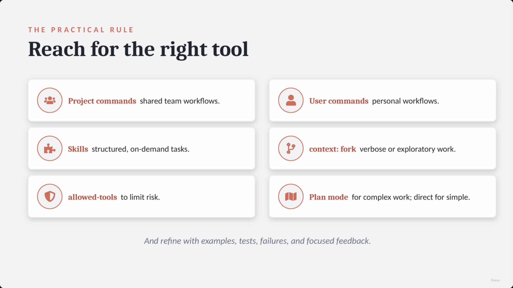

### The ShopAssist workflow, end to end

1. Run `/shopassist-review`
2. Invoke the `support-workflow-analysis` skill
3. Plan mode for multi-file design decisions
4. Direct execution for the approved change
5. Run tests
6. Share failures: exact input, expected, actual

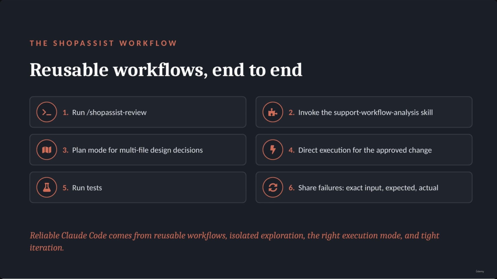

---

## Summary

- **Reliable Claude Code usage rests on four pillars:** reusable workflows, isolated exploration, the right execution mode, and tight iteration.
- **Commands** (project vs. user) give the team — or you personally — a consistent, version-controlled entry point for repeated tasks.
- **Skills** step up from commands when a workflow needs structure: a `SKILL.md` with `description`, `argument-hint`, `allowed-tools`, and optionally `context: fork` for isolated, verbose exploration.
- **CLAUDE.md vs. Skills** is a load-timing distinction: CLAUDE.md is always loaded (standards, conventions); Skills are on-demand (security review, migration analysis, release notes).
- **Plan mode vs. direct execution** is a complexity distinction: multi-file/architectural work gets planned and approved first; small, obvious changes go straight to implementation.
- **Refinement** is where iteration quality comes from: concrete input→output examples beat vague instructions; test-driven iteration gives Claude a precise failure target; the interview pattern surfaces unclear requirements before code is written; and feedback should be batched only when issues genuinely interact, otherwise sent one at a time.

**Exam framing to remember:** reusability isn't about any single feature — it's about routing each task to the *right* mechanism (command vs. skill vs. plan vs. direct execution) and then closing the loop with disciplined, specific feedback rather than vague re-prompting.

---

*Sources: [slide notes](../30-ClaudeCode-Workflows-Commands-Skills-PlanMode-And-Refinement.md) · [[hover-notes-transcripts/30-ClaudeCode-Workflows-Commands-Skills-PlanMode-And-Refinement (transcript)|full transcript]]*
