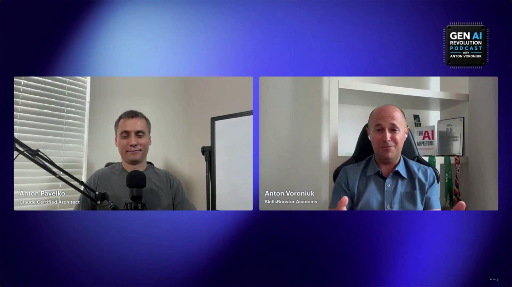
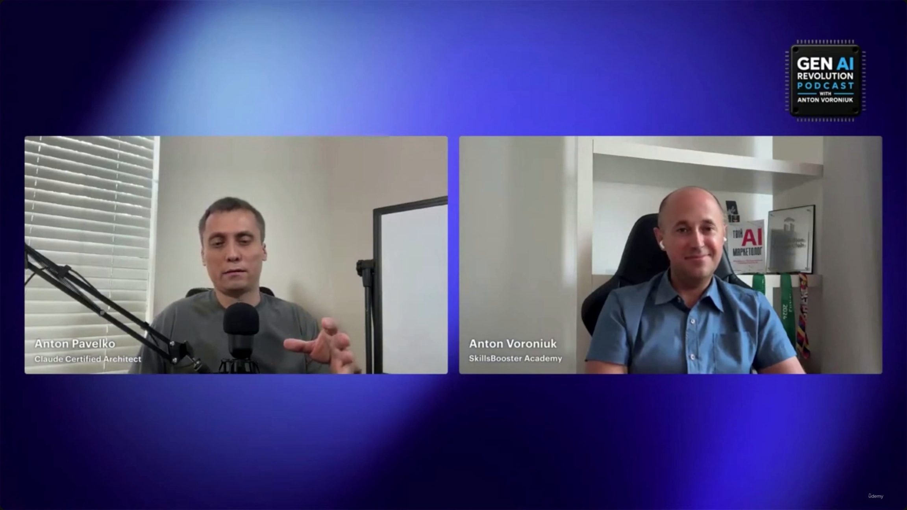
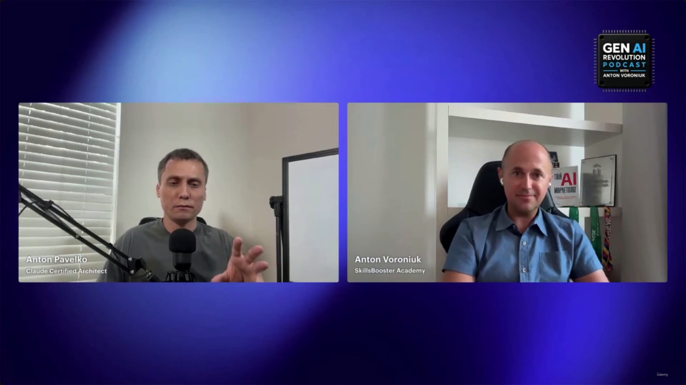
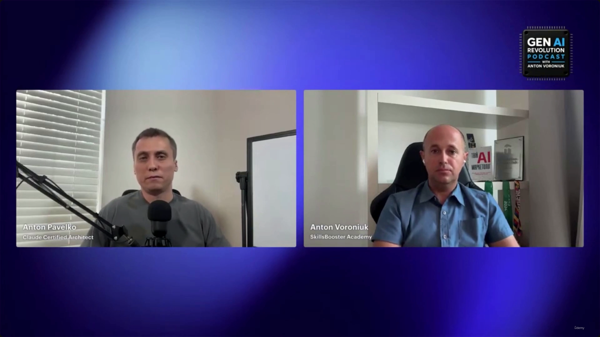
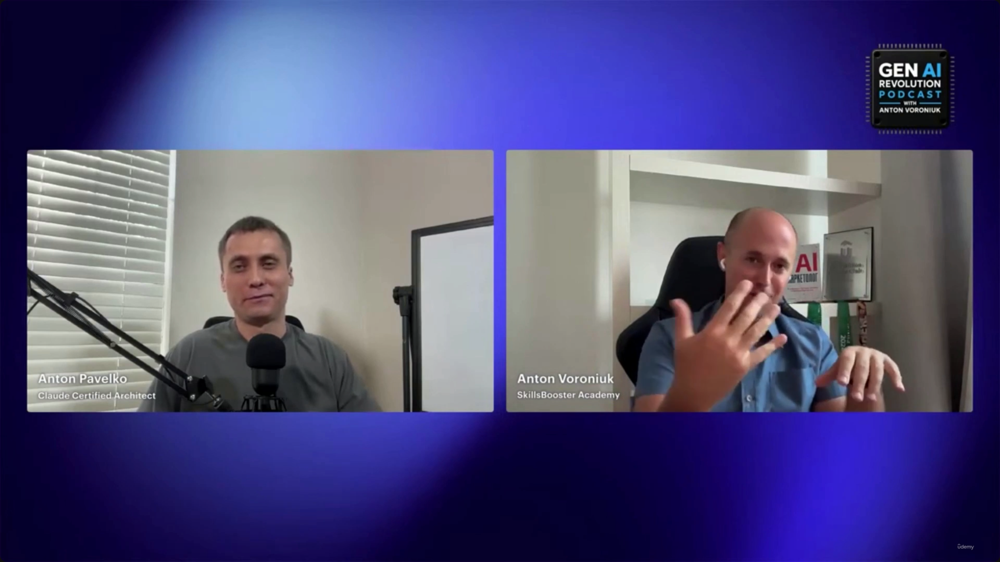

# Do You Need A Certification To Build An AI Career?

> This lecture is a bonus interview segment, not a technical walkthrough. It's a conversation between **Anton Pavelko** (Claude Certified Architect) and **Anton Voroniuk** (SkillsBooster Academy), recorded for Voroniuk's *Gen AI Revolution Podcast*, on whether certifications matter for an AI career versus hands-on production experience. **[Slide detail]** Neither speaker's name nor podcast affiliation appears anywhere in the slide-note text or transcript — they're only visible on-screen in the video captures themselves.

---

## Certifications vs. Experience

- Certifications are **not strictly required** to build a serious career in AI.
  - Real-world experience is significantly more important than any certification.
- **[What matters most?]** Building and deploying things in production.
  - It's essential to understand the architectural decisions behind a working deployment.
- Certifications can still serve as a **beneficial bonus** to a professional profile — not a replacement for experience.

> **Transcript color:** "If you want to build a serious career in AI today, can you afford to ignore AI certifications completely? Absolutely — because real-world experience is much more important than any certification... But at the same time, certification can be a good bonus for you."

---

## The Claude Certification Ladder

The reason for pursuing a certification should be driven by a **specific need** — for example, an employer explicitly requiring it — not pursued for its own sake.

- **Claude Associate Certification**
  - A basic level of proficiency.
  - Covers fundamental knowledge: how to use Claude and understand its limitations.
  - **[Slide detail, confirmed in transcript]** Per the speaker, employers generally don't weight this one — it's more useful as a personal learning checkpoint than a hiring signal.
- **Claude Developer Certification**
  - Recommended for people heavily focused on the *development* side of LLM implementation.
  - Requires familiarity with technical implementation: using APIs, writing and implementing code.
- **Claude Architect Certification**
  - Recommended for people designing complex systems that use LLMs.
  - Focuses on high-level system design and management: context management, system reliability, orchestration decisions.

> **Transcript color:** "First of all, you need to understand for what reason you need the certification... The associate certification will not be considered for the employer, so you can just pass it for yourself."

---

## Architect Certification: Who Should Take It, and When

- **[Who should take it?]** People who already have practical experience.
  - The exam is **scenario-based** — hard to pass through technical memorization alone.
- **[Recommendation]** Gain practical experience *before* attempting the exam, to avoid wasting time and money.
- **[When to take it]** Once you've already built something practical.
  - The certification then becomes a **structured way to learn** and a way to expose gaps in your current knowledge.
- **Avoid memorization** as a strategy — it doesn't work well against a scenario-based exam.
  - If you have no practical experience yet, build something first, then attempt the exam.

> **Transcript color:** "I would recommend that to people who already have practical experience... the exam is scenario-based and it will be pretty difficult to pass it just memorizing some technical details. But if you already built something, I strongly recommend you prepare for that exam... the preparation is a great structured way to learn and to expose your gaps."

*(The slide note splits this guidance across two headers — "Architect Certification: Exam Details and Recommendations" and "Strategy for Pursuing Certifications" — but both cover the same point made in one continuous transcript passage; they're merged here to avoid repeating the same advice twice.)*

---

## Practical Experience vs. Certification in Hiring

- In a competitive hiring scenario, **production experience is the priority**.

**Comparison example** (from the podcast's own hypothetical):

| Candidate | Profile | Outcome |
| --- | --- | --- |
| Candidate A | Holds Claude Architect Certification | *Not stated verbatim — see note below* |
| Candidate B | No certification, but has shipped products and AI systems | Gets the job |

> **Transcript color:** "You're hiring two candidates... one has [the] Claude Architect certification, the other has no certification but has shipped products and AI systems. Who gets the job? The person with practical production experience, for sure. No questions."

**[Table gap, checked against transcript]** The slide note's table left Candidate A's "Outcome" cell empty. The transcript doesn't spell out Candidate A's fate in so many words either — but the question is posed and answered as a strict either/or ("who gets the job?" → "the person with practical production experience, for sure"), so Candidate A is implicitly **not** the one hired. Rather than inventing wording the source never used, the gap is noted here explicitly: Candidate A's outcome is "loses out to Candidate B" by necessary implication of the binary framing, not a directly quoted result.

---

## What a Certification Proves (and Doesn't)

- A certification **validates a baseline of knowledge** — it proves the holder has the knowledge level Anthropic expects from its architects.
- **[What it does NOT prove]** Practical experience or delivery capability.
  - It cannot confirm whether someone can successfully deliver a project to a production environment.
  - It's critical to distinguish theoretical knowledge from hands-on experience.

| Aspect | Certification | Practical Experience |
| --- | --- | --- |
| Baseline Knowledge | Proves adherence to expected standards | Not necessarily verified |
| Production Delivery | Does not prove capability | The core metric of success |

> **Transcript color:** "The certification proves that person['s] knowledge, that baseline that Anthropic expects from the architects, but what it doesn't check — it doesn't check your experience, and it cannot prove that the person will be able to deliver something to production. So we should understand that experience and knowledge [are] different things."

---

## Summary

- Certifications are **optional, not required**, for a serious AI career — real-world, deployed experience matters more.
- Which certification (if any) to pursue depends on your goal: **Associate** (personal baseline, not weighted by employers), **Developer** (API/coding-heavy roles), **Architect** (system design, context management, reliability, orchestration).
- The Architect exam is **scenario-based**: build something first, then certify — certification works best as a structured way to close knowledge gaps, not as a substitute for experience.
- In a head-to-head hiring comparison, **shipped production experience beats a certification alone**.
- A certification proves **baseline knowledge**; it does not and cannot prove **delivery capability**. Treat the two as separate axes, not substitutes for one another.

---

*Sources: [slide notes](../33-Do-You-Need-A-Certification-To-Build-An-AI-Career.md) · [[hover-notes-transcripts/33-Do-You-Need-A-Certification-To-Build-An-AI-Career (transcript)|full transcript]]*
