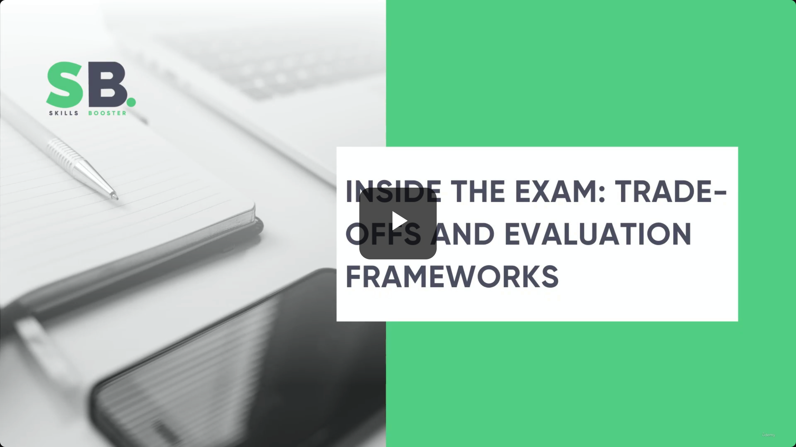
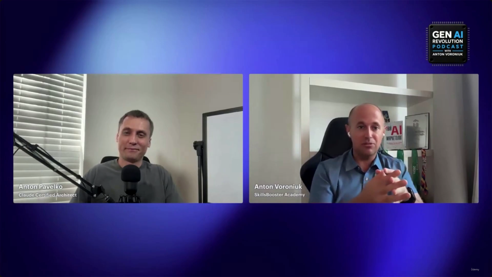
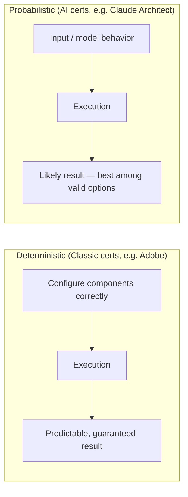

# Inside The Exam: Trade-Offs And Evaluation Frameworks

> This is a bonus/interview-style lecture, not a technical slide deck. Anton Voroniuk (SkillsBooster Academy, host of the *Gen AI Revolution Podcast*) interviews **Anton Pavelko**, a Claude Certified Architect, about his personal exam experience and — more usefully for exam prep — how sitting the exam changed the way he builds AI systems in practice. There is no slide content beyond a title card; all substance below comes from the conversation itself.

**[Slide detail]** The video is a podcast recording (*Gen AI Revolution Podcast with Anton Voroniuk*), not a slide presentation — the same title card ("Inside The Exam: Trade-Offs And Evaluation Frameworks", Skills Booster branding) bookends both the open (0:00) and the close (4:26) of the clip, with nothing but two-person webcam footage in between.

---

## The exam experience

- Personal preparation took **a couple of weeks** of dedicated study.
- Motivation for making the course: to spare other candidates the same amount of wasted time.

> **Transcript color:** "As for me, I spent too much time for the preparation... How much time did you spend? Oh my gosh, it was like a couple of weeks for sure."

## Exam preparation and question style

- **Wasted effort:** a lot of what he studied turned out not to be relevant to the certification — which is why he built a tool focused exclusively on certification-specific questions.
- **The surprise:** exam questions frequently offer **several technically correct answers**. The task isn't finding *a* correct answer — it's identifying the **single best** one.
- **[Real-world connection]** He draws a direct line from this to professional practice: "This is exactly what we do in real life... you just decide based on your experience what's the best one."

> **Transcript color:** "In those questions, you have several correct answers, technically correct answers. And you need to choose the best one... to choose something, the best among the worst."

## Traditional vs. AI certifications: deterministic vs. probabilistic

He contrasts this exam against his other certification, **Adobe Certified Master**:

- **Classic enterprise certifications** (e.g., Adobe) are **deterministic** — configure the components correctly and the system behaves predictably.
- **AI certifications** are **probabilistic** — outcomes are a matter of likelihood, not a fixed, guaranteed configuration.

> **Transcript color:** "Adobe is a great example of deterministic classic architecture, right, where you just configure something and if everything configured properly, it works fine... But in the AI world, like, it's probabilistic."

## What actually changed after the exam

The host's closing question is the practical payoff of the interview: what assumptions did Pavelko change *after* passing?

### 1. Evaluation went from pass/fail to graded quality

| | Before exam prep | After exam prep |
|---|---|---|
| **What was checked** | Simple test cases — does the solution work or not? | A full evaluation framework |
| **How it was measured** | Binary (works / doesn't work) | **LLM grading** — quantifying *how good* the result is, not just whether it functions |
| **Underlying shift** | Functional correctness only | Qualitative measurement of output quality |

> **Transcript color:** "Before the exam preparation, we just did some simple test cases where we just check... if that solution works or no. But after exam preparation, I realized that evaluation is something more... So right now we do not just check if the solution works or no, but also we measure how good it is."

### 2. Context management became more curated

- Identified as a second concrete example of practical change.
- Exam prep exposed **new, more structured approaches** to context management that he hadn't been using before.

> **Transcript color:** "Context management, we decided to be more curated, I found a couple of new approaches to do this."

## Value of structured exam preparation

- **[Methodology]** Even for an experienced practitioner, the exam gave a structured framework for understanding industry best practices — "I knew all those things, but exam preparation is a great structured way to understand what is the best practice in this field."
- **[Self-assessment]** It also exposed concrete knowledge gaps — his own biggest gap was **evaluation**.
- **[Product impact]** Applying the resulting insights made his real products:
  - More **reliable**
  - More **stable**
  - Higher **overall quality**

---

## Why this matters for the exam itself

- The "several correct answers, pick the best one" question style described here is a direct, first-hand account of the exam's own philosophy — worth keeping in mind when second-guessing an answer choice that "also seems right." See **[[01-Exam-Format]]** for how the exam is structured overall.
- The evaluation shift (binary pass/fail → LLM-graded quality) and the deterministic-vs-probabilistic framing echo the reliability and evaluation patterns covered in **[[32-Reliability-Patterns-And-Final-Exam-Mapping]]** — this interview is essentially a practitioner confirming, from real production experience, why those patterns matter.

---

## Summary

- The exam surprised him with its multiple-correct-answer, choose-the-best question style — mirroring real-world decision-making rather than testing rote configuration.
- AI certifications are fundamentally **probabilistic**, unlike deterministic, classic enterprise certifications (e.g., Adobe Certified Master).
- The single biggest practical change post-exam: moving from binary "does it work" test cases to a full **evaluation framework with LLM grading** of output quality.
- A second concrete change: a more **curated approach to context management**.
- Net effect: structured exam prep exposed real gaps (evaluation, for him) and made his shipped products more reliable, stable, and higher quality.

---

*Sources: [slide notes](../36-Inside-The-Exam-Trade-Offs-And-Evaluation-Frameworks.md) · [[hover-notes-transcripts/36-Inside-The-Exam-Trade-Offs-And-Evaluation-Frameworks (transcript)|full transcript]]*
