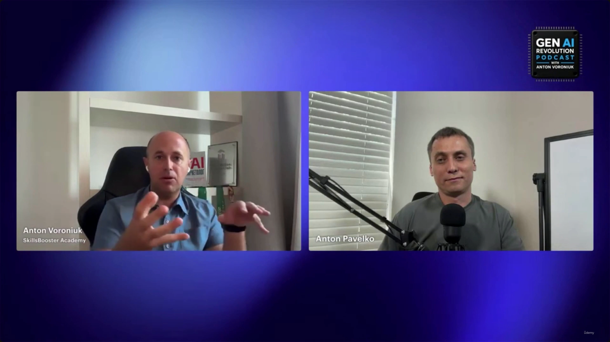

# How The Certification Exam Actually Works

> **Format note:** unlike lectures 1–32, this is a **podcast-interview segment** — host Anton Voroniuk (SkillsBooster Academy) talking with Anton Pavelko on the *Gen AI Revolution Podcast* — not a slide deck. There is no new logistics data here (no question count, time limit, or passing score); those live in [[01-Exam-Format]]. Treat this lecture as **candid, practitioner color on the same exam** rather than a replacement for the format lecture.

---

## Image review notes

The slide note references 5 screenshot files; all were viewed directly. Four of the five (`...FBEE5TFRJ715HNAP`, `...VDSPFA9QPSB8PWMGK8ZV`, `...WAXDE7PYZ8ZF8J0SFYRM`, `...X7WJHB4EXDVP930PM9XT`) are the **same two-person video-call frame** (Voroniuk left, Pavelko right, *Gen AI Revolution Podcast* bug top-right) — only hand gestures and facial expression differ frame to frame, with zero on-screen text, slides, or data. This is the classic "capture tool grabbed the same shot repeatedly while the narrator kept talking" case flagged in the vault's general lessons-learned. Only **2 of the 5 screenshots were kept**: the SkillsBooster title card (establishes the lecture) and one representative talking-head frame (establishes the interview format vs. the slide-deck format used elsewhere). The other three duplicate talking-head frames were dropped as carrying no unique information.

---

## Exam Nature (confirms lecture 01)

- Scenario-based exam — tests the ability to apply architectural decisions to real-world situations, not recall definitions.
- Draws on: agentic systems, context management, reliability, and security.
- This matches [[01-Exam-Format]]'s framing exactly ("the exam is scenario-driven, not definition-driven") — no new information here, just reaffirmation from a second source.

---

## Broad vs. Vendor-Specific Questions — a new framing, with a flagged discrepancy

This lecture introduces a coarser two-bucket way of categorizing exam questions that **lecture 01 does not use** — 01 only breaks the exam down into the five weighted domains (Agentic Architecture 27%, Tool Design 18%, Claude Code Config 20%, Prompt Engineering 20%, Context Management 15%). Here, Pavelko instead splits questions into:

- **Broad/infrastructure questions** — general topics like hallucinations or general cloud infrastructure, applicable to any LLM system.
- **Vendor-specific questions** — tied to the Claude SDK and other Anthropic-specific implementations.

> **[Discrepancy flagged]** The slide-note bullet claims: *"the exam is vendor-specific, and these [vendor-specific] questions make up a significant portion (the speaker notes that broad questions account for less than half of the total)"* — i.e., vendor-specific questions are implied to be the **majority**.
>
> But the raw transcript says the opposite. Direct quote: *"I would say we should remember that it's vendor specific exam, right? And we have many questions. I can't say that more than half, so I would say **less than half of those questions are cloud \[Claude] specific**."* He then reinforces this a moment later: *"most of the knowledge can be applied to any LLM... but at the same time it's \[still] vendor specific. So yes, they still have **some number** of questions related to Claude SDK specific things."*
>
> Read plainly, the speaker is saying **fewer than half** the questions are Claude/vendor-specific, and the majority are broad/universal-LLM questions — the reverse of how the slide-note's parenthetical summarizes it. **The transcript is treated as authoritative here** since it's the primary spoken source; the slide-note gloss appears to have inverted the ratio. Worth double-checking against your own practice-exam experience rather than taking either summary at face value.

---

## Universal vs. Vendor-Specific Knowledge

- Universal domains that transfer to any LLM system: **context management, evaluation, availability, permissions**.
- Vendor-specific domains: Claude SDK details and other Anthropic-specific implementation questions — described as "some number," not the bulk.

---

## The Hardest Part: Choosing the "Best" of Several Correct Answers

- Sourced directly from **student reviews and Q&A**, not just instructor opinion — Pavelko says this is what students themselves flagged as hardest.
- The challenge: several answer options are each technically correct; success means identifying which one is *best* for the specific scenario.

> **Transcript color:** "This is probably questions related to when you have several answers which are technically correct, each one, and then you need to decide what is the best one, right? So those answers are correct, but you need to choose the best one. This is the most challenging part of that certification."

This directly reinforces [[01-Exam-Format]]'s "How to approach a question" flowchart and its warning that incorrect answers are often *plausible*, not obviously wrong. The value-add here is **independent confirmation from real student feedback**, not a new mechanic — treat it as validation that 01's exam-taking strategy targets the actual pain point, rather than new guidance to apply.

---

## What Exam Prep Reveals That Daily Claude Use Doesn't

- **[Named answer]** Evaluation — specifically, learning *formal evaluation methodologies* is much harder to pick up from casual day-to-day Claude usage than from structured exam study.
- Framed as "one of the most painful parts" of preparation.

> **Transcript color:** "What can someone understand about the architecture from preparing for their exam that they probably wouldn't learn from simply using Claude every day? ... I can say that evaluation."

---

## Preparation Strategy: No Single Priority Topic

- There is no one "most important" topic — success requires a broad grasp of all fundamentals.
- Key pillars named: **context management, reliability, security**.
- **[Core Insight]** Most exam knowledge is model-agnostic — it would remain applicable even if the underlying model changed.

> **Transcript color:** "As for preparation, yeah, everything is important. So I kind of say that one specific topic is most important. So everything is important. So just know that basic things and then you will be ready."

---

## The "Disappearance Test" — Portability of Architectural Knowledge

A memorable framing device not present in lecture 01: imagine Claude is replaced by a different model tomorrow — how much of what you learned preparing for this exam would still be useful?

> **Transcript color:** "If Claude disappeared tomorrow and you had to build the same system without Claude with another model, which architectural knowledge from exam would remain available for you? Most of it... [a] portion of those questions are Anthropic specific, but most of that knowledge can be applied to any model."

**Takeaway:** the exam is built around durable system-design principles (context management, reliability, security, evaluation, agentic orchestration), not Claude-specific trivia or syntax — the Anthropic-specific slice is real but is the smaller piece.

---

## How this lecture relates to Lecture 01

| Aspect | [[01-Exam-Format]] (Lecture 01) | This lecture (40) |
|---|---|---|
| Format | Slide deck with logistics tables & diagrams | Podcast interview, no slides |
| Logistics (question count, time, passing score) | Covered in full (60Q / 120min / 720 pass) | Not mentioned at all |
| Domain breakdown | Five weighted domains (27/18/20/20/15%) | A separate, coarser broad-vs-vendor-specific split (see discrepancy above) |
| "Best answer" difficulty | Introduced via flowchart + caution about plausible wrong answers | Independently confirmed as the #1 hardest part, per real student Q&A/reviews |
| What prep reveals beyond daily use | Not addressed | Evaluation methodology named explicitly |
| Portability of knowledge | Implicit (universal domains listed per-domain) | Made explicit via the "disappearance test" thought experiment |

**Bottom line:** lecture 40 doesn't change any of the hard logistics from lecture 01 — treat 01 as the source of record for question count/timing/scoring. What it adds is qualitative, field-tested color: independent confirmation (from student reviews) of what's actually hard, a named answer for what prep teaches beyond daily use (evaluation), a useful mental test for judging how "vendor-locked" your knowledge is, and one figure (the broad-vs-vendor-specific question split) that is genuinely ambiguous in the source material and worth treating with caution rather than as settled fact.

---

*Sources: [slide notes](../40-How-The-Certification-Exam-Actually-Works.md) · [[hover-notes-transcripts/40-How-The-Certification-Exam-Actually-Works (transcript)|full transcript]] · see also [[01-Exam-Format]] full notes*
