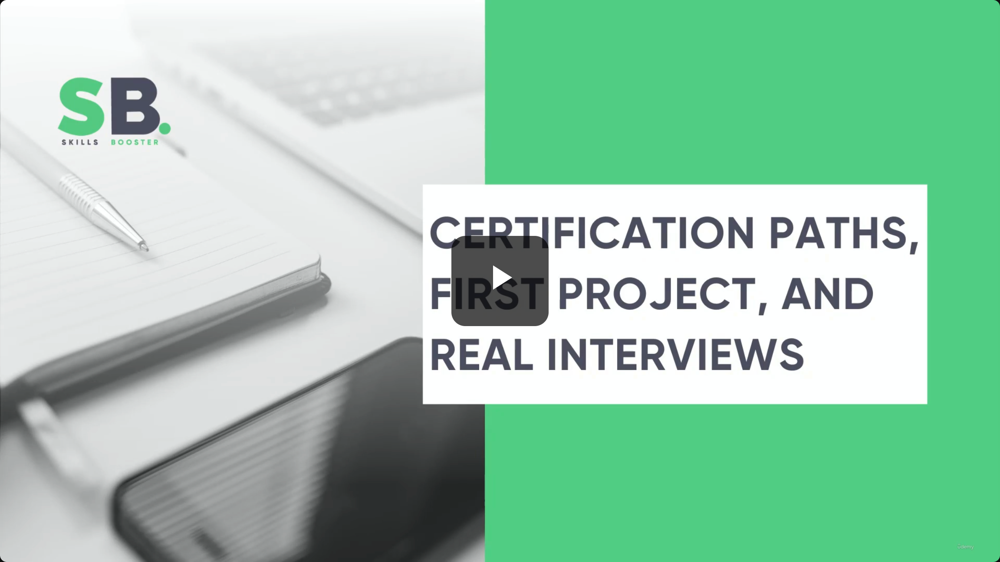
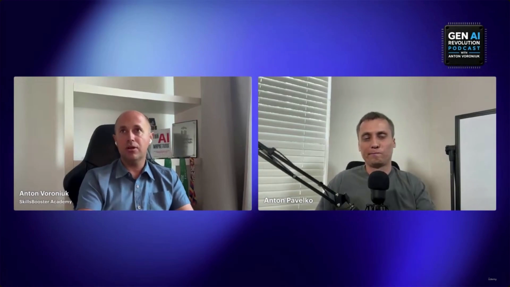
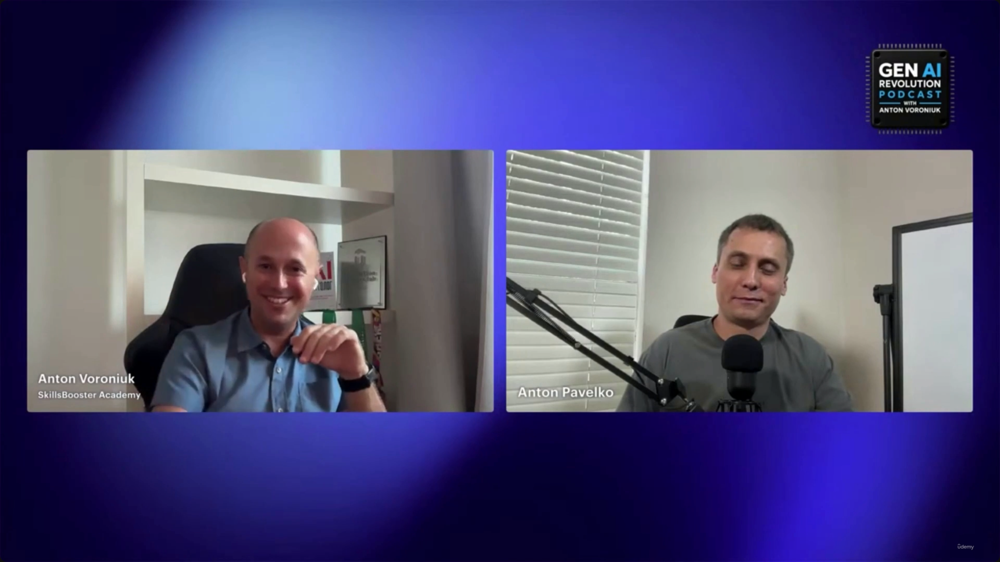

# Certification Paths, First Project, and Real Interviews

> This lecture is a short excerpt from the **Gen AI Revolution Podcast** (host Anton Voroniuk, SkillsBooster Academy) interviewing **Anton Pavelko** — the instructor behind this course's ShopAssist AI examples, and someone who has personally conducted 100+ technical AI interviews. **[Slide detail]** The speaker names and podcast branding are only visible in the video captures — the transcript itself carries no speaker labels, so this note attributes lines by inferring from content (e.g., whoever says "we built in my course" is the instructor/guest, Pavelko; the host, Voroniuk, is asking on behalf of students).
>
> Like [[33-Do-You-Need-A-Certification-To-Build-An-AI-Career]], this is bonus career-advice content rather than a technical slide deck — but where 33 asks the philosophical "do you even need a certification," this lecture is the concrete follow-up: *which* path to pick, what to build first, and what actually gets probed in a real interview.

---

## 1. Choosing a Certification Path

- **Start with "why."** The recommended first question isn't "which cert is best" — it's *why do you need one at all*:
  - **Seeking employment?** Ask the employer directly which specific certification they require. Don't guess.
  - **Personal growth?** Start with **Associate** — it's intentionally broad.

### Certification tracks at a glance

| Track | Focus |
|---|---|
| **Associate** | Broad entry point for those just starting out |
| **Developer** | Implementation-focused work |
| **Architect** | Designing AI systems |
| **AI Professional** | Advanced, enterprise-scale architecture processes |

> **Transcript color:** "First ask why you need the certification, right? So if it's for an employer, just ask the employer what kind of certification they need. In case you just do this for yourself, Associate is a broad entry point."

---

## 2. Build Before You Certify (the Architect path specifically)

- **[Prioritize building]** Even for the Architect certification, don't start with the exam.
- If you can't build something at work, build a **standalone AI system** purely to get the practical experience.
- **Recommended reference project:** something like the course's own **ShopAssist AI** — a concrete, functional system you can point to.

> **Transcript color:** "If you don't have the possibility to build something at work, I would strongly recommend building some kind of AI system — like we built in my course, like ShopAssist. And after that, you can apply all that knowledge in practice."

### The recommended sequence

1. **Build** — create a functional AI system (e.g., a shop-assistant-style app) to apply knowledge in practice.
2. **Learn** — use certification study materials to expose gaps in your knowledge and structure your understanding.
3. **Certify** — only attempt the exam after the first two stages are done.

- **Why this order works:** certification prep isn't meant to be the *source* of your knowledge — it's a diagnostic and organizing tool. Its job is to:
  - Expose specific gaps in your technical knowledge
  - Give your existing (hands-on) understanding a structured framework

---

## 3. What Real Interviewers Actually Look For

- **[The core claim]** Practical experience is the single most important part of a candidate's profile — a certification on its own doesn't prove deep understanding.
- **The two opening questions the guest says he asks:**
  1. "What AI system have you actually built?"
  2. "What happened when the LLM behaved differently from what you expected?"
- **[Evaluating problem-solving]** The interviewer isn't grading the fix itself — they're listening for the *reasoning behind it*: how the candidate decided to resolve the problem, and what specific challenges they hit along the way.
- **Memorization vs. understanding:** there's a sharp difference between remembering facts/questions and genuinely understanding the underlying concepts — and that difference is exactly what a good interview is designed to surface.

> **Transcript color:** "You're interviewing the guy — how will you understand that she understands? I probably do the same as I'm probably doing the certification: I would ask some scenario-based questions where several answers are technically valid, and I just ask, what is the best approach? That kind of question is really hard to answer just by memorizing some technical things."

### Scenario-based testing, specifically

- **[The challenge]** It's easy to memorize technical facts; it's much harder to fake genuine understanding.
- **[The technique]** Present a problem where *several* answers are technically valid, then ask the candidate to pick and justify the "best" one.
- **[Why it works]** This format can't be beaten by rote memorization — it forces the candidate to show their actual decision-making process, not just recite a fact.

---

## Summary

- **Pick a path by motivation, not prestige:** employer-required cert → ask the employer; self-directed growth → start at Associate.
- **For Architect, build first.** Ship something (a standalone AI system if you have to) before you start studying for the exam — the cert should expose gaps in *existing* practical knowledge, not substitute for it.
- **Sequence: Build → Learn → Certify.**
- **In interviews, experience outranks credentials.** Expect to be asked what you've built and how you handled the model doing something unexpected — and expect scenario-based questions designed specifically to defeat memorization.

---

*Sources: [slide notes](../41-Certification-Paths-First-Project-And-Real-Interviews.md) · [[hover-notes-transcripts/41-Certification-Paths-First-Project-And-Real-Interviews (transcript)|full transcript]]*
