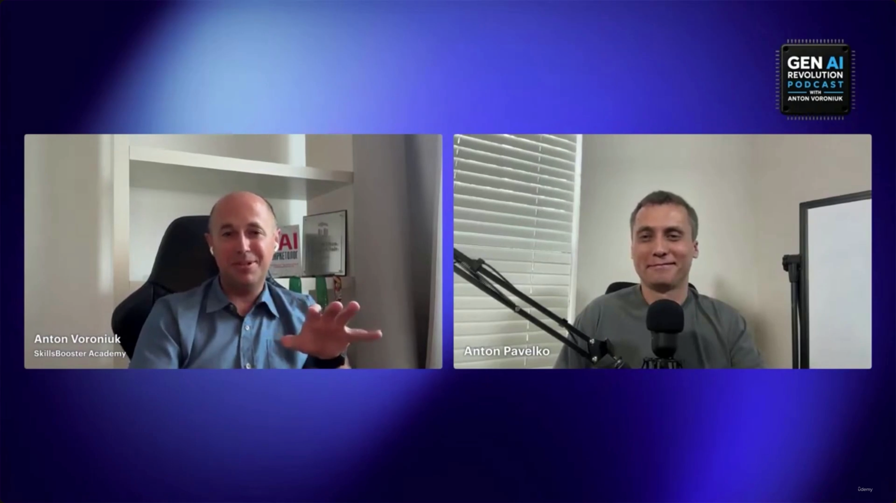
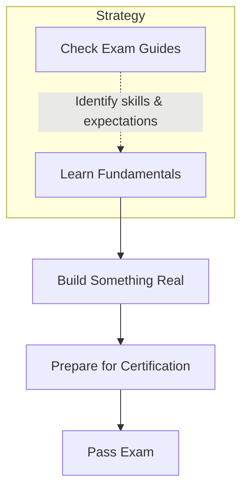
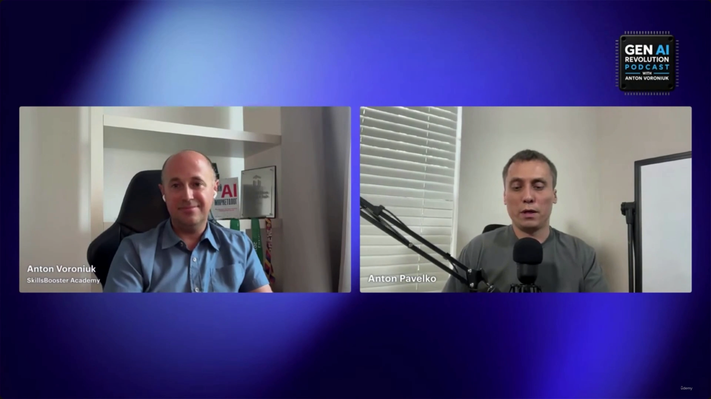
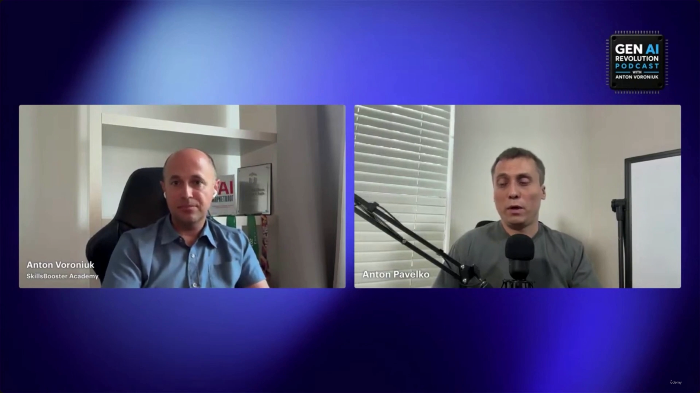

# The Five-Year View: Which Skills Keep Their Value

> This is a **Gen AI Revolution Podcast** segment (part of the same interview series as the other bonus lectures in this stretch of the course), not a technical slide lecture — there are no diagrams or architecture content here, just opinion and career advice. **[Slide detail]** The host and guest are identified only in the video-call frames themselves — never in the transcript text or the slide-note bullets: **Anton Voroniuk** (SkillsBooster Academy) interviews **Anton Pavelko**, a Claude Certified Architect, about which skills will still matter in five years.

---

## 1. Does the certification hold long-term value?

- **Long-term value of Claude certifications**
    - The knowledge gained is expected to remain helpful for **at least five years** and beyond.
    - Certifications may eventually shift from being a "big thing" to a basic, expected industry requirement.
- **GenAI hype**
    - The current hype around GenAI is significant, but the core knowledge underneath it remains a worthwhile pursuit regardless of where the hype cycle goes.

> **Transcript color:** "The knowledge that you can obtain, I believe, will be helpful in five years... I believe in some time when everyone [has] that [certification], employers will not ask like, do you have it or not? Because it will be some kind of basic thing, and it will not be a big thing."

---

## 2. The real value of certification prep

- The primary benefit isn't the credential itself — it's the **knowledge and experience gained during the study process**.
    - This expertise is expected to remain valuable for at least five years.
- Pavelko's direct encouragement to developers: pursue certification exams simply as a structured way to learn new things.

> **Transcript color:** "The knowledge you can obtain during preparation and the experience you can get — this is one of the important things, and it will be, I believe, valuable even in five years... Just learn it. It's a great opportunity to learn something new, so why not?"

---

## 3. Moving from software engineering into architecture

- **The question posed:** if a software engineer wants to move into an architecture role, what should they learn first?
- **Recommended learning path:**
    1. Learn the fundamentals first.
    2. Build something real — apply it to your current work, or build a personal project for hands-on experience.
    3. Prepare for and pass a certification.
- **How to start:**
    - Check the exam guides for the relevant certifications.
    - **[Why?]** Exam guides reveal exactly what the industry (e.g., Anthropic) expects from a given role — they help identify which skills to prioritize and give a clear baseline for the AI Developer and AI Architect roles.

> **Transcript color:** "Build something real. So first, learn from the fundamentals. Build something real. If you can build that on your work, just build this for yourself. Then prepare for the certification and then try to pass it... My recommendation would be to check exam guides for all four certifications. And in this case, you can see what exactly [Anthropic] expects from AI developer, from AI architect — it will probably be the very first step."

**[Slide detail]** The transcript is slightly more specific than the slide bullet here: Pavelko says to check the guides for **all four certifications**, whereas the slide note just says "relevant certifications" without a count.

---

## 4. Essential skills for AI architecture

- **Core technical competencies:**
    - LLM fundamentals
    - Application engineering
    - Agentic workflows
- **Dual application of AI** — Pavelko frames this as a skill in its own right:
    - Using AI as a core part of the *product* itself.
    - Using AI as part of the *implementation process* of building the product.

---

## 5. Emerging trend: AI SDLC

- **AI SDLC (AI-assisted Software Development Life Cycle)** — using AI to assist in developing and implementing software itself, not just as the product's feature set.
- Predicted to be **the major trend for the next 12 months**.
- Currently considered an **underrated** skill area.

> **Transcript color:** "Right now it's really [the] hype of AI-native or AI-assisted SDLC — let's call it AI SDLC — so I would say that the trend for the next 12 months is AI SDLC, for sure."

---

## 6. Overhyped vs. underrated skills

| | Skill | Verdict | Why |
|---|---|---|---|
| **Overhyped** | Prompt engineering (as a standalone profession) | Losing ground as a distinct role | Prompting is still an important skill, but it's increasingly just *part* of the day-to-day work of an AI engineer or AI architect — not a job title on its own. |
| **Underrated** | AI SDLC | Gaining ground | Using AI to build and ship software is expected to be the dominant trend of the next 12 months, but isn't getting the attention it deserves yet. |

> **Transcript color:** "I would say prompt engineering as a standalone profession [is overhyped]. I mean, prompting is still an important skill, but today it's usually just a part of AI engineer or AI architect work. So I would say that prompt engineer[ing] is pretty overhyped right now."

---

## Summary

- The knowledge behind a Claude certification is expected to **outlast the current GenAI hype cycle** — Pavelko puts its useful shelf-life at five years or more, after which certification itself may simply become table stakes rather than a differentiator.
- The real payoff of certification prep is the **learning and hands-on experience**, not the badge.
- The recommended path from software engineering into architecture: **fundamentals → build something real → prepare for and pass certification** — anchored by checking Anthropic's own exam guides to see what the role actually expects.
- Core architecture skills to prioritize: **LLM fundamentals, application engineering, agentic workflows**, plus using AI both *in* the product and *for* building the product.
- **AI SDLC** is called out as the underrated trend to watch over the next year; **prompt engineering as a standalone profession** is called out as overhyped — it's being absorbed into the broader AI engineer/architect role rather than surviving as its own job.

---

*Sources: [slide notes](../42-The-Five-Year-View-Which-Skills-Keep-Their-Value.md) · [[hover-notes-transcripts/42-The-Five-Year-View-Which-Skills-Keep-Their-Value (transcript)|full transcript]]*
