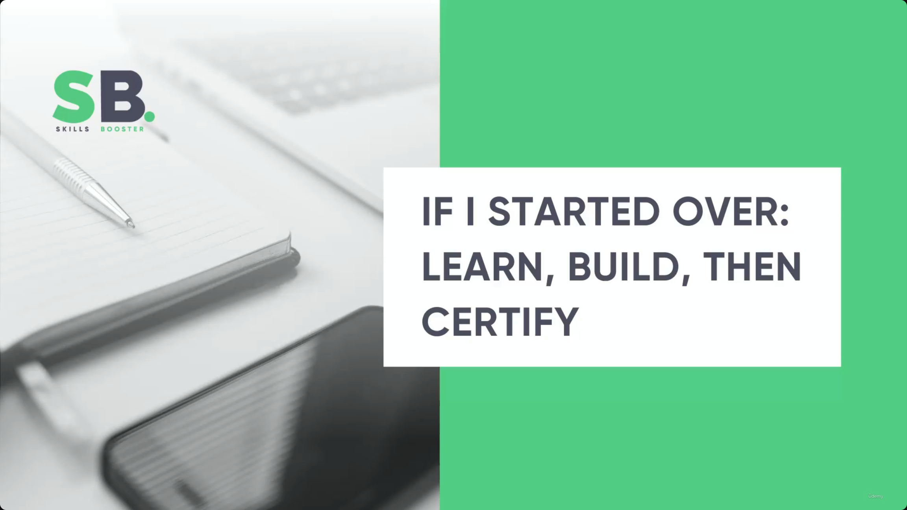
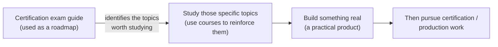
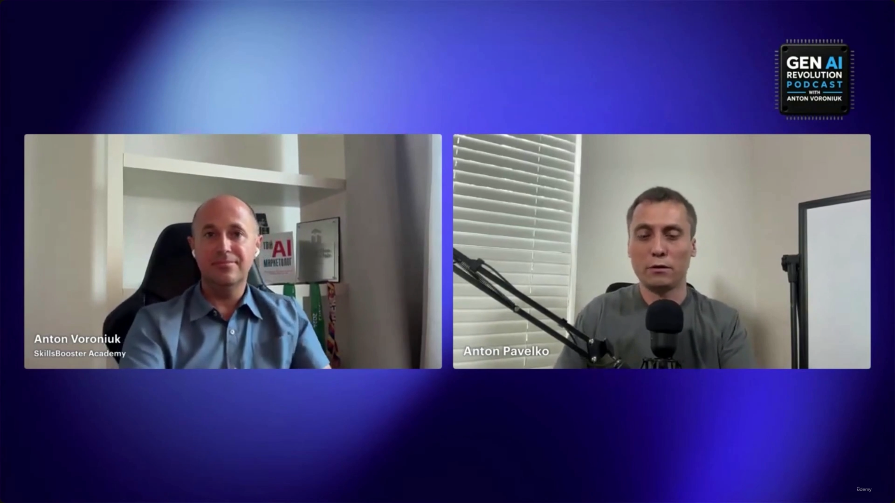
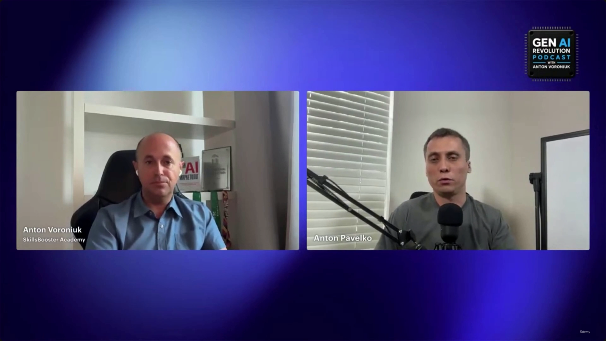

# If I Started Over: Learn, Build, Then Certify

> Bonus podcast segment from the **Gen AI Revolution Podcast**, hosted by **Anton Voroniuk** (SkillsBooster Academy), interviewing **Anton Pavelko** (the Claude Certified Architect course author) on how he'd restart his AI engineering career from scratch. **[Slide detail]** Neither speaker's name nor podcast affiliation appears anywhere in the transcript text or the slide-note bullets — they're visible only as on-screen labels/branding in the video call frames themselves.

---

## The core answer: roadmap → build → certify

Asked "if you were starting your career again right now, knowing everything you know today, what would you learn first?", Pavelko's answer is a deliberate sequence, not a topic list:

- **[Avoid]** Jumping between random YouTube tutorials and long, unstructured courses.
- **[Recommended roadmap]**
  - Use a certification exam guide as the roadmap — it tells you which topics actually matter.
  - Study those specific topics.
  - Use courses to reinforce them (rather than letting a course *define* the curriculum).
- Only after basic knowledge **and** practical experience are in place: go try to pass the exam, or build something in a production environment.

> **Transcript color:** "I would not spend too much time like me jumping between random YouTube tutorials and long courses. Instead of it, I would use like a certification exam guide as a roadmap, and then I will study that roadmap... and right after that... build something real, some practical product. And then after that, if I have practical experience, basic knowledge, go ahead, try to pass exam, try to build something in production."

**Note:** this is the same "build before you certify" ordering discussed in more depth in [[41-Certification-Paths-First-Project-And-Real-Interviews]] (which covers *which* certification path to choose and what interviewers actually look for). This lecture's distinct angle is the **starting point** — use a certification's exam guide as a syllabus/roadmap before touching any course — rather than the certification decision itself.

---

## Long-term career stability: fundamentals over vendor-specifics

- **[Question posed]** What separates AI professionals who stay relevant over the next five years from those whose skills become obsolete?
- **[Answer]** Basic/fundamental knowledge — not vendor-specific, cloud-specific, or domain-specific tooling.
  - **[Why]** Models change rapidly, and nobody knows which model will be popular in a couple of years. Fundamentals don't expire the way a specific tool or vendor stack does.
- **[Durable skills to prioritize]**
  - Context management
  - Reliability
  - Evaluation

> **Transcript color:** "If you try to learn something vendor-specific, like cloud-specific, domain-specific, models will change, right? And we don't know [which] model will be popular in a couple of years. But if you learn some basic things like context management, reliability, evaluation, I believe it will be relevant even in many years."

---

## Why the course is built around a real project (ShopAssist AI)

- **[Design choice]** The Claude Certified Architect Foundations course is built around a real application (the ShopAssist AI project) rather than teaching topics in isolation.
- **[Rationale]**
  - It's the best way to understand how theoretical knowledge is actually applied in a practical context.
  - Pure theory is harder to retain on its own.
  - Seeing how knowledge is applied in practice is the best way to learn it — and it's what Pavelko does for his own learning, and recommends to others.

> **Transcript color:** "Because as for me, it's [the] best way to understand how the knowledge can be applied... pure theory... is harder to remember... when you see a way you can apply that knowledge in practice, this is the best way to learn it — this is how I do that over time, and this is what I recommend to do for other people."

---

## Summary

- **Learn** — don't self-assemble a curriculum from scattered tutorials; let a certification exam guide define the roadmap of topics, then use courses to reinforce those specific topics.
- **Build** — once the basics are down, build something real and practical (a full application, not isolated exercises) before chasing the credential.
- **Certify** — only after practical experience and basic knowledge are both in place, attempt the exam or ship the work in production.
- **Future-proofing** — invest in fundamentals (context management, reliability, evaluation) that outlast any specific model or vendor, rather than over-specializing in vendor/cloud/domain-specific tooling.
- **Why ShopAssist AI** — a single running example beats teaching topics in isolation because application is what makes theory stick.

---

*Sources: [slide notes](../43-If-I-Started-Over-Learn-Build-Then-Certify.md) · [[hover-notes-transcripts/43-If-I-Started-Over-Learn-Build-Then-Certify (transcript)|full transcript]]*
